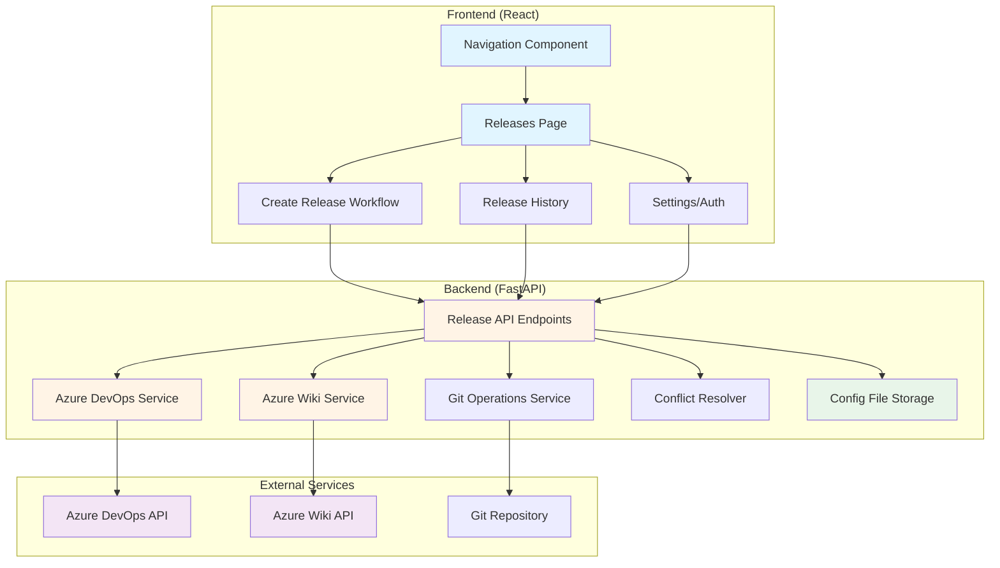

# Design Document: Azure Release Management

## Overview

The Azure Release Management feature replaces the existing "Analytics" navigation section with a comprehensive release management system integrated with Azure DevOps. This feature enables release managers to streamline the process of creating release branches by:

1. Pulling work items (PBIs) from Azure DevOps using tags or PBI numbers
2. Validating PBI states to ensure only completed work is included
3. Fetching commits associated with selected PBIs
4. Creating release branches with selected commits
5. Detecting and resolving merge conflicts through an interactive interface
6. Maintaining a history of all releases

The system provides a guided workflow from work item selection through branch creation, with robust error handling and user feedback at each step.

### Key Design Goals

- **Seamless Integration**: Deep integration with Azure DevOps APIs for work items, commits, and repositories
- **User-Friendly Workflow**: Step-by-step guided process with clear feedback and validation
- **Conflict Resolution**: Interactive merge conflict resolution without requiring external tools
- **Wiki-Based Approvals**: Commit approvals managed directly in Azure Wiki by developers
- **Auditability**: Complete history of releases tracked in Azure Wiki
- **Security**: Secure credential storage in config files and authentication with Azure DevOps

## Architecture

### High-Level Architecture



### Component Layers

1. **Presentation Layer** (React UI)
   - Navigation component with "Releases" section
   - Release creation wizard with multi-step workflow
   - Conflict resolution interface
   - Release history viewer (fetches from Azure Wiki)
   - Settings/authentication configuration

2. **API Layer** (FastAPI)
   - RESTful endpoints for release operations
   - Request validation and error handling
   - Authentication middleware
   - WebSocket support for real-time progress updates

3. **Service Layer** (Python)
   - Azure DevOps integration service
   - Azure Wiki integration service
   - Git operations service
   - Conflict detection and resolution service
   - Release history management (via Azure Wiki)

4. **Configuration Storage** (Config Files)
   - Azure DevOps credentials (PATs) stored in encrypted config files
   - Organization-specific settings
   - Repository configuration
   
   **Note**: All release history and audit logs are stored in Azure Wiki. No database is required.

## Components and Interfaces

### 1. Navigation Component

**Purpose**: Replace Analytics section with Releases in left navigation

**Interface**:
```typescript
interface NavigationItem {
  id: string;
  label: string;
  icon: React.ComponentType;
  path: string;
  enabled: boolean;
}

// Remove Analytics, add Releases
const navigationItems: NavigationItem[] = [
  // ... other items
  {
    id: 'releases',
    label: 'Releases',
    icon: GitBranchIcon,
    path: '/releases',
    enabled: true
  }
];
```

**Implementation Notes**:
- Update `ui/src/components/Navigation.jsx` or equivalent
- Remove Analytics route and component
- Add Releases route pointing to new Releases page

### 2. Azure DevOps Client Service

**Purpose**: Interface with Azure DevOps REST API for work items and commits

**API Endpoints Used**:
- `GET https://dev.azure.com/{organization}/_apis/wit/wiql` - Query work items
- `GET https://dev.azure.com/{organization}/_apis/wit/workitems` - Get work item details
- `GET https://dev.azure.com/{organization}/{project}/_apis/git/repositories/{repositoryId}/commits` - Get commits

**Interface**:
```python
class AzureDevOpsClient:
    def __init__(self, pat: str):
        """Initialize with Personal Access Token (organization/project provided per request)"""
        
    async def get_work_items_by_tags(
        self, 
        organization: str,
        project: str,
        tags: List[str]
    ) -> List[WorkItem]:
        """Retrieve work items matching any of the specified tags"""
        
    async def get_work_items_by_ids(
        self, 
        organization: str,
        project: str,
        ids: List[int]
    ) -> List[WorkItem]:
        """Retrieve work items by PBI numbers"""
        
    async def get_commits_for_work_item(
        self, 
        organization: str,
        project: str,
        work_item_id: int
    ) -> List[Commit]:
        """Fetch all commits associated with a work item"""
        
    async def validate_connection(
        self,
        organization: str,
        project: str
    ) -> ConnectionResult:
        """Test authentication and connectivity for specific organization/project"""
```

**Data Models**:
```python
class WorkItem(BaseModel):
    id: int
    title: str
    state: str  # New, Active, Resolved, Closed, etc.
    work_item_type: str  # PBI, Bug, Task, etc.
    tags: List[str]
    assigned_to: Optional[str]
    created_date: datetime
    
class Commit(BaseModel):
    commit_id: str  # SHA hash
    author: str
    author_email: str
    commit_date: datetime
    message: str
    work_item_ids: List[int]
    changed_files: List[str]
```

**Error Handling**:
- `AzureDevOpsConnectionError`: Network/connectivity issues
- `AzureDevOpsAuthenticationError`: Invalid PAT or permissions
- `AzureDevOpsNotFoundError`: Work item or repository not found
- `AzureDevOpsRateLimitError`: API rate limit exceeded

### 2A. Azure Wiki Client Service

**Purpose**: Interface with Azure Wiki REST API for creating and managing wiki pages

**API Endpoints Used**:
- `GET https://dev.azure.com/{organization}/{project}/_apis/wiki/wikis` - List wikis
- `PUT https://dev.azure.com/{organization}/{project}/_apis/wiki/wikis/{wikiId}/pages` - Create or update wiki page
- `GET https://dev.azure.com/{organization}/{project}/_apis/wiki/wikis/{wikiId}/pages` - Get wiki page

**Interface**:
```python
class AzureWikiClient:
    def __init__(self, pat: str):
        """Initialize with Personal Access Token"""
        
    async def get_project_wiki(
        self,
        organization: str,
        project: str
    ) -> WikiInfo:
        """Get the project wiki information"""
        
    async def create_wiki_page(
        self,
        organization: str,
        project: str,
        wiki_id: str,
        path: str,
        content: str
    ) -> WikiPageResult:
        """Create a new wiki page with markdown content"""
        
    async def update_wiki_page(
        self,
        organization: str,
        project: str,
        wiki_id: str,
        path: str,
        content: str,
        version: str
    ) -> WikiPageResult:
        """Update an existing wiki page"""
        
    async def create_release_documentation(
        self,
        organization: str,
        project: str,
        release: Release,
        work_items: List[WorkItem],
        commits: List[Commit]
    ) -> WikiDocumentationResult:
        """
        Create complete release documentation in Azure Wiki
        Creates main page and commits sub-page
        """
```

**Data Models**:
```python
class WikiInfo(BaseModel):
    id: str
    name: str
    project_id: str
    repository_id: str
    
class WikiPageResult(BaseModel):
    success: bool
    page_id: Optional[str]
    page_path: Optional[str]
    url: Optional[str]
    error_message: Optional[str]
    
class WikiDocumentationResult(BaseModel):
    success: bool
    main_page_url: Optional[str]
    commits_page_url: Optional[str]
    error_message: Optional[str]
```

**Wiki Page Templates**:

*Main Release Page Template*:
```markdown
# Release: {release_name}

## Release Information

| Property | Value |
|----------|-------|
| Branch Name | {branch_name} |
| Created Date | {created_date} |
| Created By | {creator} |
| Status | {status} |

## Product Backlog Items

| PBI ID | Title | State | Tags |
|--------|-------|-------|------|
{pbi_rows}

## Links

- [Commits Details](./{release_name}/Commits)
```

*Commits Sub-Page Template*:
```markdown
# Commits for Release: {release_name}

## Commit List

{commit_sections}

## Developer Approval Section

### Instructions for Developers
Please check the box next to your commits to approve them for this release.
You can edit this page directly in Azure Wiki to mark your approvals.

### Commit Approvals

#### PBI #{pbi_id}: {pbi_title}
- [ ] **{commit_hash}** - {commit_message}
  - **Author**: {author} ({author_email})
  - **Date**: {commit_date}
  - **Approved by**: _Pending approval from {author}_
  
- [ ] **{commit_hash}** - {commit_message}
  - **Author**: {author} ({author_email})
  - **Date**: {commit_date}
  - **Approved by**: _Pending approval from {author}_

### Approval Status Summary
- Total Commits: {total_commits}
- Approved: {approved_count}
- Pending: {pending_count}

---
*Last Updated: {timestamp}*
*Developers: Edit this page to check boxes and add your name next to "Approved by"*
```

**Error Handling**:
- `AzureWikiConnectionError`: Network/connectivity issues
- `AzureWikiAuthenticationError`: Invalid PAT or permissions
- `AzureWikiNotFoundError`: Wiki or page not found
- `AzureWikiConflictError`: Page already exists or version conflict

### 3. Release Manager Service

**Purpose**: Orchestrate the release creation workflow

**Interface**:
```python
class ReleaseManager:
    def __init__(
        self, 
        ado_client: AzureDevOpsClient,
        wiki_client: AzureWikiClient,
        git_service: GitOperationsService
    ):
        """Initialize with dependencies"""
        
    async def create_release(
        self,
        release_name: str,
        organization: str,
        project: str,
        work_item_ids: List[int],
        commit_ids: List[str],
        base_branch: str = "main"
    ) -> ReleaseResult:
        """
        Create a release branch with selected commits
        Also creates Azure Wiki documentation
        Returns: ReleaseResult with success status and branch name or conflicts
        """
        
    async def validate_work_items(
        self,
        organization: str,
        project: str,
        work_item_ids: List[int]
    ) -> ValidationResult:
        """
        Validate that all work items are in Closed state
        Returns: ValidationResult with warnings for non-closed items
        """
        
    async def get_release_history(
        self,
        organization: str,
        project: str,
        limit: int = 50,
        offset: int = 0
    ) -> List[Release]:
        """Retrieve release history from Azure Wiki with optional filtering"""
        
    async def get_release_details(
        self,
        organization: str,
        project: str,
        release_name: str
    ) -> ReleaseDetails:
        """Get detailed information about a specific release from Azure Wiki"""
        
    async def create_wiki_documentation(
        self,
        release: Release,
        work_items: List[WorkItem],
        commits: List[Commit]
    ) -> WikiDocumentationResult:
        """
        Create Azure Wiki documentation for the release
        Creates main page with PBI table and sub-page with commits
        """
```

**Data Models**:
```python
class Release(BaseModel):
    id: str  # UUID
    name: str
    branch_name: str
    organization: str
    project: str
    created_at: datetime
    created_by: str
    work_item_ids: List[int]
    commit_ids: List[str]
    status: str  # created, failed, conflict_resolved
    wiki_main_page_url: Optional[str]  # URL to main wiki page
    wiki_commits_page_url: Optional[str]  # URL to commits wiki page
    
class ReleaseResult(BaseModel):
    success: bool
    release_id: Optional[str]
    branch_name: Optional[str]
    conflicts: Optional[List[MergeConflict]]
    error_message: Optional[str]
    wiki_urls: Optional[Dict[str, str]]  # URLs to created wiki pages
    
class ValidationResult(BaseModel):
    valid: bool
    warnings: List[ValidationWarning]
    
class ValidationWarning(BaseModel):
    work_item_id: int
    work_item_title: str
    current_state: str
    message: str
```

### 4. Git Operations Service

**Purpose**: Handle Git operations for branch creation and commit application

**Interface**:
```python
class GitOperationsService:
    def __init__(self, repo_path: str):
        """Initialize with local repository path"""
        
    async def create_branch(
        self,
        branch_name: str,
        base_branch: str = "main"
    ) -> BranchResult:
        """Create a new branch from base branch"""
        
    async def apply_commits(
        self,
        branch_name: str,
        commit_ids: List[str]
    ) -> ApplyResult:
        """
        Cherry-pick commits onto branch in chronological order
        Returns: ApplyResult with success status or conflicts
        """
        
    async def validate_branch_name(
        self,
        branch_name: str
    ) -> bool:
        """Validate branch name follows Git conventions"""
        
    async def get_commit_details(
        self,
        commit_id: str
    ) -> CommitDetails:
        """Get detailed information about a commit"""
```

**Data Models**:
```python
class BranchResult(BaseModel):
    success: bool
    branch_name: Optional[str]
    error_message: Optional[str]
    
class ApplyResult(BaseModel):
    success: bool
    applied_commits: List[str]
    conflicts: Optional[List[MergeConflict]]
    failed_commit: Optional[str]
    
class CommitDetails(BaseModel):
    commit_id: str
    author: str
    date: datetime
    message: str
    diff: str
    changed_files: List[str]
```

### 5. Conflict Resolver Service

**Purpose**: Detect and assist in resolving merge conflicts

**Interface**:
```python
class ConflictResolver:
    def __init__(self, repo_path: str):
        """Initialize with repository path"""
        
    async def detect_conflicts(
        self,
        branch_name: str
    ) -> List[MergeConflict]:
        """Detect conflicts in current merge state"""
        
    async def get_conflict_details(
        self,
        file_path: str
    ) -> ConflictDetails:
        """Get detailed conflict information for a file"""
        
    async def resolve_conflict(
        self,
        file_path: str,
        resolution: str  # "ours", "theirs", or custom content
    ) -> ResolveResult:
        """Apply conflict resolution for a file"""
        
    async def mark_resolved(
        self,
        file_path: str
    ) -> bool:
        """Mark a file as resolved in Git"""
        
    async def abort_merge(
        self,
        branch_name: str
    ) -> bool:
        """Abort the current merge operation"""
```

**Data Models**:
```python
class MergeConflict(BaseModel):
    file_path: str
    conflict_type: str  # content, delete, rename
    our_commit: str
    their_commit: str
    
class ConflictDetails(BaseModel):
    file_path: str
    ours_content: str
    theirs_content: str
    base_content: Optional[str]
    conflict_markers: List[ConflictMarker]
    
class ConflictMarker(BaseModel):
    start_line: int
    end_line: int
    ours_start: int
    ours_end: int
    theirs_start: int
    theirs_end: int
    
class ResolveResult(BaseModel):
    success: bool
    file_path: str
    error_message: Optional[str]
```

### 6. Releases Page Component

**Purpose**: Main UI for release management

**Component Structure**:
```typescript
interface ReleasesPageProps {}

interface ReleasesPageState {
  view: 'list' | 'create' | 'details';
  releases: Release[];
  selectedRelease: Release | null;
  loading: boolean;
}

const ReleasesPage: React.FC<ReleasesPageProps> = () => {
  // State management
  // View switching logic
  // Release list rendering
  // Create release workflow
  // Release details viewer
};
```

**Sub-components**:
- `ReleaseList`: Display release history table
- `CreateReleaseWizard`: Multi-step release creation workflow
- `ReleaseDetails`: Detailed view of a specific release

### 7. Create Release Wizard Component

**Purpose**: Guide users through release creation workflow

**Workflow Steps**:
1. **Organization and Project Selection**: Enter Azure DevOps organization and project
2. **Work Item Selection**: Enter tags or PBI numbers
3. **Work Item Review**: Display fetched work items with state validation
4. **Commit Selection**: Show commits grouped by PBI, allow selection
5. **Branch Configuration**: Enter branch name and validate
6. **Conflict Resolution** (if needed): Interactive conflict resolution
7. **Completion**: Display success message and branch details

**Component Structure**:
```typescript
interface CreateReleaseWizardProps {
  onComplete: (release: Release) => void;
  onCancel: () => void;
}

interface WizardState {
  step: number;
  organization: string;
  project: string;
  workItemCriteria: WorkItemCriteria;
  workItems: WorkItem[];
  selectedWorkItems: number[];
  commits: Commit[];
  selectedCommits: string[];
  branchName: string;
  conflicts: MergeConflict[];
  validationWarnings: ValidationWarning[];
}

const CreateReleaseWizard: React.FC<CreateReleaseWizardProps> = ({
  onComplete,
  onCancel
}) => {
  // Multi-step form logic
  // API calls for each step
  // Progress tracking
  // Error handling
};
```

### 8. Conflict Resolution Interface Component

**Purpose**: Interactive UI for resolving merge conflicts

**Component Structure**:
```typescript
interface ConflictResolutionProps {
  conflicts: MergeConflict[];
  onResolve: (resolutions: Map<string, string>) => void;
  onAbort: () => void;
}

const ConflictResolutionInterface: React.FC<ConflictResolutionProps> = ({
  conflicts,
  onResolve,
  onAbort
}) => {
  // File list with conflict status
  // Diff viewer for each file
  // Resolution options (ours/theirs/manual)
  // Code editor for manual resolution
  // Validation before proceeding
};
```

**Features**:
- Side-by-side diff view
- Syntax highlighting
- Line-by-line resolution
- Quick actions (accept ours/theirs for all)
- Validation that all conflicts are resolved

### 9. Settings/Authentication Component

**Purpose**: Configure Azure DevOps credentials for multiple organizations

**Component Structure**:
```typescript
interface AzureDevOpsSettingsProps {
  onSave: (config: AzureDevOpsConfig) => void;
}

interface AzureDevOpsConfig {
  organization: string;
  pat: string;  // Personal Access Token
  repositoryId: string;
}

const AzureDevOpsSettings: React.FC<AzureDevOpsSettingsProps> = ({
  onSave
}) => {
  // Form for Azure DevOps configuration
  // Support multiple organizations with separate PATs
  // PAT input with secure handling
  // Connection test button per organization
  // Save and validation
};
```

## Data Models

### Configuration File Format

**Credentials Configuration** (`config/azure_devops_credentials.json`):
```json
{
  "organizations": {
    "my-org": {
      "pat_encrypted": "encrypted_pat_value_here",
      "repository_id": "repo-guid-here",
      "created_at": "2024-01-15T10:30:00Z",
      "updated_at": "2024-01-15T10:30:00Z"
    },
    "another-org": {
      "pat_encrypted": "encrypted_pat_value_here",
      "repository_id": "repo-guid-here",
      "created_at": "2024-01-16T14:20:00Z",
      "updated_at": "2024-01-16T14:20:00Z"
    }
  }
}
```

**Note**: 
- PATs are encrypted using Fernet symmetric encryption
- Encryption key stored in environment variable `AZURE_DEVOPS_ENCRYPTION_KEY`
- Config file has restricted permissions (600 on Unix systems)
- All release history is stored in Azure Wiki pages

### API Request/Response Models

```python
# Request models
class CreateReleaseRequest(BaseModel):
    name: str = Field(..., min_length=1, max_length=255)
    organization: str = Field(..., min_length=1)
    project: str = Field(..., min_length=1)
    work_item_ids: List[int] = Field(..., min_items=1)
    commit_ids: List[str] = Field(..., min_items=1)
    base_branch: str = Field(default="main")
    
class GetWorkItemsRequest(BaseModel):
    organization: str = Field(..., min_length=1)
    project: str = Field(..., min_length=1)
    tags: Optional[List[str]] = None
    pbi_numbers: Optional[List[int]] = None
    
class ResolveConflictRequest(BaseModel):
    release_id: str
    file_path: str
    resolution_type: str  # "ours", "theirs", "manual"
    content: Optional[str] = None  # Required if resolution_type is "manual"
    
class AzureDevOpsConfigRequest(BaseModel):
    organization: str
    pat: str
    repository_id: str

# Response models
class CreateReleaseResponse(BaseModel):
    success: bool
    release_id: Optional[str]
    branch_name: Optional[str]
    conflicts: Optional[List[MergeConflict]]
    message: str
    
class GetWorkItemsResponse(BaseModel):
    work_items: List[WorkItem]
    total_count: int
    
class GetCommitsResponse(BaseModel):
    commits: List[Commit]
    work_item_id: int
    
class ReleaseHistoryResponse(BaseModel):
    releases: List[Release]
    total_count: int
    page: int
    page_size: int
```

## Error Handling

### Error Categories

1. **Validation Errors** (400 Bad Request)
   - Invalid branch name format
   - Empty work item or commit selection
   - Invalid Azure DevOps configuration

2. **Authentication Errors** (401 Unauthorized)
   - Invalid or expired PAT
   - Missing Azure DevOps credentials

3. **Authorization Errors** (403 Forbidden)
   - Insufficient permissions to access work items
   - No permission to create branches

4. **Not Found Errors** (404 Not Found)
   - Work item not found
   - Repository not found
   - Release not found

5. **Conflict Errors** (409 Conflict)
   - Branch name already exists
   - Merge conflicts detected

6. **External Service Errors** (502 Bad Gateway)
   - Azure DevOps API unavailable
   - Git repository unreachable

7. **Rate Limit Errors** (429 Too Many Requests)
   - Azure DevOps API rate limit exceeded

### Error Response Format

```python
class ErrorResponse(BaseModel):
    error: str  # Error type
    message: str  # User-friendly message
    details: Optional[Dict[str, Any]]  # Additional context
    timestamp: datetime
    request_id: str  # For tracking
```

### Error Handling Strategy

1. **Frontend Error Handling**:
   - Display user-friendly error messages in UI
   - Provide actionable guidance (e.g., "Check your Azure DevOps credentials")
   - Log errors to console for debugging
   - Show retry options for transient failures

2. **Backend Error Handling**:
   - Catch and classify exceptions
   - Log errors with full context (stack trace, request details)
   - Return appropriate HTTP status codes
   - Include request IDs for tracing

3. **Retry Logic**:
   - Implement exponential backoff for Azure DevOps API calls
   - Maximum 3 retries for transient failures
   - Circuit breaker pattern for repeated failures

4. **Validation**:
   - Validate all inputs at API boundary
   - Provide detailed validation error messages
   - Validate branch names against Git conventions
   - Check work item states before proceeding

## Testing Strategy

### Testing Approach

Since this feature involves UI components, external API integration, Git operations, and workflow orchestration, **property-based testing is not appropriate**. The testing strategy will focus on:

1. **Unit Tests**: Test individual components and services in isolation
2. **Integration Tests**: Test interactions between services and external APIs
3. **End-to-End Tests**: Test complete user workflows
4. **Manual Testing**: UI/UX validation and exploratory testing

### Unit Tests

**Frontend Components** (Jest + React Testing Library):
- Navigation component renders Releases section correctly
- Create Release Wizard advances through steps
- Conflict Resolution Interface displays conflicts correctly
- Form validation works as expected
- Error messages display appropriately

**Backend Services** (pytest):
- `AzureDevOpsClient`:
  - Correctly constructs API requests
  - Parses API responses into data models
  - Handles authentication errors
  - Retries on transient failures
  
- `AzureWikiClient`:
  - Creates wiki pages correctly
  - Parses wiki content
  - Retrieves release history from wiki
  - Handles wiki API errors
  
- `ReleaseManager`:
  - Validates work item states correctly
  - Creates wiki documentation
  - Orchestrates workflow steps
  
- `GitOperationsService`:
  - Validates branch names
  - Creates branches correctly
  - Applies commits in order
  
- `ConflictResolver`:
  - Detects conflicts accurately
  - Parses conflict markers
  - Applies resolutions correctly

- `ConfigManager`:
  - Encrypts/decrypts credentials
  - Reads/writes config files
  - Manages multiple organizations

**Test Coverage Target**: 80% code coverage for backend services

### Integration Tests

**Azure DevOps Integration** (pytest with mocked API):
- Mock Azure DevOps API responses
- Test work item retrieval with various filters
- Test commit fetching for work items
- Test authentication flow
- Test error handling for API failures

**Azure Wiki Integration** (pytest with mocked API):
- Mock Azure Wiki API responses
- Test wiki page creation
- Test release history retrieval from wiki
- Test wiki page parsing
- Test error handling for wiki failures

**Git Operations Integration** (pytest with test repository):
- Create test Git repository
- Test branch creation
- Test commit cherry-picking
- Test conflict detection
- Test conflict resolution
- Clean up test repository after tests

**Configuration File Integration** (pytest):
- Test credential encryption/decryption
- Test config file read/write
- Test multiple organization support
- Test config file permissions encryption

### End-to-End Tests

**Complete Release Workflow** (Playwright or Cypress):
1. Navigate to Releases page
2. Click "Create New Release"
3. Enter work item criteria (tags or PBI numbers)
4. Review and select work items
5. Review and select commits
6. Enter branch name
7. Handle conflicts (if any)
8. Verify release creation success
9. View release in history

**Conflict Resolution Workflow**:
1. Create release with conflicting commits
2. Verify conflict detection
3. Resolve conflicts using interface
4. Complete release creation
5. Verify branch contains resolved conflicts

**Error Scenarios**:
- Invalid Azure DevOps credentials
- Network failures
- Invalid branch names
- Non-closed PBIs
- Empty selections

### Manual Testing Checklist

- [ ] Navigation displays Releases section
- [ ] Analytics section is removed
- [ ] Releases page loads correctly
- [ ] Create Release button works
- [ ] Work item search by tags works
- [ ] Work item search by PBI numbers works
- [ ] Non-closed PBI warnings display
- [ ] Commit list displays correctly
- [ ] Commit selection works
- [ ] Branch name validation works
- [ ] Conflict detection works
- [ ] Conflict resolution interface is usable
- [ ] Side-by-side diff is readable
- [ ] Manual conflict editing works
- [ ] Release history displays correctly
- [ ] Release details view works
- [ ] Settings page saves credentials
- [ ] Connection test works
- [ ] Error messages are clear
- [ ] Loading indicators display
- [ ] Success messages display

### Test Data

**Mock Work Items**:
```json
[
  {
    "id": 12345,
    "title": "Implement user authentication",
    "state": "Closed",
    "work_item_type": "Product Backlog Item",
    "tags": ["authentication", "security"]
  },
  {
    "id": 12346,
    "title": "Add password reset feature",
    "state": "Active",
    "work_item_type": "Product Backlog Item",
    "tags": ["authentication"]
  }
]
```

**Mock Commits**:
```json
[
  {
    "commit_id": "abc123def456",
    "author": "John Doe",
    "author_email": "john@example.com",
    "commit_date": "2024-01-15T10:30:00Z",
    "message": "Add login endpoint #12345",
    "work_item_ids": [12345]
  }
]
```

### Performance Testing

**Load Testing**:
- Test with 100+ work items
- Test with 500+ commits
- Test with large diff files (>10,000 lines)
- Measure API response times
- Measure UI rendering performance

**Benchmarks**:
- Work item retrieval: < 2 seconds for 100 items
- Commit fetching: < 3 seconds for 500 commits
- Branch creation: < 5 seconds
- Conflict detection: < 1 second per file
- UI rendering: < 100ms for list updates

### Security Testing

- [ ] PAT is encrypted in config file
- [ ] PAT is not logged or exposed in errors
- [ ] Config file has correct permissions (600)
- [ ] API endpoints require authentication
- [ ] XSS prevention in UI
- [ ] CSRF protection
- [ ] Rate limiting on API endpoints

---

## Implementation Notes

### Technology Stack

**Frontend**:
- React 18+
- TypeScript
- React Router for navigation
- Axios for API calls
- Monaco Editor for conflict resolution
- Tailwind CSS for styling

**Backend**:
- FastAPI (Python 3.11+)
- GitPython for Git operations
- cryptography for credential encryption
- httpx for Azure DevOps API calls and Azure Wiki API calls
- JSON for config file storage

**External Services**:
- Azure DevOps REST API (Work Items, Git, Wiki)

### Security Considerations

1. **Credential Storage**:
   - Encrypt PATs using Fernet (symmetric encryption)
   - Store encryption key in environment variable
   - Store encrypted credentials in config file with restricted permissions (600)
   - Never log or expose PATs in responses

2. **API Security**:
   - Require authentication for all endpoints
   - Implement rate limiting
   - Validate all inputs
   - Use HTTPS only

3. **Git Operations**:
   - Validate branch names to prevent injection
   - Sanitize commit messages
   - Limit repository access to configured paths

4. **Config File Security**:
   - Restrict file permissions to owner only
   - Store config files outside web root
   - Validate config file integrity on load

### Performance Optimizations

1. **Caching**:
   - Cache work item details for 5 minutes (in-memory)
   - Cache commit lists for 10 minutes (in-memory)
   - Cache wiki page lists for 15 minutes (in-memory)
   - Invalidate cache on release creation

2. **Pagination**:
   - Paginate work item lists (50 per page)
   - Paginate commit lists (100 per page)
   - Paginate release history from wiki (20 per page)

3. **Async Operations**:
   - Use async/await for all I/O operations
   - Parallel fetch commits for multiple work items
   - Background task for branch creation
   - Parallel wiki page creation (main + commits pages)

### Deployment Considerations

1. **Environment Variables**:
   ```
   AZURE_DEVOPS_ENCRYPTION_KEY=<fernet-key>
   GIT_REPO_PATH=/path/to/repository
   CONFIG_PATH=/path/to/config/directory
   ```

2. **Config File Setup**:
   - Create config directory with restricted permissions
   - Initialize credentials config file
   - Set file permissions to 600 (owner read/write only)

3. **Git Repository Setup**:
   - Ensure API has read/write access to repository
   - Configure Git user for commits
   - Set up SSH keys or HTTPS credentials

4. **Monitoring**:
   - Log all release operations to file
   - Monitor Azure DevOps API usage
   - Alert on repeated failures
   - Track release creation success rate
   - Monitor wiki page creation success

### Future Enhancements

1. **Automated Testing**:
   - Run tests on PBIs before release
   - Integration with CI/CD pipelines

2. **Approval Workflow**:
   - Require approval before branch creation
   - Multi-stage release process

3. **Rollback Support**:
   - Ability to revert releases
   - Track release deployments

4. **Advanced Conflict Resolution**:
   - AI-assisted conflict resolution
   - Conflict resolution suggestions

5. **Notifications**:
   - Email notifications on release creation
   - Slack/Teams integration

6. **Analytics**:
   - Release frequency metrics
   - Time-to-release tracking
   - Conflict rate analysis

7. **Enhanced Wiki Integration**:
   - Automatic wiki page updates when commits are approved
   - Wiki page templates customization
   - Integration with Azure Boards for automatic status updates
   - Wiki page versioning and history tracking

---

## Appendix

### Azure DevOps API Reference

- [Work Items API](https://learn.microsoft.com/en-us/rest/api/azure/devops/wit/work-items)
- [Git API](https://learn.microsoft.com/en-us/rest/api/azure/devops/git)
- [Wiki API](https://learn.microsoft.com/en-us/rest/api/azure/devops/wiki)
- [Authentication](https://learn.microsoft.com/en-us/azure/devops/organizations/accounts/use-personal-access-tokens-to-authenticate)

### Git Operations Reference

- [GitPython Documentation](https://gitpython.readthedocs.io/)
- [Git Cherry-Pick](https://git-scm.com/docs/git-cherry-pick)
- [Git Merge Conflicts](https://git-scm.com/docs/git-merge)

### Related Documentation

- [FastAPI Documentation](https://fastapi.tiangolo.com/)
- [React Router Documentation](https://reactrouter.com/)
- [Monaco Editor](https://microsoft.github.io/monaco-editor/)
