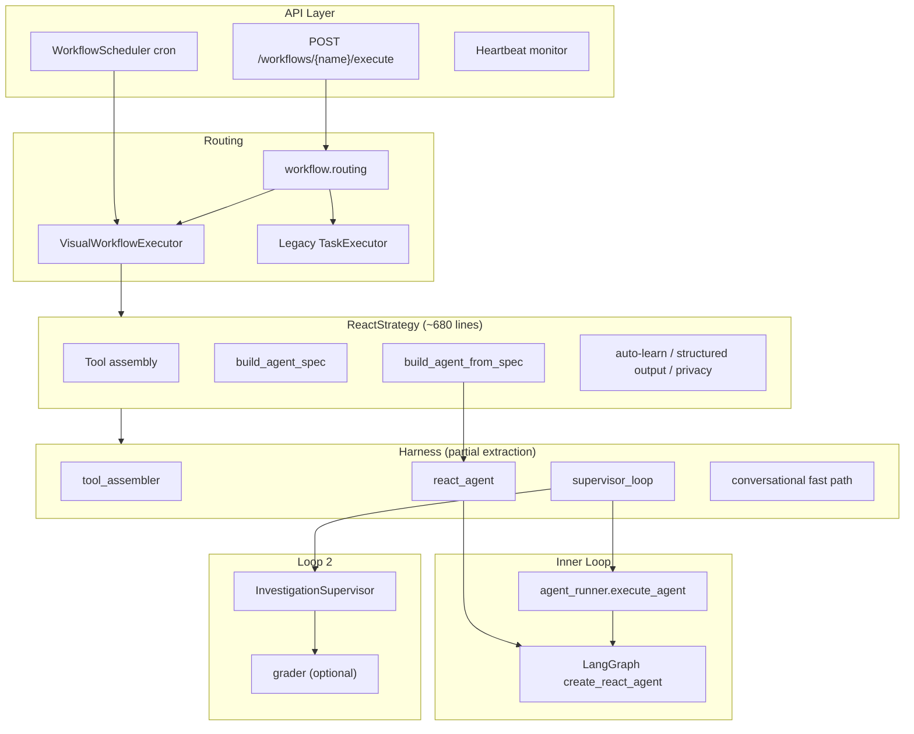

# Agent Architecture Analysis

Audit of the agent platform architecture — design intent, current structure, flaws, and
prioritized remediation. Complements [loop-engineering.md](./loop-engineering.md).

**Date:** 2026-06-30

---

## Architecture Overview

This codebase implements a **loop-engineered ReAct platform**: LangGraph inner loop,
supervisor verification loop, cron-driven event loop, and optional hill-climbing
improvement loop. The design intent in `loop-engineering.md` is sound — deterministic
cached system prompts, run-specific steering in control loops, progressive tool
disclosure, bounded supervision. The main problems are **incomplete extraction**,
**dual parallel implementations**, and **state/lifecycle gaps** that undermine
multi-replica correctness and predictability.

**Intended layering:** Harness owns runtime; ReactStrategy owns workflow wiring.

**Actual layering:** Bidirectional coupling — harness imports heavily from
`app/workflow/strategies/react/`, and strategy imports harness APIs back.

### Execution path (full run)

1. **Early exit** — `is_conversational()` skips tool assembly for greetings / capability questions.
2. **Context augmentation** — KB recall, seeded CloudWatch/code blocks, PII pseudonymization.
3. **Base tools** — MCP, CloudWatch, crawler/codegraph, DB schema, progressive disclosure.
4. **Extension tools** — delegate, edit, planning, VFS, named subagents, sandbox, verify.
5. **Spec assembly** — `build_agent_spec()` → `build_agent_from_spec()` → `react_agent.build_agent()`.
6. **Run** — `run_supervised()` wraps `execute_agent()` with supervisor retries and LLM failover.
7. **Post-run** — synthesis floor, auto-learn, structured output, privacy rehydration, session cleanup.

### Key file roles

| Path | Role |
|---|---|
| `app/workflow/strategies/react/strategy.py` | Main orchestrator for agent node execution |
| `app/harness/__init__.py` | Public harness API: `build_agent_from_spec`, envelopes |
| `app/harness/spec.py` | `AgentSpec` dataclass — declarative agent configuration |
| `app/harness/spec_factory.py` | Builds `AgentSpec` from workflow context |
| `app/harness/tool_assembler.py` | Base + extension tool assembly |
| `app/harness/react_agent.py` | LangGraph agent construction (policy, caching, compaction, HITL) |
| `app/harness/supervisor_loop.py` | Bounded outer loop with supervisor verdict routing |
| `app/workflow/strategies/react/agent_builder.py` | Cache-stable system prompt (CACHE CONTRACT) |
| `app/workflow/strategies/react/agent_runner.py` | Inner ReAct loop: invoke, stream, recovery |
| `app/core/supervisor.py` | Quality scoring + PASS/RETRY/HITL/ESCALATE verdicts |
| `app/core/grader.py` | Optional LLM-judge for verification loop |
| `app/core/scheduler.py` | Cron scheduling, curator, hill-climb periodic jobs |
| `app/services/mcp_client_manager.py` | MCP stdio connection lifecycle per execution |

---

## Critical Flaws (Correctness & Reliability)

### 1. ~~Async delegation registry never cleaned up~~ — Resolved

`build_async_delegation_tools`, `_delegate_async`, `_collect`, `clear_async_registry`,
and `_ASYNC_REGISTRY` have been removed from `subagent_factory.py` entirely, along with
their wiring in `tool_assembler.add_extension_tools`. `delegate_parallel` (single
blocking `asyncio.gather`, no standing state) and the serial `delegate_to_<name>` tools
are unaffected and remain the concurrency surface. The leak is gone by construction —
there is no registry left to leak.

---

### 2. ~~Subagent LLM resolution is inconsistent~~ — Resolved

The wired `subagent` port has been retired: `strategy.py`'s port-resolution stash
(previously ~line 167-179) is removed, along with the `subagent_llm_config` plumbing it
fed. `subagent.py` (the only consumer of that precedence chain) is deleted (see #9).
Every delegation tool — named `delegate_to_<name>`, `delegate_parallel`, and the generic
`delegate_investigation` — now resolves its LLM through the single chain in
`subagent_factory._run_child`: per-def `model` (including the `"inherit"` sentinel for
an explicit parent-LLM opt-in) → global `subagent` role → parent LLM.

---

### 3. ~~Supervisor tool-health scoring is broken~~ — Resolved

`agent_runner._serialize_agent_result` now correlates each `AIMessage.tool_calls[*].id`
with its `ToolMessage` output and runs the existing content-based
`classify_tool_failure(tool_name, output_str)` to backfill `ok`/`status` on every
`tool_calls_summary` entry. `_score_tool_health` reads that real status instead of
matching substrings in the tool name — `cloudwatch_get_error_logs` succeeding no longer
scores as a failure. Summaries with no status (pre-existing callers) fall back to the
prior neutral 0.60 contribution, so the change is backward compatible.

---

### 4. ~~Improvement guard vs selftest runner mismatch~~ — Resolved

`guard.py` now invokes `[sys.executable, "-m", "evals.harness_selftest"]` — the actual
async `_main()` runner — instead of `pytest evals/harness_selftest.py`. The
`_import_smoke_guard` fallback for `FileNotFoundError` is unchanged.

---

### 5. ~~Stale `deep_agent.py` still on disk~~ — Resolved

Git shows `deep_agent.py` deleted. Verified against the current working tree:
`app/harness/deep_agent.py` does not exist on disk. `__init__.py`'s claim that
deepagents was removed is accurate. No action needed.

---

## Structural Architecture Issues

### 6. Incomplete harness extraction (layering inversion)

The harness is described as the "single ReAct runtime," but core behavior still lives in
strategy:

| Harness module | Imports from strategy |
|---|---|
| `tool_assembler.py` | `tool_setup`, `subagent`, `edit_tools`, `planning_tools`, `subagent_factory`, `verify_tools` |
| `react_agent.py` | `agent_builder`, `tool_setup`, `agent_runner` |
| `supervisor_loop.py` | `helpers`, `hitl` |
| `context_builder.py` | `helpers` |
| `conversational.py` | `agent_runner` |

`permissions.py` is intentionally excluded from this table: it's a documented stable
re-export shim over `app.workflow.strategies.react.tool_permissions` (its own
docstring states this is the intended entry point pending Phase 2 migration), not an
example of unplanned coupling.

This creates **circular import risk**, mitigated only by lazy imports in
`supervisor_loop.py`. The intended dependency direction (strategy → harness) is violated
in practice.

**Fix:** Complete harness extraction — move `agent_builder`, `agent_runner`, and tool
implementations behind harness interfaces; strategy becomes thin wiring only.

---

### 7. ReactStrategy is a god object

`strategy.py` owns in one ~680-line method chain:

- Profile merge and config extraction
- Conversational fast path
- KB recall and context seeding
- PII pseudonymization
- Tool assembly (two phases)
- LLM build + throttle failover chain
- Agent spec + build
- Supervised execution
- Synthesis floor, auto-learn, trajectory persistence
- Structured output parsing
- Privacy rehydration and session cleanup

Hard to test, extend, or reason about in isolation. Every new capability adds another
branch here.

---

### 8. Dual execution paths with different semantics

| Trigger | Path | Inputs | Leader gate | Return value |
|---|---|---|---|---|
| Manual API | `routing.execute_workflow` | Full `inputs`, chat persistence | No | Full result dict |
| Cron scheduler | `execute_visual_workflow` directly | **None** | Yes | `None` |
| Legacy workflows | `TaskExecutor` via scheduler | Task-specific | Partial | `WorkflowExecution` record |

Scheduled visual workflows cannot receive dynamic inputs. Manual and scheduled runs have
different observability envelopes. Two workflow schema dialects (ReactFlow `data.*` vs
LangflowEditor `params.*`) add edge-case complexity throughout.

---

### 9. ~~Dual subagent systems~~ — Resolved

`subagent.py` is deleted. `subagent_factory.py` is now the single delegation engine,
exposing three tools built on one shared `_run_child`:

| Tool | Trigger | Notes |
|---|---|---|
| `delegate_to_<name>` | Profile `subagents` list | Named specialist, per-def role/tools/model |
| `delegate_parallel` | Profile `subagents` list (2+) | Concurrent fan-out, `asyncio.gather`, no standing state |
| `delegate_investigation` | Code-analyzer tools configured | Generic ad hoc delegate (`build_generic_delegate_tool`), replaces `subagent.py` |

All three share unified LLM resolution (per-def `model` → `"inherit"` sentinel → global
`subagent` role → parent LLM), unified tool scoping (`_scope_tools`: wildcard-or-allow-list
+ per-def `disallowedTools` + the global blocked-tools floor, with unmatched globs logged
rather than silently dropped), and a unified result envelope with a text-fallback finalizer.
Depth stays hardcoded at 1 for all three. `has_code_analyzer`/`has_cloudwatch` are now
inferred per-child from its actual scoped tool set, so a crawler-scoped specialist gets the
same code-aware system-prompt guidance a top-level agent would.

---

### 10. Dual tool-filtering mechanisms

- **`tool_disclosure`** — BM25 `search_tools` / `call_tool` bridge (preferred, used in assembly)
- **`tool_router`** — keyword top-K pruning (legacy, still in codebase/tests)

Two overlapping concepts increase maintenance cost and risk of divergent behavior.

---

### 11. Dual planning models

- Profile `planning: true` → `write_todos` / `update_todo` tools + prompt section
- `agent_mode == "multi"` → markdown plan instructions in system prompt only

Two planning paradigms without clear mutual exclusion or unified abstraction.

---

## Scalability & Multi-Replica Issues

### 12. In-process session state

| Store | Location | Cleared on run end? | Cross-replica safe? |
|---|---|---|---|
| Todo store | `planning_tools._store` | Yes | No |
| VFS | `app.core.vfs` | Yes | No |
| HITL checkpointer | Postgres `AsyncPostgresSaver` | Persistent | Yes |

(`subagent_factory._ASYNC_REGISTRY` dropped from this table — see #1/#9: async
delegation is being removed rather than made cross-replica safe.)

Postgres checkpointer supports HITL across restarts, but todos/VFS are in-memory.
**Inconsistent persistence model** — works on single node, breaks under horizontal
scaling or process restart mid-run.

**Fix:** Move todos/VFS to execution-scoped stores backed by Postgres or Redis. This
remains the P2 multi-replica gap; it is no longer coupled to async delegation cleanup.

---

### 13. Leader lock fail-open

In `scheduler.py`, if Postgres advisory lock acquisition fails, every replica assumes
leadership (`_is_leader = True`). Cron curator and hill-climb jobs can double-run.
Manual API executes are never leader-gated at all.

**Fix:** Leader lock fail-closed in multi-replica mode (env flag).

---

### 14. SSE stream keyed by workflow name, not execution ID

Concurrent runs of the same workflow can conflate streaming events. No per-execution
stream isolation at the API level.

**Fix:** SSE streams keyed by `execution_id`.

---

## Configuration & Spec Wiring Gaps

### 15. ~~`AgentSpec.filesystem` flag is ignored for tools~~ — Resolved

VFS tool construction in `tool_assembler.add_extension_tools` is now gated on
`_flags.get("filesystem")`, matching the `planning` gate pattern and the
`AgentSpec.filesystem: bool = False` default. **Behavior change:** profiles that never
set `filesystem` no longer get `fs_*` tools by default — this was the actual bug (the
flag existed but had no effect); the selftest assertion encoding the old always-on
behavior was updated to assert the fixed behavior instead. An audit of the remaining
`AgentSpec` fields (`planning`, `subagents`, `sandbox`, `verify_command`, `memory`)
against `tool_assembler` found no other drift — each is already correctly gated.

---

### 16. Tool registry is discovery-only

`registry_loader` populates a catalog at startup with `NotImplementedError` handlers.
Live runs still build tools per-execution in `tool_assembler`. Phase 2 intent (resolve
from registry before instantiation) is documented but not implemented — **two parallel
tool paths**.

---

### 17. Governance split across layers

- Policy expansion (`expand_policy_refs`) — in strategy
- Tool pseudonymization wrapping — in strategy after harness assembly
- Policy engine tool wrapping — in harness `react_agent.py`

Governance is conceptually harness-owned but partially implemented in strategy, making it
hard to enforce consistently for subagents and delegated children.

---

## Operational & Security Gaps

### 18. No API authentication

Workflow execute, MCP CRUD, improvement apply, and crawler investigate appear
unauthenticated. Suitable for internal/trusted networks only.

---

### 19. Silent feature degradation

Nearly every optional capability (CloudWatch, crawler, disclosure, VFS, sandbox) is
wrapped in broad `except Exception` with warnings. Good for availability, but
**misconfiguration is invisible** — e.g., sandbox enabled with no backend logs at info
and silently skips.

---

### 20. MCP injection handling is warn-only

Suspicious tool descriptions are logged and optionally replaced, but tools are still
registered and callable.

---

### 21. Documentation drift

| Doc says | Code does |
|---|---|
| `improvement/__init__.py`: "never auto-applies" | Scheduler calls `apply_proposals(dry_run=False)` when `HILLCLIMB_APPLY_ENABLED=true` |
| `output_registry`: defaults to InvestigationReport | `_DEFAULT = "generic"` |
| `subagent_factory`: registry "cleared on run teardown" | Never called from strategy |

Creates operator confusion about what Loop 4 actually does in production.

---

## Loop Maturity Assessment

| Loop | Status | Main gap |
|---|---|---|
| **1 — Agent** | Mature | Recovery stack in `agent_runner` is powerful but combinatorially complex; harness extraction incomplete |
| **2 — Verification** | Partially activated | Weak tool-health heuristic; retry only prepends to user query (CACHE CONTRACT prevents prompt-level fixes) |
| **3 — Event-driven** | Partial | Cron works; no inbound webhooks/Slack/alarm→run; scheduled runs lack inputs |
| **4 — Hill-climbing** | Opt-in, fragile guard | Guard/test runner mismatch; `_apply_reliability_proposal` always returns True; skill apply patches `SkillService._CACHE` internals |

---

## Recovery & Complexity Concerns

`agent_runner.py` stacks many overlapping recovery paths:

- Pre-invocation compaction
- Mid-loop deterministic pruning (`pre_model_hook`)
- Post-invocation overflow recovery
- Recursion limit synthesis
- Truncation continuation
- Mid-thought preamble continuation
- LLM throttle failover (rebuilds entire agent)

Each is individually reasonable; together they create **hard-to-test interaction
surfaces** and make failure modes difficult to diagnose.

Supervisor RETRY rebuilds the agent but only prepends guidance to the user query —
corrective steering fights the CACHE CONTRACT design. There is no mechanism to inject
retry-specific system prompt deltas without breaking prompt caching.

---

## Prioritized Remediation

### P0 — Fix correctness bugs — DONE

1. ~~Remove `delegate_async` / `collect_delegations` and `_ASYNC_REGISTRY` entirely~~
   (see #1, #9) — eliminates the leak by construction instead of adding teardown
   cleanup. `delegate_parallel` is unaffected and stays.
2. ~~Fix `_score_tool_health` to inspect tool result status, not tool name substrings~~
3. ~~Unify guard to run `python -m evals.harness_selftest`, not pytest~~

### P1 — Reduce architectural debt — items 5–6 DONE, item 4 still open

4. Complete harness extraction: move `agent_builder`, `agent_runner`, tool implementations behind harness interfaces; strategy becomes thin wiring only
5. ~~Consolidate `subagent.py` into `subagent_factory.py` as a single factory offering
   serial (`delegate_to_<name>`) and parallel (`delegate_parallel`) delegation, with
   unified LLM resolution (per-def `model` → global `subagent` role → parent LLM).
   The wired `subagent` port is retired, not carried forward~~ (see #2, #9)
6. ~~Gate VFS tools on `filesystem` flag; audit all `AgentSpec` fields for similar drift~~

### P2 — Multi-replica readiness

7. Move todos/VFS to execution-scoped stores backed by Postgres or Redis
8. Leader lock fail-closed in multi-replica mode (env flag)
9. SSE streams keyed by `execution_id`

### P3 — Operational hardening

10. API authentication middleware
11. Unify manual and scheduled execution through one path with consistent inputs/observability
12. Reconcile Loop 4 documentation with actual auto-apply behavior

---

## Bottom Line

The **design philosophy is strong** — loop engineering over prompt engineering, CACHE
CONTRACT, progressive disclosure, bounded supervision, and opt-in self-improvement are
the right architectural bets. The **implementation is mid-migration**: P0 (correctness
bugs) and P1 items 5–6 (subagent consolidation, VFS flag gating) are now resolved;
harness extraction (P1 item 4 / #6-#7) is still incomplete, leaving bidirectional
coupling and the `ReactStrategy` god object; duplicate planning/tool-filtering paths
(#10-#11) and multi-replica lifecycle gaps (P2, #12-#14) remain open.

The remaining highest-risk items for production are **in-memory session state under
multi-replica deployment** (P2) and the **ReactStrategy god object / incomplete harness
boundary** (P1 item 4) — the highest maintenance cost in the codebase.
