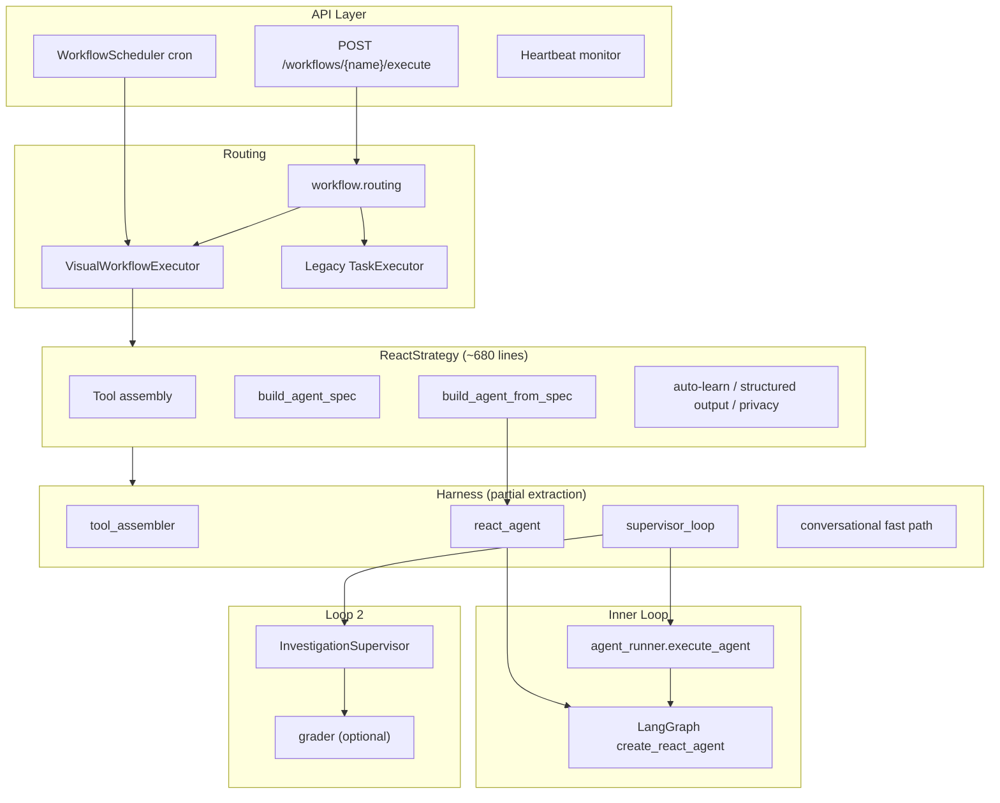

# Agent Architecture Analysis

Audit of the agent platform architecture — design intent, current structure, flaws, and
prioritized remediation. Complements [loop-engineering.md](./loop-engineering.md).

**Date:** 2026-06-30

---

## Architecture Overview

This codebase implements a **loop-engineered ReAct platform**: LangGraph inner loop,
supervisor verification loop, cron-driven event loop, and optional hill-climbing
improvement loop. The design intent in `loop-engineering.md` is sound — deterministic
cached system prompts, run-specific steering in control loops, progressive tool
disclosure, bounded supervision. The main problems are **incomplete extraction**,
**dual parallel implementations**, and **state/lifecycle gaps** that undermine
multi-replica correctness and predictability.

**Intended layering:** Harness owns runtime; ReactStrategy owns workflow wiring.

**Actual layering:** Bidirectional coupling — harness imports heavily from
`app/workflow/strategies/react/`, and strategy imports harness APIs back.

### Execution path (full run)

1. **Early exit** — `is_conversational()` skips tool assembly for greetings / capability questions.
2. **Context augmentation** — KB recall, seeded CloudWatch/code blocks, PII pseudonymization.
3. **Base tools** — MCP, CloudWatch, crawler/codegraph, DB schema, progressive disclosure.
4. **Extension tools** — delegate, edit, planning, VFS, named subagents, sandbox, verify.
5. **Spec assembly** — `build_agent_spec()` → `build_agent_from_spec()` → `react_agent.build_agent()`.
6. **Run** — `run_supervised()` wraps `execute_agent()` with supervisor retries and LLM failover.
7. **Post-run** — synthesis floor, auto-learn, structured output, privacy rehydration, session cleanup.

### Key file roles

| Path | Role |
|---|---|
| `app/workflow/strategies/react/strategy.py` | Main orchestrator for agent node execution |
| `app/harness/__init__.py` | Public harness API: `build_agent_from_spec`, envelopes |
| `app/harness/spec.py` | `AgentSpec` dataclass — declarative agent configuration |
| `app/harness/spec_factory.py` | Builds `AgentSpec` from workflow context |
| `app/harness/tool_assembler.py` | Base + extension tool assembly |
| `app/harness/react_agent.py` | LangGraph agent construction (policy, caching, compaction, HITL) |
| `app/harness/supervisor_loop.py` | Bounded outer loop with supervisor verdict routing |
| `app/workflow/strategies/react/agent_builder.py` | Cache-stable system prompt (CACHE CONTRACT) |
| `app/workflow/strategies/react/agent_runner.py` | Inner ReAct loop: invoke, stream, recovery |
| `app/core/supervisor.py` | Quality scoring + PASS/RETRY/HITL/ESCALATE verdicts |
| `app/core/grader.py` | Optional LLM-judge for verification loop |
| `app/core/scheduler.py` | Cron scheduling, curator, hill-climb periodic jobs |
| `app/services/mcp_client_manager.py` | MCP stdio connection lifecycle per execution |

---

## Critical Flaws (Correctness & Reliability)

### 1. ~~Async delegation registry never cleaned up~~ — Resolved

`build_async_delegation_tools`, `_delegate_async`, `_collect`, `clear_async_registry`,
and `_ASYNC_REGISTRY` have been removed from `subagent_factory.py` entirely, along with
their wiring in `tool_assembler.add_extension_tools`. `delegate_parallel` (single
blocking `asyncio.gather`, no standing state) and the serial `delegate_to_<name>` tools
are unaffected and remain the concurrency surface. The leak is gone by construction —
there is no registry left to leak.

---

### 2. ~~Subagent LLM resolution is inconsistent~~ — Resolved

The wired `subagent` port has been retired: `strategy.py`'s port-resolution stash
(previously ~line 167-179) is removed, along with the `subagent_llm_config` plumbing it
fed. `subagent.py` (the only consumer of that precedence chain) is deleted (see #9).
Every delegation tool — named `delegate_to_<name>`, `delegate_parallel`, and the generic
`delegate_investigation` — now resolves its LLM through the single chain in
`subagent_factory._run_child`: per-def `model` (including the `"inherit"` sentinel for
an explicit parent-LLM opt-in) → global `subagent` role → parent LLM.

---

### 3. ~~Supervisor tool-health scoring is broken~~ — Resolved

`agent_runner._serialize_agent_result` now correlates each `AIMessage.tool_calls[*].id`
with its `ToolMessage` output and runs the existing content-based
`classify_tool_failure(tool_name, output_str)` to backfill `ok`/`status` on every
`tool_calls_summary` entry. `_score_tool_health` reads that real status instead of
matching substrings in the tool name — `cloudwatch_get_error_logs` succeeding no longer
scores as a failure. Summaries with no status (pre-existing callers) fall back to the
prior neutral 0.60 contribution, so the change is backward compatible.

---

### 4. ~~Improvement guard vs selftest runner mismatch~~ — Resolved

`guard.py` now invokes `[sys.executable, "-m", "evals.harness_selftest"]` — the actual
async `_main()` runner — instead of `pytest evals/harness_selftest.py`. The
`_import_smoke_guard` fallback for `FileNotFoundError` is unchanged.

---

### 5. ~~Stale `deep_agent.py` still on disk~~ — Resolved

Git shows `deep_agent.py` deleted. Verified against the current working tree:
`app/harness/deep_agent.py` does not exist on disk. `__init__.py`'s claim that
deepagents was removed is accurate. No action needed.

---

## Structural Architecture Issues

### 6. ~~Incomplete harness extraction (layering inversion)~~ — Resolved

The 10 modules the harness actually depended on physically lived under
`app/workflow/strategies/react/` even though they're generic agent-runtime/tool
implementations, not react-workflow-specific: `agent_builder.py`, `agent_runner.py`,
`helpers.py`, `hitl.py`, `tool_setup.py`, `tool_permissions.py`, `edit_tools.py`,
`planning_tools.py`, `verify_tools.py`, `subagent_factory.py` (plus `hashline.py`,
found during the move — used only by `edit_tools.py` and one unrelated service). All
11 moved to `app/harness/`. Every import site across `app/` and `evals/` (~35 call
sites) was repointed; the now-pointless `app/harness/permissions.py` re-export shim
(created specifically to avoid this move — see its old docstring — and confirmed to
have zero external callers) was deleted, since `tool_permissions` now has a stable
home directly in harness.

`streaming.py` and `llm_factory.py` were deliberately **not** moved: both are used
well beyond the react strategy (`batch_react.py`, `router_classify.py`, executor
handlers, `evals/accuracy/*`), so they're a different, pre-existing "generic util
misplaced in one strategy's package" issue — moving them into harness would just
relocate the misplacement, not fix it. Out of scope here.

One genuine circular-import cycle the move eliminated (not just "mitigated by laziness"):
`supervisor_loop.py`'s `emit_hitl_pause`/`estimate_confidence` were lazily imported
specifically to avoid a real cycle through `strategies/__init__.py`. Now that `hitl.py`
and `helpers.py` live in harness (and have zero `strategies`-package imports
themselves), that cycle no longer exists — converted back to ordinary top-level
imports and verified (`app.harness.supervisor_loop` imports cleanly, `test_supervisor_loop`
still passes).

Verification: full-repo `compileall` (no syntax errors), explicit `importlib.import_module`
of all 34 touched/dependent modules including `app.main` and `evals.harness_selftest`
(all resolve), and the harness self-test suite's DB-free-capable functions (~20 test
functions, 140+ individual checks spanning envelopes, tool_router, engine
resolution/dispatch, turn_loop, spec/facade, policy engine, sandbox, agent_spec,
supervisor_loop, context_builder, extension_tools, edit_tools, configurable_agents,
delegation, conversational intent) — all green.

The intended dependency direction (strategy → harness) now holds structurally, not
just by convention: harness modules that used to reach backward into strategy no
longer can, because the files they needed are inside harness itself.

---

### 7. ~~ReactStrategy is a god object~~ — Resolved

`strategy.py` is now 134 lines — a thin coordinator delegating to `preflight.build_run_plan`
(config resolution, action-space assembly, spec build), `executor.run_plan` (agent build,
supervised loop, engine routing), and `finalizer.finalize`/`cleanup_on_error` (synthesis
floor, auto-learn, trajectory save, structured output, PII rehydration, result envelope).
Each phase is independently testable; `ReactStrategy.execute` itself is just try/preflight/
executor/finalizer/except.

---

### 8. ~~Dual execution paths with different semantics~~ — Partially resolved

Previously, cron-fired **visual** workflows bypassed the canonical dispatcher entirely:
`scheduler._execute_workflow_wrapper` called `WorkflowScheduler.execute_workflow`, which
had its own inline `is_visual_workflow` branch calling `execute_visual_workflow(workflow_data)`
directly — no `inputs`, return value discarded (`None`). Manual API calls, and nested-workflow
tasks (`executor.py::_execute_workflow`), went through `app.workflow.routing.execute_workflow`
instead — the actual canonical dispatcher, already used by 3 call sites. Two divergent code
paths reaching the same runtime.

**Fix applied:** `_execute_workflow_wrapper` now fetches `workflow_data` itself and, for
visual workflows, calls `routing.execute_workflow(workflow_data, manual=False)` directly —
the same function manual API and nested-workflow calls use. `WorkflowScheduler.execute_workflow`
no longer has a visual-workflow branch at all; it now only ever handles legacy (task-based)
workflows, which is the one thing that still calls it (both from the cron wrapper's `else`
branch and from `routing.execute_legacy_workflow`).

| Trigger | Path | Inputs | Leader gate | Return value |
|---|---|---|---|---|
| Manual API | `routing.execute_workflow` | Full `inputs`, chat persistence | No | Full result dict |
| Cron scheduler (visual) | `routing.execute_workflow` (same path as manual) | **None** — no UI/config for static per-schedule inputs yet | Yes | Full result dict |
| Nested workflow task | `routing.execute_workflow` | `variables` from the parent task | No | Full result dict |
| Alarm-triggered (heartbeat) | `routing.execute_visual_workflow` directly | Alarm context (`user_query`, `alarm_name`, `alarm_reason`) | No | Result dict |
| Legacy workflows | `TaskExecutor` via `WorkflowScheduler.execute_workflow` | Task-specific | Partial | `WorkflowExecution` record |

**Still open:** cron still has no mechanism to supply dynamic/static inputs (a feature gap,
not a duplicate-path bug now — there's one dispatcher, it just isn't given anything to pass).
The legacy `TaskExecutor` runtime remains structurally separate — genuinely a different
execution engine (shell/python tasks vs. the node graph), not something to collapse into
`routing.execute_workflow` without a much larger rewrite; out of scope here. Two workflow
schema dialects (ReactFlow `data.*` vs LangflowEditor `params.*`) still add edge-case
complexity throughout.

---

### 9. ~~Dual subagent systems~~ — Resolved

`subagent.py` is deleted. `subagent_factory.py` is now the single delegation engine,
exposing three tools built on one shared `_run_child`:

| Tool | Trigger | Notes |
|---|---|---|
| `delegate_to_<name>` | Profile `subagents` list | Named specialist, per-def role/tools/model |
| `delegate_parallel` | Profile `subagents` list (2+) | Concurrent fan-out, `asyncio.gather`, no standing state |
| `delegate_investigation` | Code-analyzer tools configured | Generic ad hoc delegate (`build_generic_delegate_tool`), replaces `subagent.py` |

All three share unified LLM resolution (per-def `model` → `"inherit"` sentinel → global
`subagent` role → parent LLM), unified tool scoping (`_scope_tools`: wildcard-or-allow-list
+ per-def `disallowedTools` + the global blocked-tools floor, with unmatched globs logged
rather than silently dropped), and a unified result envelope with a text-fallback finalizer.
Depth stays hardcoded at 1 for all three. `has_code_analyzer`/`has_cloudwatch` are now
inferred per-child from its actual scoped tool set, so a crawler-scoped specialist gets the
same code-aware system-prompt guidance a top-level agent would.

---

### 10. Dual tool-filtering mechanisms

- **`tool_disclosure`** — BM25 `search_tools` / `call_tool` bridge (preferred, used in assembly)
- **`tool_router`** — keyword top-K pruning (legacy, still in codebase/tests)

Two overlapping concepts increase maintenance cost and risk of divergent behavior.

---

### 11. Dual planning models

- Profile `planning: true` → `write_todos` / `update_todo` tools + prompt section
- `agent_mode == "multi"` → markdown plan instructions in system prompt only

Two planning paradigms without clear mutual exclusion or unified abstraction.

---

## Scalability & Multi-Replica Issues

### 12. ~~In-process session state~~ — Resolved

| Store | Location | Cleared on run end? | Cross-replica safe? |
|---|---|---|---|
| Todo store | `planning_tools._store` (memory) or `execution_scratch_store` (postgres) | Yes | Only in postgres mode |
| VFS | `app.core.vfs.VFSBackend` (memory) or `execution_scratch_store` (postgres) | Yes | Only in postgres mode |
| HITL checkpointer | Postgres `AsyncPostgresSaver` | Persistent | Yes |

(`subagent_factory._ASYNC_REGISTRY` dropped from this table — see #1/#9: async
delegation was removed rather than made cross-replica safe.)

Added an opt-in Postgres backend (`SCRATCH_STORE_BACKEND=postgres`, default stays
`memory` — zero behavior change unless explicitly configured). Migration
`029_execution_scratch_store.sql` adds `execution_scratch_store` (one row per
`(execution_id, store)`, whole store content as one JSON blob — mirrors how both
in-memory stores already represent one session's data as a single Python object).
`app/infrastructure/persistence/execution_scratch_repository.py` follows the
existing `BaseAsyncRepository` pattern used by the other 11 repositories.
`planning_tools.get_todos/drop_session` and the new `vfs_write/vfs_read/vfs_ls/
vfs_grep/vfs_drop_session` facade in `app/core/vfs/backend.py` are now async and
branch on the backend setting; `write_todos`/`update_todo`/`fs_*` tools switched
from `StructuredTool(func=...)` to `StructuredTool(coroutine=...)` accordingly.
`VFSBackend`'s existing bounds-checking/grep/ls logic is reused for the Postgres
path by hydrating a transient instance from the stored JSON blob rather than
re-implementing that logic against a second data model. `offload_if_large` stays
memory-only/sync — it isn't wired into the live tool-execution pipeline (only
`fs_write`/`fs_read`/`fs_ls`/`fs_grep` are), so converting it added risk with no
production benefit.

Postgres checkpointer already supported HITL across restarts; todos/VFS now have
the same option. **Note:** the Postgres backend is config-wired and unit-tested
against the memory path's behavior, but not yet exercised end-to-end against a
live Postgres instance in this pass — verify with a real DB before enabling
`SCRATCH_STORE_BACKEND=postgres` in a genuine multi-replica deployment.

---

### 13. ~~Leader lock fail-open~~ — Resolved

`scheduler.py`'s `_ensure_leader` previously always set `_is_leader = True` on any
Postgres advisory-lock acquisition error. Added `LEADER_LOCK_FAIL_CLOSED` (env flag,
`app.config.settings.leader_lock_fail_closed`, default `False`) — when set, a lock
error instead sets `_is_leader = False`, so a transient DB hiccup in a genuine
multi-replica deployment can't cause every replica to double-fire cron/curator/
hill-climb jobs. Default stays fail-open so a single-node deployment with no
Postgres advisory-lock support keeps running its scheduled jobs unaffected. Manual
API executes remain ungated by design (see #8) — leader election only governs
*scheduled* fires.

---

### 14. ~~SSE stream keyed by workflow name, not execution ID~~ — Resolved

The canonical visual-workflow path (`visual_workflow_executor.py`) was already
`execution_id`-keyed. The legacy `TaskExecutor`-based path in `scheduler.py` was the
one still keyed by `workflow_name` (`event_queues`, `_emit_event`,
`subscribe_to_events`, `unsubscribe_from_events`) — now re-keyed to `execution_id` for
consistency. Note: this legacy scheduler SSE surface currently has no HTTP endpoint
subscribing to it (grepped — zero external callers of `subscribe_to_events`), so the
fix is defensive/consistency rather than closing an actively-exploitable conflation
bug; if a legacy-workflow SSE endpoint is added later, it now keys correctly by
default.

---

## Configuration & Spec Wiring Gaps

### 15. ~~`AgentSpec.filesystem` flag is ignored for tools~~ — Resolved

VFS tool construction in `tool_assembler.add_extension_tools` is now gated on
`_flags.get("filesystem")`, matching the `planning` gate pattern and the
`AgentSpec.filesystem: bool = False` default. **Behavior change:** profiles that never
set `filesystem` no longer get `fs_*` tools by default — this was the actual bug (the
flag existed but had no effect); the selftest assertion encoding the old always-on
behavior was updated to assert the fixed behavior instead. An audit of the remaining
`AgentSpec` fields (`planning`, `subagents`, `sandbox`, `verify_command`, `memory`)
against `tool_assembler` found no other drift — each is already correctly gated.

---

### 16. Tool registry is discovery-only

`registry_loader` populates a catalog at startup with `NotImplementedError` handlers.
Live runs still build tools per-execution in `tool_assembler`. Phase 2 intent (resolve
from registry before instantiation) is documented but not implemented — **two parallel
tool paths**.

---

### 17. Governance split across layers

- Policy expansion (`expand_policy_refs`) — in strategy
- Tool pseudonymization wrapping — in strategy after harness assembly
- Policy engine tool wrapping — in harness `react_agent.py`

Governance is conceptually harness-owned but partially implemented in strategy, making it
hard to enforce consistently for subagents and delegated children.

---

## Operational & Security Gaps

### 18. ~~No API authentication~~ — Resolved

Added `app.api.middleware.api_auth.APIKeyAuthMiddleware`, opt-in via
`API_AUTH_ENABLED` + `API_AUTH_KEYS` (comma-separated). Off by default — internal/
trusted-network deployments are unaffected. When enabled, every request needs a
valid key via `Authorization: Bearer <key>` or `X-API-Key: <key>`, except an
always-open allowlist (`/`, `/docs`, `/openapi.json`, `/redoc`, `/api/v1/health` —
infra health probes can't be expected to carry a key). Registered before
`CORSMiddleware` in `main.py` so CORS ends up outermost (Starlette: last-added
wraps first) and a 401 rejection still carries CORS headers for browser clients.
Fails open (passes requests through, with a warning) if enabled with no keys
configured, so a misconfiguration can't silently lock every route with no way in.

---

### 19. Silent feature degradation

Nearly every optional capability (CloudWatch, crawler, disclosure, VFS, sandbox) is
wrapped in broad `except Exception` with warnings. Good for availability, but
**misconfiguration is invisible** — e.g., sandbox enabled with no backend logs at info
and silently skips.

---

### 20. MCP injection handling is warn-only

Suspicious tool descriptions are logged and optionally replaced, but tools are still
registered and callable.

---

### 21. ~~Documentation drift~~ — Resolved

All three drift points fixed:

| Doc said | Code did | Fix |
|---|---|---|
| `improvement/__init__.py`: "never auto-applies" | Scheduler calls `apply_proposals(dry_run=False)` when `HILLCLIMB_APPLY_ENABLED=true` | Docstring now explains the two-flag opt-in (`self_improvement_enabled` + `hillclimb_apply_enabled`), which kinds actually auto-apply (`skill`, `reliability`) and which never do (`prompt`, `policy`) |
| `output_registry.resolve_output_schema`: "defaulting to InvestigationReport" | `_DEFAULT = "generic"` | Docstring corrected to say `GenericReport` |
| `subagent_factory`: registry "cleared on run teardown" | Never called from strategy | Moot — `_ASYNC_REGISTRY` itself was removed entirely (see #1) |

---

## Loop Maturity Assessment

| Loop | Status | Main gap |
|---|---|---|
| **1 — Agent** | Mature | Recovery stack in `agent_runner` is powerful but combinatorially complex; harness extraction incomplete |
| **2 — Verification** | Partially activated | Tool-health scoring fixed (#3); retry still only prepends to user query (CACHE CONTRACT prevents prompt-level fixes) |
| **3 — Event-driven** | Partial | Cron works; `HeartbeatMonitor` (`app/core/heartbeat.py`, wired in `main.py` lifespan) already polls CloudWatch alarms and auto-triggers investigation workflows with alarm context as inputs — the doc previously claimed no alarm→run path existed, which was stale. Still genuinely missing: inbound webhooks / Slack triggers; scheduled (cron) runs still can't receive dynamic inputs (only the heartbeat's alarm-triggered path passes `inputs` today) |
| **4 — Hill-climbing** | Opt-in, guard fixed (#4) | `_apply_reliability_proposal` always returns True (by design — it's a log-only write, see #21); skill apply still patches `SkillService._CACHE` internals directly |

---

## Recovery & Complexity Concerns

`agent_runner.py` stacks many overlapping recovery paths:

- Pre-invocation compaction
- Mid-loop deterministic pruning (`pre_model_hook`)
- Post-invocation overflow recovery
- Recursion limit synthesis
- Truncation continuation
- Mid-thought preamble continuation
- LLM throttle failover (rebuilds entire agent)

Each is individually reasonable; together they create **hard-to-test interaction
surfaces** and make failure modes difficult to diagnose.

Supervisor RETRY rebuilds the agent but only prepends guidance to the user query —
corrective steering fights the CACHE CONTRACT design. There is no mechanism to inject
retry-specific system prompt deltas without breaking prompt caching.

---

## Prioritized Remediation

### P0 — Fix correctness bugs — DONE

1. ~~Remove `delegate_async` / `collect_delegations` and `_ASYNC_REGISTRY` entirely~~
   (see #1, #9) — eliminates the leak by construction instead of adding teardown
   cleanup. `delegate_parallel` is unaffected and stays.
2. ~~Fix `_score_tool_health` to inspect tool result status, not tool name substrings~~
3. ~~Unify guard to run `python -m evals.harness_selftest`, not pytest~~

### P1 — Reduce architectural debt — items 5–6 DONE, item 4 still open

4. Complete harness extraction: move `agent_builder`, `agent_runner`, tool implementations behind harness interfaces; strategy becomes thin wiring only
5. ~~Consolidate `subagent.py` into `subagent_factory.py` as a single factory offering
   serial (`delegate_to_<name>`) and parallel (`delegate_parallel`) delegation, with
   unified LLM resolution (per-def `model` → global `subagent` role → parent LLM).
   The wired `subagent` port is retired, not carried forward~~ (see #2, #9)
6. ~~Gate VFS tools on `filesystem` flag; audit all `AgentSpec` fields for similar drift~~

### P2 — Multi-replica readiness — ALL DONE

7. ~~Move todos/VFS to execution-scoped stores backed by Postgres or Redis~~
   (Postgres; not yet DB-verified end-to-end, see #12)
8. ~~Leader lock fail-closed in multi-replica mode (env flag)~~
9. ~~SSE streams keyed by `execution_id`~~

### P3 — Operational hardening — ALL DONE

10. ~~API authentication middleware~~
11. ~~Unify manual and scheduled execution through one path with consistent inputs/observability~~
    (visual-workflow dispatch unified; legacy `TaskExecutor` remains a separate runtime by design — see #8)
12. ~~Reconcile Loop 4 documentation with actual auto-apply behavior~~

---

## Bottom Line

The **design philosophy is strong** — loop engineering over prompt engineering, CACHE
CONTRACT, progressive disclosure, bounded supervision, and opt-in self-improvement are
the right architectural bets. The **implementation is mid-migration**: P0 (all), P1
items 5–6 (subagent consolidation, VFS flag gating), P2 (all — leader-lock
fail-closed, SSE execution_id keying, Postgres-backed todos/VFS), and P3 (all — API
auth middleware, unified visual-workflow dispatch, Loop 4 doc reconciliation) are now
resolved. **P1 item 4 (harness extraction) is the sole remaining open item on this
whole list** — moving `agent_builder`, `agent_runner`, and tool implementations
behind harness interfaces so `strategy.py` becomes thin wiring only, resolving the
bidirectional coupling (#6) and `ReactStrategy` god object (#7). Duplicate
planning/tool-filtering paths (#10-#11) are a known, accepted lower-priority
structural issue not on the numbered remediation list.

The remaining highest-risk/highest-maintenance-cost item for production is the
**ReactStrategy god object / incomplete harness boundary** (P1 item 4) — the sole
item outstanding from P0–P3.
