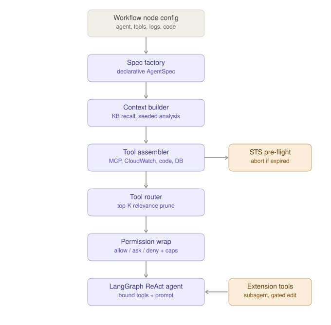
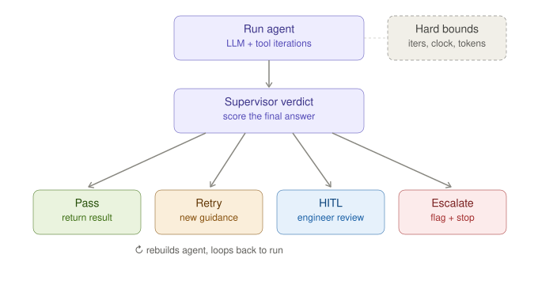

# Agent harness

The agent harness (`agent-api/app/harness`) is the cohesive runtime layer that builds and
runs a **supervised ReAct agent** for agent-style workflow nodes. It is the "agency"
altitude of the platform: the workflow engine decides *what* runs; the harness decides
*how* an agent node runs.

See also: [Architecture overview](architecture.md).

## What it is (and what it deliberately is not)

The harness is a **facade, not a relocation**. `AgentHarness.build_agent` and
`permissions.py` delegate to the original `app.workflow.strategies.react` modules rather
than moving them — relocating `tool_permissions` alone would have churned ~35 importers
for no behavioural gain. New code should depend on `app.harness.*` as the stable entry
point; the `react` internals remain the implementation.

The trade-offs of that choice:

- A few **lazy imports** break import cycles (documented at the top of
  `supervisor_loop.py`).
- A regression suite (`harness_selftest.py`) guards the extraction; accuracy held at 100%
  across the phases 0–4 work.

## Modules

| Module | Role |
|--------|------|
| `__init__.py` | `AgentHarness` facade + module singleton `harness`; re-exports the envelope types |
| `spec.py` | `AgentSpec` — declarative inputs for building an agent (config, capability flags, permission mode, session) |
| `spec_factory.py` | Builds an `AgentSpec` from a workflow node config |
| `context_builder.py` | `build_recall_query` (KB recall block) + `seed_context_blocks` (pre-computed analysis) |
| `tool_assembler.py` | Builds the agent's action space; `add_extension_tools` appends LLM-dependent tools |
| `tool_router.py` | `filter_tools` — top-K relevance pruning of MCP tools |
| `permissions.py` | Re-exports the allow/ask/deny policy, HITL futures, output-cap wrappers |
| `supervisor_loop.py` | `run_supervised` — the bounded retry/score loop |
| `envelopes.py` | `ToolResult` / `NodeOutput` transport envelopes + the uniform output cap |
| `registry_loader.py` | Startup population of the central tool registry, exposed via `GET /api/v1/tools` |

## Build pipeline

An agent node config is turned into a runnable agent through a fixed pipeline:

1. **Spec factory** — `build_agent_spec` distills the node config into a declarative
   `AgentSpec` (one source of truth, replacing duplicated `build_agent` call sites).
2. **Context builder** — prepends institutional memory: a knowledge-base recall block
   (similar past issues / patterns / executable skills) and any seeded analysis the
   executor pre-computed (deterministic CloudWatch synthesis, code analysis,
   anomaly↔code correlation). Both are best-effort — a failure never blocks the run.
3. **Tool assembler** — builds the base action space from MCP, CloudWatch, code-crawler,
   and DB-schema tools. A cheap **STS credential pre-flight** validates AWS credentials
   *before* the LLM is invoked, so an expired session token aborts with a refresh message
   instead of burning a full agent loop.
4. **Tool router** — prunes the live tool set to the top-K most relevant tools for the
   query (a 15–25K-token saving per LLM call on rigs with many MCP servers). "Special"
   tools (CloudWatch / code / DB / SQL families, matched by name prefix) are always kept;
   only open-ended MCP tools are ranked and capped.
5. **Permission wrap** — wraps every tool with the allow / ask / deny policy and a uniform
   output cap. Gated tools (such as `edit_file`) raise an approval request the operator
   must answer.
6. **LangGraph ReAct agent** — `AgentHarness.build_agent` binds the tools and prompt into
   the agent. **Extension tools** (the depth-1 subagent delegate and the gated edit tool)
   are added *after* the LLM exists, because they need the model. The subagent is built
   from a snapshot *without* the delegate tool, so it cannot fan out further.

## Supervisor loop

`run_supervised` is the harness's core orchestration primitive — a behaviour-preserving
extraction of the "run agent → score → retry / HITL / escalate" loop so it is reusable by
any strategy and unit-testable in isolation.

Each iteration:

1. **Run agent** — execute the ReAct agent for the current query, accumulating input/output
   tokens across retries.
2. **Score** — estimate confidence from the final answer and tool calls, then ask the
   supervisor for a verdict.
3. **Act on the verdict:**
   - **Pass** — return the result to the workflow executor.
   - **Retry** — prepend the supervisor's corrective guidance to the original query and
     **rebuild the agent fresh** (it does not carry the failed attempt's state), then loop.
   - **HITL** — pause and emit an engineer-review request carrying the draft answer and
     quality score.
   - **Escalate** — flag the result and stop.

### Hard bounds

Three defensive bounds sit *above* the supervisor's own `max_retries`, so the loop always
terminates no matter what the supervisor returns. Each exhaustion is flagged on the result
rather than thrown:

- an absolute **iteration ceiling** (`max_retries + 1`),
- a **wall-clock deadline**, and
- a cumulative **token budget** across all retries.

## Envelopes and the output cap

`envelopes.py` defines the harness's data contracts:

- **`ToolResult`** — what every tool hands back to the loop: a summary line first, then a
  payload uniformly capped at `DEFAULT_TOOL_OUTPUT_MAX_CHARS` (12,000 chars). The cap
  matters because a tool result is **replayed in message history on every subsequent ReAct
  iteration** — one unbounded CloudWatch dump silently inflates input cost for the whole
  run. Truncation is accuracy-safe: nothing is summarized; the model receives an explicit
  marker telling it how to fetch the rest with a narrower query (`WHERE`/`LIMIT`, date
  range, `name_like`, `drill_down`, or pagination).
- **`NodeOutput`** — the typed envelope a workflow node hands back to the executor, with
  `to_dict` preserving the existing wire shape so adoption is incremental.

## Registry loader

`registry_loader.py` runs at startup and populates the central
`app.core.tool_registry.registry` with built-in and MCP-discovered tools, exposing the
catalog via `GET /api/v1/tools` so the UI and the router share one source of truth.
