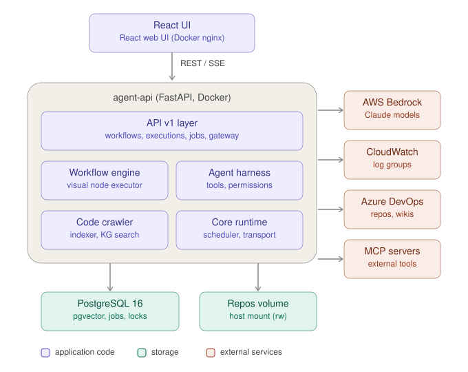
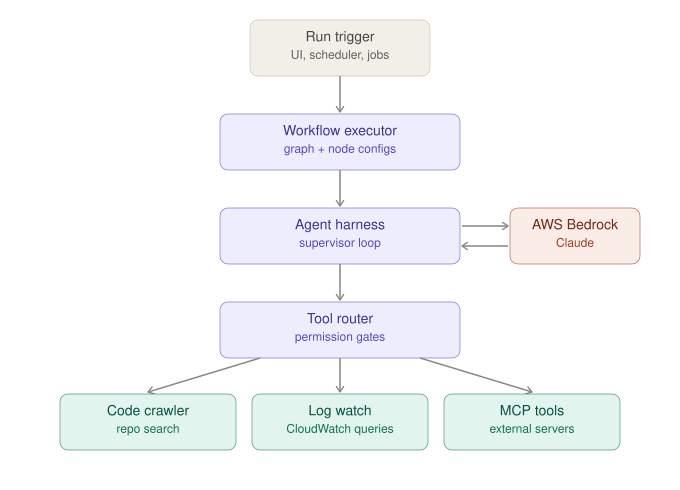

# Architecture overview

This document describes the high-level architecture of the KYC Protect on-call agent
platform: an AI investigation system that helps engineers diagnose production issues by
combining CloudWatch log analysis, code-base search, and a supervised agent loop driven
by AWS Bedrock (Claude).

See also: [Agent harness](agent-harness.md) for the agent runtime in detail.

## System overview

The platform ships as separate Docker containers, wired together by the single
[`docker-compose.yml`](../docker-compose.yml) at the repo root (the only compose
file — there are no per-service compose files):

| Unit | Container | Tech | Role |
|------|-----------|------|------|
| `ui` | `kyc-agent-ui` | React + nginx | Operator console — workflows, chat, dashboards, scheduler |
| `agent-api` | `kyc-agent-api` | FastAPI | Backend — API, workflow engine, agent harness, crawler |
| `postgres` | `kyc-agent-db` | `pgvector/pgvector:pg16` | Relational state, vector embeddings, coordination |

The UI talks to the backend over REST and Server-Sent Events (SSE streams live
execution progress). Backend code is **baked into the Docker image** — there is no hot
reload, so Python changes require `docker compose up -d --build agent-api`.

Host repositories are mounted **read-write** into the container so the crawler can index
them and the permission-gated `edit_file` tool can apply approved fixes — every edit
still requires operator approval through the harness permission gate.

### Backend layers (`agent-api/app`)

| Layer | Path | Responsibility |
|-------|------|----------------|
| API v1 | `app/api/v1/endpoints` | HTTP surface: `workflows`, `executions`, `jobs`, `gateway`, `tools`, plus log-watch, crawler, settings, model/MCP config |
| Workflow engine | `app/workflow`, `app/services/visual_workflow_executor.py` | Resolves the visual node graph and runs nodes (decides *what* runs) |
| Agent harness | `app/harness` | Builds and runs a supervised ReAct agent for agent nodes (decides *how* an agent node runs) |
| Code intelligence | `app/services/codegraph_indexer.py`, `app/workflow/graph_engine` | Background indexing (native codegraph engine) + the generic DAG framework |
| Core runtime | `app/core` | Cross-cutting: scheduler, Bedrock transport, distributed locks, caching, circuit breaker, retries, rate-limit tracking, redaction, telemetry |

### Storage and coordination

PostgreSQL does triple duty:

- **Relational state** — workflows, executions, DB-backed background jobs, model/MCP
  role config, tool-approval records.
- **Vector embeddings** — `pgvector` powers semantic code search.
- **Coordination** — `SKIP LOCKED` job claims plus a pg advisory **leader lock** so the
  scheduler runs single-leader across replicas.

### External integrations

- **AWS Bedrock** — the only LLM provider. Prompt caching uses the native `cachePoint`
  kwarg, not Anthropic `cache_control` blocks.
- **AWS CloudWatch** — log-group queries drive the log-watch investigation tools.
- **Azure DevOps** — repo and wiki clients for source and documentation discovery.
- **MCP servers** — external tool servers discovered at startup and exposed to the agent.

## Workflow execution flow

1. A run is triggered from the UI, the APScheduler-based scheduler, or the DB-backed
   background job queue.
2. The [visual workflow executor](../agent-api/app/services/visual_workflow_executor.py)
   resolves the node graph. It accepts **both schema dialects** (legacy
   `codeAnalyzer`/`data` and the newer `code_search_tool`/`params`) and applies per-node
   model wiring (node-level model gateway, with global Settings as fallback).
3. Agent-style nodes hand off to the **agent harness**, whose supervisor loop iterates
   against Bedrock.
4. Each tool call passes through the **tool router** and permission gates before reaching
   the code crawler, CloudWatch log-watch, or MCP-server tools.
5. Tool results feed back into the loop until the node completes; envelopes normalize the
   results and SSE streams progress back to the UI.

## Notes on structure

- The harness extraction (phases 0–4) gives the repo a clean three-altitude split:
  **orchestration** (workflow engine — what runs), **agency** (harness — how an agent
  node runs), and **capability** (tools/services — the work). Most code paths respect it.
- Code intelligence is the native **codegraph** C engine driven in-process over stdio;
  the generic DAG framework it feeds lives in `app/workflow/graph_engine`. (The old
  Python `app/crawler` package was removed.)
- Cross-cutting concerns live in `app/core` rather than being scattered through the
  services layer, which keeps the services thin. They are grouped into intent-named
  subpackages (`context/`, `llm/`, `aws/`, `concurrency/`, `resilience/`, `runtime/`,
  `observability/`, `quality/`, …) — see the repo-root README's "Repository layout".

## Known caveats

A few structural overlaps are known and tracked (previously enumerated in a
now-removed analysis note; git history preserves the full list):

- **Dual tool-filtering** — the `tool_disclosure` `search_tools`/`call_tool` bridge is
  preferred, but the legacy keyword top-K `tool_router` still exists.
- **Dual planning models** — profile `planning: true` (`write_todos`/`update_todo`) vs
  the markdown plan instructions used by `agent_mode == "multi"`.
- **Tool registry is discovery-only** — the startup catalog documents a
  resolve-from-registry intent that live runs don't yet use; tools are still built
  per-execution in `tool_assembler`.
- **Governance spread across layers** — policy expansion, pseudonymization wrapping and
  policy-engine tool wrapping live partly in strategy and partly in the harness.
