# Architecture & flow

How the platform is built, and what happens between "engineer types a question" and
"evidence-backed answer streams back".

> Companion docs: **[tool-calling.md](tool-calling.md)** for tool-selection accuracy,
> **[features.md](features.md)** for the full feature inventory.

---

## 1. System topology

Three containers wired by the single [`docker-compose.yml`](../docker-compose.yml) at the
repo root, plus two things that run *inside* the API container: the native **codegraph**
C engine (driven in-process over stdio) and any number of **MCP server** subprocesses.

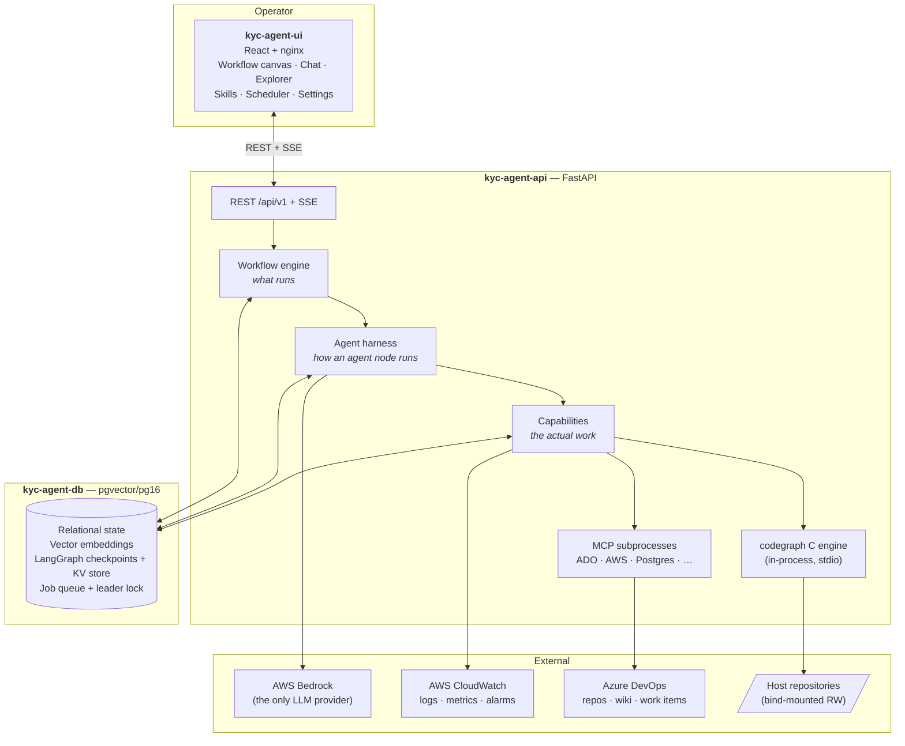

| Unit | Container | Role |
|------|-----------|------|
| `ui` | `kyc-agent-ui` | Operator console — workflow canvas, chat, codebase explorer, skills, scheduler, settings |
| `agent-api` | `kyc-agent-api` | API, workflow engine, agent harness, code intelligence, MCP client |
| `postgres` | `kyc-agent-db` | Relational state, `pgvector` embeddings, LangGraph checkpoints + KV store, coordination |

Backend code is **baked into the image** — no hot reload. Python changes require
`docker compose up -d --build agent-api`.

Host repositories are mounted **read-write** so codegraph can index them and the
approval-gated `edit_file` tool can apply fixes. Every edit still passes the permission
gate.

### Postgres does quadruple duty

- **Relational state** — workflows, executions, chat sessions, agent profiles, model/MCP
  role config, tool-approval records, trajectory events.
- **Vector + FTS memory** — `pgvector` for semantic code search; Postgres FTS for the
  OKF knowledge bundle and the pinned/semantic memory banks.
- **Agent runtime** — LangGraph checkpointer (HITL pause/resume, partial-state recovery)
  and the `store` KV table (durable tool results).
- **Coordination** — `SKIP LOCKED` job claims + a pg advisory **leader lock** so the
  scheduler runs single-leader across replicas.

---

## 2. The three altitudes

The repo enforces a strict separation. Knowing which altitude you're at tells you which
module owns a behaviour.

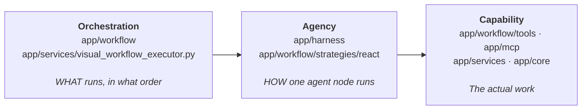

| Layer | Path | Responsibility |
|-------|------|----------------|
| API v1 | `app/api/v1/endpoints` | `workflows`, `executions`, `sessions`, `jobs`, `gateway`, `tools`, `skills`, `codegraph`, `trajectories`, `settings`, `log_watch`, `improvement`, `wiki`, … |
| Workflow engine | `app/workflow`, `app/services/visual_workflow_executor.py` | Node-graph resolution, DAG scheduling, per-node handlers |
| Agent harness | `app/harness` | Spec → prompt → action space → LangGraph agent → bounded run |
| Strategy | `app/workflow/strategies/react` | The 3-phase run: `preflight` → `executor` → `finalizer` |
| Code intelligence | `app/services/codegraph_indexer.py`, `app/core/code_semantic` | Native codegraph indexing + ONNX semantic code search |
| Core runtime | `app/core` | Cross-cutting, grouped by intent: `context/`, `llm/`, `aws/`, `tools/`, `quality/`, `policy/`, `privacy/`, `memory/`, `skills/`, `resilience/`, `concurrency/`, `observability/`, `runtime/`, `vfs/`, `sandbox/`, `supervision/`, `governance/`, `transport/` |

---

## 3. End-to-end flow

One question, start to finish.

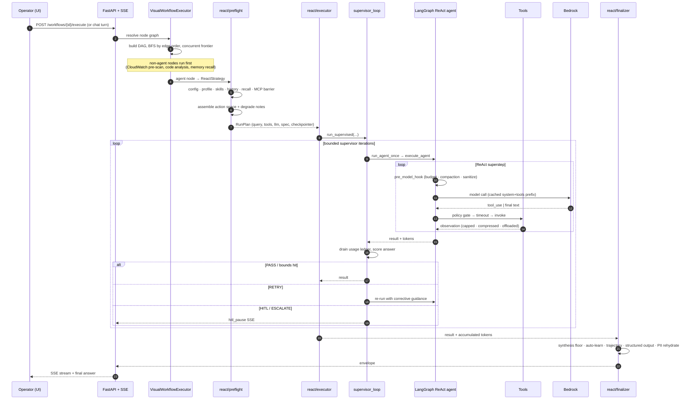

### Triggers

A run starts from one of three places, all converging on the same executor:

- the **UI** (workflow execute, or a chat turn),
- the **scheduler** (`app/core/runtime/scheduler.py`, APScheduler behind a pg advisory
  leader lock so only one replica fires),
- the **DB-backed job queue** (`SKIP LOCKED` claim in `app/services/background_jobs.py`).

### Workflow DAG scheduling

[`app/workflow/executor/graph.py`](../agent-api/app/workflow/executor/graph.py) builds an
adjacency list + in-degree map and walks it breadth-first, running each frontier
concurrently. Nodes that never become runnable raise `WorkflowDeadlockError` naming the
stranded ids rather than silently vanishing. Per-node wall-clock budget is **300 s**, and
**900 s** for `agent` nodes (`WORKFLOW_NODE_TIMEOUT_SECONDS` /
`WORKFLOW_AGENT_NODE_TIMEOUT_SECONDS`).

Node handlers live in `app/workflow/executor/handlers/`:

| Node | Handler | What it contributes |
|------|---------|---------------------|
| `agent` | `agent.py` | The ReAct run itself |
| `language_model` | `language_model.py` | Model wiring (`lm::name` ports) |
| `cloudwatch` | `cloudwatch.py` | Deterministic pre-scan → seeded context block + live tools |
| `code_analyzer` | `code_analyzer.py` | Repo selection → codegraph + repo file tools |
| `mcp_server` | `mcp_server.py` | Connect an MCP server, expose its tools |
| `tool` | `tool.py` | Per-node tool filter / pinning |
| `database` | `database.py` | `db_server_map` → `db_*` schema tools |
| `vector_memory` | `vector_memory.py` | Which memory tiers are active |
| `subagent_window` | `subagent_window.py` | Named specialists reachable via `delegate_to_*` |
| `batch_agent` | `batch_agent.py` | Fan-out over a collection |
| `orchestrator`, `scheduler`, `wiki` | … | Control flow, cron, ADO wiki publish |

The executor accepts **both schema dialects** (legacy `codeAnalyzer`/`data` and the newer
`code_search_tool`/`params`), so old saved workflows keep running.

---

## 4. Phase 1 — Preflight

[`app/workflow/strategies/react/preflight.py`](../agent-api/app/workflow/strategies/react/preflight.py)
turns a node graph plus a user message into a `RunPlan`. It is where almost all of the
platform's "be smart before spending a token" logic lives.

```mermaid
flowchart TD
    Q["User query + workflow"] --> CFG["Extract agent config<br/>merge subagents node<br/>merge DB agent profile"]
    CFG --> SLASH{"starts with<br/>/skill-name?"}
    SLASH -->|yes| EXP["Expand runbook inline<br/>(record invoked skill)"]
    SLASH -->|no| CONV
    EXP --> LLMC
    CONV{"is_conversational?<br/>(greeting / thanks /<br/>'what can you do')"}
    CONV -->|yes| FAST["<b>Conversational fast-path</b><br/>one tiny tool-less call<br/>~28K tokens saved on 'Hi'"]
    FAST --> RET(["EarlyReturn"])
    CONV -->|no| LLMC["Resolve LLM config<br/>+ tools config<br/>(wired nodes ▸ gateway defaults)"]

    LLMC --> HIST["Rebuild tool-inclusive<br/>chat history<br/>(if Memory node has 'session')"]
    HIST --> REFS["Expand @file / @folder<br/>/ @url / @git references"]

    subgraph PAR1["concurrent"]
        RECALL["build_recall_query<br/>pinned ▸ semantic ▸ KB ▸ skill map<br/>under memory_turn_token_budget"]
        BARRIER["MCP pre-connect barrier<br/>(beats the cold-start race)"]
    end

    subgraph PAR2["concurrent"]
        ASM["assemble_base_tools<br/>MCP + CloudWatch + codegraph<br/>+ repo files + db_* → disclosure"]
        CRED["collect_backend_degradations<br/>per-provider credential probes"]
    end

    REFS --> PAR1
    PAR1 --> PAR2
    PAR2 --> GATE{"anything<br/>buildable?"}
    GATE -->|"nothing built, or<br/>model creds dead"| ABORT(["EarlyReturn:<br/>refresh credentials"])
    GATE -->|yes| NOTICE["Fold degrade notes into<br/><b>[System notice]</b> on the user turn"]

    NOTICE --> ANCHOR["Time anchor<br/><i>only if cloudwatch_* bound</i>"]
    ANCHOR --> SEED["Seed pre-computed blocks<br/>CloudWatch · code · memory"]
    SEED --> PII["Bind PII vault<br/>pseudonymize the query"]
    PII --> SKILLT["Bind skill / search_skills<br/><i>only if library non-empty</i>"]
    SKILLT --> EXT["add_extension_tools<br/>delegate · edit · todos · fs_*<br/>subagents · sandbox · verify<br/>read_tool_result · offload wrap"]
    EXT --> MM["Metamemory hydrate + seed<br/>+ resumed-state block"]
    MM --> WRAP["Wrap tools with pseudonymization"]
    WRAP --> SPEC["AgentSpec + policy expansion<br/>+ checkpointer"]
    SPEC --> PLAN(["RunPlan"])
```

Three design rules run through this phase:

**Degrade, never abort.** Every builder in
[`tool_assembler.py`](../agent-api/app/harness/tool_assembler.py) is independently
try/except'd. A dead CloudWatch credential, a codegraph engine that won't start, or a
crashed MCP subprocess removes *that family* and appends a note to `degraded`. The turn is
only short-circuited when **zero** tools built, or the model's own credentials are
confirmed dead. This is why an expired AWS session no longer blocks a pure-database
question.

**Tell the model what's missing.** `degraded` notes become a `[System notice]` prefix on
the user turn — "CloudWatch/log tools are unavailable this turn (AWS credentials
expired…)" — so the model routes around the gap instead of discovering it by calling a
tool that was never bound.

**Everything per-run goes in the user turn, never the system prompt.** The time anchor,
degrade notices, recalled memory, skill map and seeded analysis blocks are all appended to
the query. The system prompt stays byte-stable so the Bedrock cache prefix survives — see
[tool-calling.md § prompt caching](tool-calling.md#7-the-cache-contract).

---

## 5. Phase 2 — Build & run

### 5.1 Building the agent

[`react_agent.build_agent`](../agent-api/app/harness/react_agent.py) composes the prompt,
prepares the governed action space, and compiles a
`langgraph.prebuilt.create_react_agent` graph.

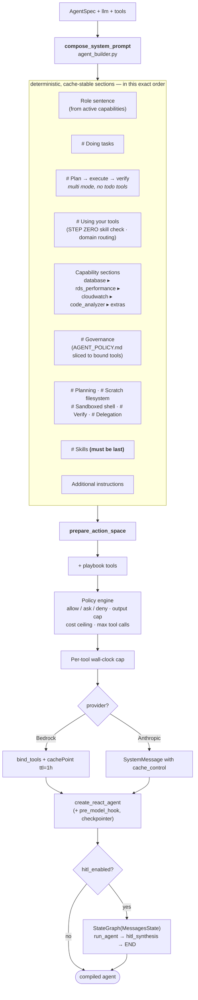

Two invariants worth knowing:

- **Never name a tool the agent doesn't have.** Each prompt section is gated on the tool
  actually being in the final bound list (`has_cloudwatch_tools`, `has_verify_tool`,
  `has_search_tools`, …), not on the operator's intent to enable it. Otherwise a degraded
  run would carry thousands of tokens describing tools that aren't in the schema list.
- **`# Skills` must be the last platform section.** Measured: when it preceded the
  capability sections, "prefer `codegraph__find_symbol`" beat "load the matching skill
  first" 8/8 times. Recency is what binds it.

### 5.2 The ReAct superstep

Every model call passes through `_pre_model_hook`. This is the one place that runs before
*every* LLM invocation, so all per-turn governance lives there.

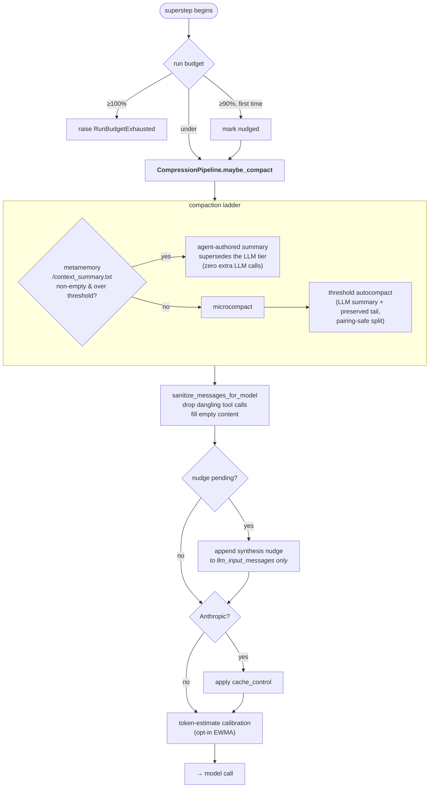

The nudge and compaction ride `llm_input_messages` — the **model view only** — never the
persisted graph state, so checkpointing and HITL resume are unaffected.

### 5.3 The recovery ladder

[`agent_runner.execute_agent`](../agent-api/app/harness/agent_runner.py) is mostly a
ladder of honest failure modes. Every rung produces a *labelled partial answer* rather
than an error or a half-thought passed off as a conclusion.

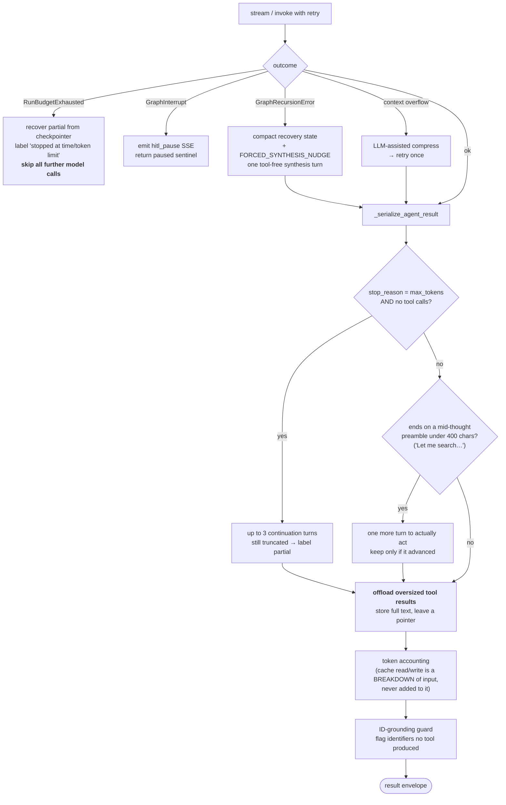

### 5.4 The supervisor loop

[`supervisor_loop.run_supervised`](../agent-api/app/harness/supervisor_loop.py) is the
**quality** supervisor: it runs *after* a turn and grades the answer. (It is distinct from
the **Action Supervisor**, which gates individual write-class actions *before* they
execute.)

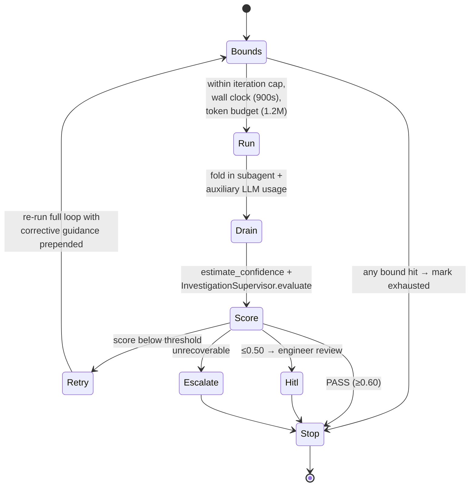

Bounds are **defensive and independent** of the supervisor's own `max_retries`: an
absolute iteration ceiling, a wall-clock deadline, and a cumulative token budget. A RETRY
re-runs the entire ReAct loop — roughly a 2× token multiplier — so it is logged at WARNING
with the score breakdown that triggered it.

---

## 6. Context & token management

Four independent mechanisms keep a long investigation inside the window. They compose;
none of them is the whole answer.

```mermaid
flowchart LR
    subgraph IN["Inbound — what enters context"]
        A1["Per-turn memory budget<br/>memory_turn_token_budget = 800"]
        A2["Skill map: names only<br/>skill_map_char_budget = 1500"]
        A3["Tool map: names only<br/>tool_map_char_budget = 2000"]
        A4["Seeded analysis blocks<br/>cap_context_block"]
    end
    subgraph OBS["Observation-side — what a tool returns"]
        B1["MCP self-cap 8000 chars"]
        B2["Policy output cap 16000"]
        B3["Compression sidecar<br/>(JSON yes, prose/code no)"]
        B4["VFS offload > 6000 chars<br/>→ handle + preview"]
    end
    subgraph LOOP["In-loop — as history grows"]
        C1["metamemory summary<br/>supersedes LLM summary"]
        C2["microcompact"]
        C3["threshold autocompact"]
        C4["reactive compact<br/>on overflow error"]
    end
    subgraph OUT["Across turns — what persists"]
        D1["tool_result_store<br/>full text in pg KV"]
        D2["trajectory keeps a pointer<br/>+ 600-char preview"]
        D3["read_tool_result(handle)<br/>fetches the original bytes"]
        D4["chat session compaction"]
    end
    IN --> LOOP
    OBS --> LOOP
    LOOP --> OUT
```

**Why the store matters.** Tool results used to be cut to 2,000 chars *at write time* into
`executions.trajectory` — which is exactly what a follow-up chat turn replays from. The cut
destroyed the evidence before the read-side budget could see it, so turn 2 of "now check
the logs" started blind and re-derived everything. Storing the full text and replaying a
pointer made replay both **recoverable** and **cheaper** (≈300 chars vs 2,000).

**Token accounting, correctly.** `input_tokens` is the *whole* prompt.
`cache_read_tokens` and `cache_creation_tokens` are a **breakdown of it**, not counters to
add to it. Three call sites once did the addition; the run token budget consequently
stopped runs at roughly half their real budget. See
[`app/core/observability/cache_metrics.py`](../agent-api/app/core/observability/cache_metrics.py)
for the live-Bedrock evidence.

**Subagent tokens are counted.** A delegated child runs under its own execution id and its
own callback, so its usage is invisible to the parent. The
[usage ledger](../agent-api/app/harness/usage_ledger.py) — a ContextVar **mutated in
place**, never re-`set` (a `.set()` is lost across `asyncio.wait_for`) — collects child and
auxiliary (compaction, grader, extractor) usage, and the supervisor loop drains it after
every turn. Without it, a measured run reported 119K tokens against ~1.05M actually spent.

---

## 7. Delegation & multi-agent

A single factory — [`subagent_factory.py`](../agent-api/app/harness/subagent_factory.py) —
builds every `delegate_*` tool, so there is one LLM-resolution path, one tool-scoping path
and one result envelope.

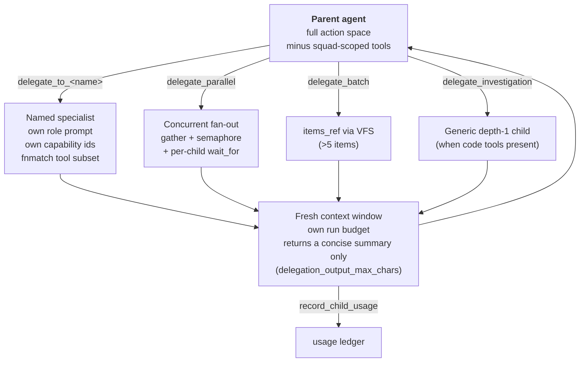

**Strict squad scoping.** A tool matched by a specialist's glob is stripped from the
*parent's* own list — reachable only through that child. `delegate_*` tools and wildcard
(`*`) defs are never stripped.

**Model precedence** (explicit signals only, in order): global
`SUBAGENT_MODEL_OVERRIDE` → per-def `model` (or the `"inherit"` sentinel) → **the parent's
LLM** → the global `subagent` model role. Step 3 is the default, which is how a workflow's
wired Language Model node reaches its children.

Bounds: `DELEGATION_MAX_DEPTH=1`, `DELEGATION_MAX_CONCURRENT=3`,
`DELEGATION_CHILD_TIMEOUT_SECONDS=240`, `DELEGATION_OUTPUT_MAX_CHARS=8000`, plus a CSV
`DELEGATION_BLOCKED_TOOLS` fnmatch list always subtracted from children. There is
deliberately **no** fire-and-forget delegation mode — an earlier async-handle registry
leaked task handles across runs and was removed.

---

## 8. Governance & safety

Five gates, layered, each with a different job.

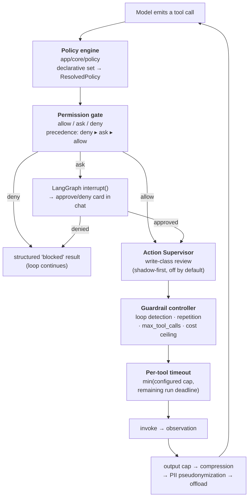

- **Mutation classification is dynamic.** Beyond the name patterns
  (`edit_file`, `*_write`, `*_delete`, `run_command`, …), an unknown MCP tool is classified
  by its MCP read-only/destructive annotation, then as a last resort by whole-word mutation
  verbs matched against the leaf name. Read verbs (`get`/`list`/`search`/`describe`/
  `query`/`fetch`/`read`) are never caught. So a newly-wired server is gated without a code
  change and without hardcoding any server name.
- **Modes:** `default` (rules apply), `auto_allow` (skip ask prompts), `plan` (dry-run
  preview — risky tools stay `ask`).
- **PII pseudonymization** binds a per-run vault, swaps entities for stable placeholders in
  everything bound for the model, scrubs tool output through the same vault, and rehydrates
  the final answer on the way out.
- **Governance text** is sliced from [`AGENT_POLICY.md`](../agent-api/AGENT_POLICY.md) down
  to the rules matching this run's bound tools, and injected as a `# Governance` section —
  empty (a no-op) when nothing matches.

---

## 9. Streaming & observability

SSE event types are defined in
[`app/workflow/event_schema.py`](../agent-api/app/workflow/event_schema.py):

| Group | Events |
|-------|--------|
| Workflow lifecycle | `workflow_started`, `workflow_completed`, `workflow_failed` |
| Node lifecycle | `node_started`, `node_completed`, `node_failed` |
| Agent streaming | `llm_token`, `tool_call`, `tool_result`, `agent_error`, `agent_complete` |
| Human-in-the-loop | `hitl_pause`, `hitl_approved`, `hitl_rejected` |
| Cost | `cost_update`, plus live `token_usage_delta` |
| Meta | `stream_end`, `heartbeat` |

`tool_call` events carry an `agent` field so the chat can attribute a call to the parent or
to a specific delegated child, and the stream callback is tagged with the resolved model
name per event.

Per-run telemetry surfaced in the result envelope: `stop_reason`, `truncated`,
`did_forced_synthesis`, `verify_pending`/`verify_last_passed`, `ungrounded_ids`,
`subagent_usage` (per-child, most expensive first), `auxiliary_usage` (by source),
`compression_stats` (including `skipped_uncompressible` — the sidecar answers 200 OK and
hands text straight back for content it can't shrink, so "enabled" tells you nothing about
whether it did anything).

---

## 10. Known structural notes

- **Two disclosure modes coexist by design.** `legacy` (all-or-nothing threshold defer) is
  the default; `window` (per-assembly ranked budget) is opt-in and is a measured no-op
  below the same threshold. See [tool-calling.md](tool-calling.md).
- **Two planning mechanisms, mutually exclusive by construction.** Profile
  `planning: true` binds `write_todos`/`update_todo` and emits `# Planning`; the markdown
  checklist section is the fallback for `agentMode == "multi"` agents *without* todo tools.
  The prompt never emits both.
- **Tool registry is discovery-only.** The startup catalog documents intent; live runs
  still build tools per-execution in `tool_assembler`.
- **`evals/` is not in the production image.** Run accuracy evals on the host (`PYTHONUTF8=1`)
  or copy them into the container.
