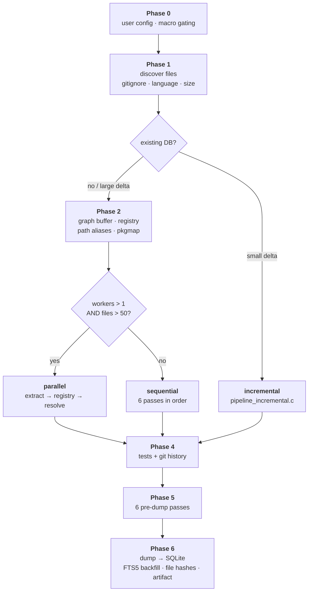
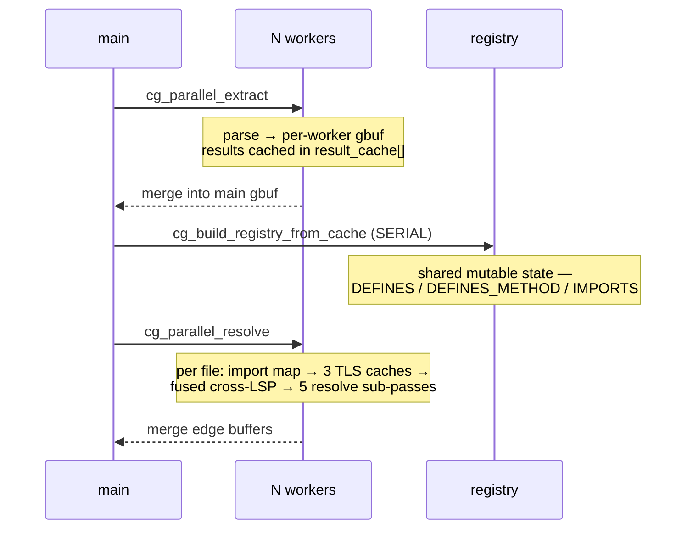
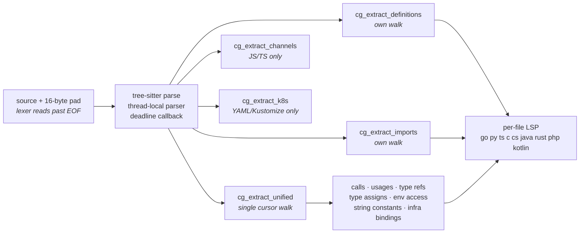

# codegraph — the code-intelligence engine

A clean-room code-intelligence engine written in C, living in [`codegraph/`](../codegraph)
and shipped as an MCP server over stdio. It parses a repository with tree-sitter,
resolves symbols into a property graph, persists that graph to SQLite, and serves it to
the agent as 20 MCP tools.

It is the platform's **only** code-intelligence backend (the Python crawler was deleted),
and it is the thing behind every `codegraph__*` tool the agent calls.

## Contents

| Section | What it covers |
|---------|----------------|
| [Process shape](#1-process-shape) | Entry points, threads, shutdown |
| [MCP layer](#2-mcp-layer) | The 20 tools, project resolution |
| [Indexing pipeline](#3-indexing-pipeline) | The six phases, parallel vs sequential |
| [Per-file extraction](#4-per-file-extraction) | tree-sitter → definitions, calls, imports, LSP |
| [Symbol resolution](#5-symbol-resolution) | The strategy chain — the accuracy-critical part |
| [Storage](#6-storage) | Schema, node labels, edge types |
| [Query path](#7-query-path) | BM25, Cypher, semantic, traversal |
| [Incremental re-index](#8-incremental-re-index) | Change detection and its deliberate gaps |
| [Platform integration](#9-platform-integration) | How agent-api spawns and governs it |

---

## 1. Process shape

[`src/main.c`](../codegraph/src/main.c) supports four modes:

| Invocation | Behavior |
|------------|----------|
| `codegraph serve` | MCP server, JSON-RPC 2.0 over stdin/stdout — **how the platform uses it** |
| `codegraph cli <tool> <json>` | Run one tool call, print the result, exit |
| `codegraph --version` / `--help` | Info |
| `--ui=true --port=N` | Optional embedded HTTP UI on a background thread (persisted) |

Two background threads may run alongside the MCP read loop: a **git watcher**
([`monitor/watcher.c`](../codegraph/src/monitor/watcher.c)) polling for changes, and the
**web UI** ([`webui/http_server.c`](../codegraph/src/webui/http_server.c)).

Shutdown is idempotent and async-signal-safe. SIGTERM/SIGINT and a parent-death watchdog
both call `request_shutdown()`, which does only atomic stores: it cancels any in-flight
pipeline through a flag the pass loop polls, stops the background servers, and closes
stdin to unblock the reader.

`cg_alloc_init()` binds the SQLite and libgit allocators to **mimalloc** before any of
them initialize — it must be the first call in `main`.

---

## 2. MCP layer

[`src/server/mcp.c`](../codegraph/src/server/mcp.c) holds a static `TOOLS[]` table of
**20 tools** with inline JSON schemas, served through `initialize` / `tools/list` /
`tools/call`.

| Kind | Tools |
|------|-------|
| Write | `index_repository`, `delete_project`, `manage_adr`, `ingest_traces` |
| Search | `search_graph`, `search_code`, `search_semantic`, `find_symbol`, `find_similar` |
| Graph | `query_graph`, `trace_path`, `get_architecture`, `get_graph_schema`, `list_routes` |
| Read | `get_code_snippet`, `symbol_history`, `get_layout` |
| Admin | `list_projects`, `index_status`, `detect_changes`, `engine_status` |

Each project gets its own SQLite file, resolved from `CODEGRAPH_DB` or the cache
directory as `<project>.db`. Project names are sanitized by `cg_project_name_from_path()`
to `[A-Za-z0-9._-]` — every other byte becomes `-`, consecutive dashes and dots collapse,
and leading dots/dashes are trimmed. This matters: the store-open validator rejects
anything else, so a repo path like `/home/u/my project` would otherwise index fine and
then report project-not-found on every query.

---

## 3. Indexing pipeline

[`src/indexer/pipeline.c`](../codegraph/src/indexer/pipeline.c) → `cg_pipeline_run()`.



Four index modes gate work throughout: `FULL`, `MODERATE`, `FAST`, `ADVANCED`.

### Phase 0 — configuration

`cg_userconfig_load()` reads per-repo extension overrides (fail-open — NULL on error).
`cg_set_macro_extraction()` enables C/C++ `#define` Macro nodes **only in FULL mode**;
they were ~49% of all nodes on the Linux kernel, so moderate and fast skip them entirely.

### Phase 1 — discovery

[`walker/discover.c`](../codegraph/src/walker/discover.c) walks the tree honoring, in
layers: hardcoded skip-dirs, the repo `.gitignore`, nested `.gitignore` files, the global
gitignore, and `.cgignore` (which can *un*-ignore paths). It then filters by extension →
language and by `max_file_size`. Non-FULL modes skip additional directories and file
classes.

Excluded subtrees are recorded on the pipeline so the MCP layer can report *which*
directories were skipped rather than silently returning a thin graph.

### Phase 2 — staging structures

| Structure | File | Role |
|-----------|------|------|
| `cg_gbuf_t` | [`staging/graph_buffer.c`](../codegraph/src/staging/graph_buffer.c) | The in-memory graph. Nodes are individually heap-allocated so pointers stay stable across array growth; indexed by QN, by label, and edges by (source,type) and (target,type). |
| `cg_registry_t` | [`indexer/registry.c`](../codegraph/src/indexer/registry.c) | Symbol table: `exact` (QN → label) plus `by_name` (simple name → QN array). |
| path aliases | [`indexer/path_alias.c`](../codegraph/src/indexer/path_alias.c) | tsconfig/jsconfig `paths` mappings. NULL for non-TS projects, which then pay nothing. |
| pkgmap | [`indexer/pass_pkgmap.c`](../codegraph/src/indexer/pass_pkgmap.c) | Monorepo manifests, so a workspace import like `@my/pkg` resolves to its target Module. |

### Phase 3 — extraction

**Parallel path** ([`pass_parallel.c`](../codegraph/src/indexer/pass_parallel.c)), taken
when `worker_count > 1 && file_count > 50`:



The three thread-local per-file caches exist because resolution dominates CPU on large
repos: a reachability memo, an import-map prefix hash, and a full resolve-result memo.
All three are opened at file entry and closed at file exit — their correctness depends on
that lifecycle, since imports and class scope change between files.

Cross-file LSP is skipped when the file has no calls, or when every call is already
resolved — the AST cannot yield anything new in either case.

The five resolve sub-passes, in order: **calls → usages → throws → reads/writes →
semantic**.

**Sequential path** — six passes in order:
`definitions → k8s → lsp_cross → calls → usages → semantic`, followed by infra-route and
infra-binding extraction.

> **Both paths emit edges through the same `cg_pp_emit_service_edge`.** They previously
> diverged — the sequential path carried a reduced classifier — and because path choice is
> purely a file-count threshold, an ordinary one-file incremental re-index silently
> produced a graph missing gRPC/GraphQL/tRPC edges.

### Phase 4 — tests and git history

`pass_tests` links tests to their subjects. `pass_githistory` computes change-coupling and
per-file churn on a separate compute thread (it never touches the gbuf), then applies the
result on the main thread.

### Phase 5 — pre-dump passes

Run over the completed graph buffer:

| Pass | Produces | Skipped in FAST |
|------|----------|-----------------|
| `decorator_tags` | decorator-derived tags | no |
| `configlink` | config ↔ code links | no |
| `route_match` | client calls ↔ server handlers | no |
| `similarity` | `SIMILAR_TO` via MinHash/LSH | **yes** |
| `semantic_edges` | `SEMANTICALLY_RELATED` | **yes** |
| `complexity` | transitive loop depth, recursion flags | no |

The two skipped-in-FAST passes still run in FULL, MODERATE **and** ADVANCED — the check is
an explicit `== CG_MODE_FAST`, not `> CG_MODE_MODERATE`, so ADVANCED (numerically 3) is
not mistaken for a lighter mode.

### Phase 6 — dump

`cg_gbuf_dump_to_sqlite()` writes nodes and edges. Then file hashes are persisted for the
next incremental run, the ADR captured before the dump is restored, and **FTS5 is
backfilled** with `cg_camel_split()` applied to both `name` and `qualified_name` so
camelCase subtokens match dotted and nested identifiers.

Node and edge counts are captured *before* the dump — dumping releases the gbuf indexes,
after which the counters read zero.

---

## 4. Per-file extraction

[`src/parser/cg.c`](../codegraph/src/parser/cg.c) → `cg_extract_file()`.



Everything allocates from a per-result **arena**, so freeing the result frees every string
at once. Grammars are `dlopen`'d from `languages.so`. A 5 MB extraction budget and a parse
deadline bound worst-case files.

The per-language **LSP resolvers** ([`parser/lsp/`](../codegraph/src/parser/lsp)) are the
type-aware layer: they track receiver types, walk superclasses and interfaces, and emit
`resolved_calls` entries that **outrank** textual resolution downstream.

---

## 5. Symbol resolution

[`indexer/registry.c`](../codegraph/src/indexer/registry.c). This is the accuracy-critical
part of the engine.

Every FQN is `project.dir.parts.Class.name` ([`fqn.c`](../codegraph/src/indexer/fqn.c)).
`__init__.py` and `index.ts` segments collapse when a symbol name is present.

For each call, strategies run in priority order — **first hit wins**:

| # | Strategy | Conf | Condition |
|---|----------|------|-----------|
| — | **LSP override** | from LSP | a type-aware resolver already answered |
| 1 | `import_map` | 0.95 | callee prefix matches an import; exact QN exists |
| 1 | `import_map_suffix` | 0.85 | probes the by-name index, tail-checks candidates |
| 1.5 | `self_scope` | 0.97 | `self.m()` / `this.m()` → the enclosing type's member |
| 2 | `same_module` | 0.90 | `module_qn.callee` exists |
| 2.5 | `class_scope` | 0.88 | bare `m()` inside a type body → that type's member |
| 3.5 | `qualified_suffix` | 0.90 | a qualified callee uniquely matches one candidate's full tail |
| 3 | `unique_name` | 0.75 | exactly one candidate project-wide |
| 4 | `suffix_match` | 0.55 | many candidates → filter by import reachability, then score |

### Why the scope strategies exist

Two classes in one file, each with a `validate()`, and each `save()` calling
`self.validate()`. Without scope, both fall through to bare-name scoring, which scores
every same-name candidate identically — same module prefix, neither a test — and returns
whichever was registered first. **Both call sites wire to the same `validate()`**: a hard
0.50 precision ceiling that has nothing to do with grammar versions.

The scope comes free from `enclosing_func_qn` (`proj.svc.UserService.save` → parent is the
type QN) via `cg_pipeline_parent_qn()`. The registry checks the parent is a registered
`Class`/`Interface` before either strategy fires, so passing a module QN for a top-level
function is a safe no-op.

Two placements are deliberate:

- **`self_scope` runs before `same_module`** — `self.validate()` must never bind to a
  module-level `validate`.
- **`class_scope` runs after `same_module`**, on exact hits only, and only for unqualified
  callees. A module-level definition still wins where that is the language rule (Python);
  for a qualified callee with a non-self receiver, the enclosing type says nothing.

The per-file resolve memo is keyed on **`(class_qn, callee_name)`**, not `callee_name`
alone. `class_qn` varies *within* a file, so a name-only key would hand the first class's
answer to every later class and silently defeat both strategies.

### Strategy 4 scoring

Candidates are filtered by import reachability — a segment-boundary ancestor/descendant
relation, so `proj.user` does not "reach" `proj.users` — then scored by test-scope
deprioritization (segment-aware: `UserServiceTest` yes, `getLatestVersion` no) plus
namespace proximity. Confidence scales down with candidate count.

Names with **more than 256 candidates** bail out entirely. On the Linux kernel, 274 such
names (`list_head` at 7188, `flags` at 5520, …) accounted for ~900s of 987s of resolve CPU,
and their confidence floor was already ~0.006 — the edges were noise.

A Perl-specific guard drops weak short-name matches for builtins (`push`/`shift`/`keys`)
and method calls, keeping the high-confidence import/same-module hits so a genuine
same-file call to a builtin-named sub still resolves.

---

## 6. Storage

[`graphdb/store.c`](../codegraph/src/graphdb/store.c). One SQLite file per project.

```sql
projects(...)                                    -- registry of indexed projects
file_hashes(project, rel_path, mtime, size)      -- incremental change detection
nodes(id, project, label, name, qualified_name,
      file_path, start_line, end_line, properties)   -- properties = JSON
edges(source_id, target_id, type, properties)
project_summaries(...)
nodes_fts USING fts5(name, qualified_name, label, file_path)   -- contentless
```

Indexes cover `(project,label)`, `(project,name)`, `(project,file_path)`, both edge
directions by type, and a generated `url_path_gen` column for route matching.

**Node labels** — `Project`, `Folder`, `File`, `Module`, `Package`, `Branch`, `Function`,
`Method`, `Class`, `Interface`, `Variable`, `Field`, `Route`, `Channel`, `Decorator`,
`EnvVar`, `Resource`, `Chart`

**Edge types**

| Group | Types |
|-------|-------|
| Structure | `DEFINES`, `DEFINES_METHOD`, `IMPORTS` |
| Call graph | `CALLS`, `USAGE`, `READS`, `WRITES`, `THROWS` |
| Type graph | `INHERITS`, `IMPLEMENTS`, `OVERRIDE`, `DECORATES` |
| Service | `HTTP_CALLS`, `ASYNC_CALLS`, `GRPC_CALLS`, `GRAPHQL_CALLS`, `TRPC_CALLS`, `HANDLES` |
| Derived | `TESTS`, `CONFIGURES`, `DATA_FLOWS`, `SIMILAR_TO`, `SEMANTICALLY_RELATED`, `INFRA_MAPS` |
| Cross-repo | `CROSS_HTTP_CALLS`, `CROSS_ASYNC_CALLS`, `CROSS_GRPC_CALLS`, `CROSS_GRAPHQL_CALLS`, `CROSS_TRPC_CALLS`, `CROSS_CHANNEL` |

---

## 7. Query path

| Tool | Mechanism |
|------|-----------|
| `search_graph` | BM25 over FTS5 with camelCase splitting, plus structured filters (`label`, `name_pattern`, `qn_pattern`), optional `include_connected`, and offset/limit pagination |
| `query_graph` | A real Cypher subset ([`cql/cypher.c`](../codegraph/src/cql/cypher.c)): `MATCH` with relationship patterns, `WHERE`, `RETURN` with `COUNT`/`ORDER BY`/`LIMIT`/`DISTINCT` |
| `search_semantic` | Deterministic TF-IDF + co-occurrence embeddings ([`vectors/semantic.c`](../codegraph/src/vectors/semantic.c)) — random indexing over a pretrained token map, multi-threaded corpus build |
| `trace_path` | Directional call-graph traversal (`callers`/`callees`/`both`) with depth, edge-type filtering, and a data-flow mode following `CALLS` + `DATA_FLOWS` |
| `get_code_snippet` | Reads the source range off the node |
| `find_similar` | Walks `SIMILAR_TO` edges from the MinHash/LSH pass |

**Cypher is read-only by construction.** `CREATE`, `DELETE`, `DETACH DELETE`, `SET` and
`REMOVE` are each rejected with an explicit "write operations not supported" error rather
than being parsed and ignored.

**Semantic search degrades cleanly.** With `CODEGRAPH_EMBED_URL` unset it uses the
deterministic backend and needs no model. Point it at an OpenAI-compatible
`/v1/embeddings` endpoint and it fuses the neural and deterministic rankings with
**Reciprocal Rank Fusion**. `engine_status` reports which backend is live.

`get_code_snippet`'s tool description explicitly tells the agent to call `search_graph`
first to obtain a qualified name — the two-step is intentional, not an accident of the
schema.

---

## 8. Incremental re-index

[`indexer/pipeline_incremental.c`](../codegraph/src/indexer/pipeline_incremental.c).

1. Compare current files against stored `file_hashes` (mtime + size).
2. Classify as unchanged / changed / new / **truly deleted**. Deletion requires an actual
   `stat()` returning ENOENT or ENOTDIR — otherwise a mode-skipped directory would be
   mistaken for a deletion and purge everything under it.
3. Purge deleted files' nodes and drop their hash rows.
4. Re-extract and re-resolve **changed files only** — parallel above 50 changed files,
   sequential below, which is the common case.
5. Rebuild the registry from existing graph nodes so incremental resolution picks the same
   targets a full re-index would.
6. Run post-passes, dump.

**Cross-file LSP is deliberately skipped in incremental mode.** It needs the whole
project's definitions, not a changed slice, so it is deferred to the next full re-index.
Per-file LSP still runs.

---

## 9. Platform integration

The binary is baked into the agent-api image — `agent-api/Dockerfile` runs
`COPY --from=codegraph:latest …` in the runtime-full stage, `rebuild-docker.sh` builds
`codegraph:latest` first, and the image carries `git` for `detect_changes` and
`symbol_history`. `CODEGRAPH_DB=/app/data/codegraph.db` persists the index on the data
volume.

It is registered as a stdio MCP server from a DB row (`MCPServerModel`):

```json
{
  "name": "codegraph",
  "command": "/usr/local/bin/codegraph",
  "args": ["serve"],
  "env": {},
  "enabled": true,
  "description": "Code-intelligence engine (structural + semantic code search)."
}
```

Its tools then flow through the platform's existing MCP governance — PII pseudonymization,
credential scrubbing, injection/SSRF guards, and permission gates — exactly like any other
MCP server. See [tool-calling.md](tool-calling.md) for how the agent decides to call them.

---

## Testing

The entire test surface is [`codegraph/test/smoke.sh`](../codegraph/test/smoke.sh):
functional gates M0–M7 (including Cypher write rejection and the tree-sitter backend),
plus two evals run in the builder image.

- **`test/accuracy/eval.py`** — the two-class ambiguity fixture. Indexes it, queries
  `CALLS`→`validate`, and checks both edges against a hardcoded ground truth. **Gated** —
  a regression fails the build.
- **`test/retrieval/eval.py`** — hybrid `search_graph` vs BM25-only over a labelled query
  set. Informational.

There is no C unit-test target in `CMakeLists.txt`; a comment in `registry.c` referencing
`test_registry.c` points at a file that does not exist.

```bash
./codegraph/test/smoke.sh --docker
```

---

## Source of truth

| Concern | Module |
|---------|--------|
| Entry, modes, shutdown | [`src/main.c`](../codegraph/src/main.c) |
| MCP tools and dispatch | [`src/server/mcp.c`](../codegraph/src/server/mcp.c) |
| Pipeline orchestration | [`src/indexer/pipeline.c`](../codegraph/src/indexer/pipeline.c) |
| Parallel extract + resolve | [`src/indexer/pass_parallel.c`](../codegraph/src/indexer/pass_parallel.c) |
| Sequential call resolution | [`src/indexer/pass_calls.c`](../codegraph/src/indexer/pass_calls.c) |
| Resolution strategy chain | [`src/indexer/registry.c`](../codegraph/src/indexer/registry.c) |
| FQN scheme | [`src/indexer/fqn.c`](../codegraph/src/indexer/fqn.c) |
| In-memory graph | [`src/staging/graph_buffer.c`](../codegraph/src/staging/graph_buffer.c) |
| Persistence + schema | [`src/graphdb/store.c`](../codegraph/src/graphdb/store.c) |
| Extraction entry | [`src/parser/cg.c`](../codegraph/src/parser/cg.c) |
| Per-language type resolvers | [`src/parser/lsp/`](../codegraph/src/parser/lsp) |
| Cypher subset | [`src/cql/cypher.c`](../codegraph/src/cql/cypher.c) |
| Semantic backend | [`src/vectors/semantic.c`](../codegraph/src/vectors/semantic.c) |
| File discovery | [`src/walker/discover.c`](../codegraph/src/walker/discover.c) |
| Incremental | [`src/indexer/pipeline_incremental.c`](../codegraph/src/indexer/pipeline_incremental.c) |
