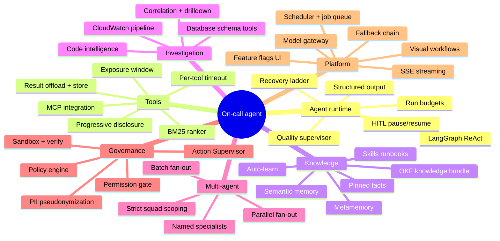
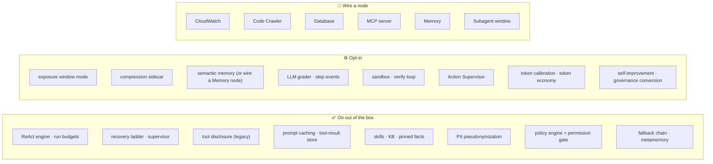

# Feature catalogue

Everything the platform ships, what turns it on, and where it lives.

Legend: **✅ on** = active by default · **⚙️ opt-in** = flag/env off by default ·
**🔌 wired** = activates when the corresponding workflow node is connected ·
**👤 profile** = enabled per agent profile / node config.

> Companion docs: **[architecture.md](architecture.md)** for how these fit together,
> **[tool-calling.md](tool-calling.md)** for the tool-selection machinery.

---

## Feature map

---

## 1. Agent runtime

| Feature | State | What it does | Where |
|---|---|---|---|
| **LangGraph ReAct engine** | ✅ | The single agent engine — `create_react_agent` compiled per run. The former native turn loop was deleted (~1,050 LOC). | `harness/react_agent.py` |
| **Declarative AgentSpec** | ✅ | One source of truth for building an agent — initial build and supervisor-retry rebuild both go through it. | `harness/spec.py`, `spec_factory.py` |
| **Composable capabilities** | ✅ | Registry of capability descriptors (`database`, `rds_performance`, `cloudwatch`, `code_analyzer`, + custom) contributing a role fragment and a prompt section in stable order. | `harness/capabilities.py` |
| **Conversational fast-path** | ✅ | A greeting / "what can you do?" gets one tiny tool-less call instead of the full investigation prompt + every tool schema (~28K tokens saved on "Hi"). | `harness/conversational.py`, `core/quality/intent.py` |
| **Run budgets** | ✅ | Wall-clock **840 s** + **200,000** tokens *per agent* (so it caps runaway subagents). Graceful synthesis nudge at 90%, honest partial at 100%. | `harness/run_budget.py` |
| **Wall-clock backstop** | ✅ | `asyncio.wait_for` at deadline + 60 s grace, for the one case a hook can't see: a single model/tool call that hangs. | `harness/engine/__init__.py` |
| **Recovery ladder** | ✅ | Budget stop, recursion limit → forced synthesis, context overflow → compress+retry, output truncation → up to 3 continuations, mid-thought preamble → one more turn. Every rung yields a *labelled* partial. | `harness/agent_runner.py` |
| **Quality supervisor** | ✅ | Post-turn scoring → PASS / RETRY / HITL / ESCALATE, under an iteration cap, 900 s wall clock and a 1.2M-token brake. | `harness/supervisor_loop.py`, `core/quality/supervisor.py` |
| **LLM grader** | ⚙️ | Adds model-based scoring to the supervisor. Auto-enabled for auto-learn workflows (they persist findings, so they should earn a real verdict). | `core/quality/grader.py` |
| **HITL approve/reject** | 👤 | `hitl_enabled` wraps the agent in a `StateGraph(MessagesState)` with an `interrupt()` synthesis gate; pause/resume rides the Postgres checkpointer. | `harness/hitl.py`, `react_agent.py` |
| **Structured output** | 👤 | Named output schemas ("Data Query Mode", investigation report, generic). | `strategies/react/output_registry.py` |
| **Verified completion** | ⚙️ | Todo-evidence gate — an unproven plan item downgrades the result to `UNVERIFIED`. | `harness/completion_check.py`, `TODO_EVIDENCE_REQUIRED` |
| **ID-grounding guard** | ✅ | Flags identifiers in the final answer that no tool produced and the user didn't supply. Log-only; surfaced as `ungrounded_ids`. | `core/quality/grounding.py` |
| **Progress ledger / step events** | ⚙️ | Per-step trajectory events + late-bound supervisor reward. | `harness/step_recorder.py`, `STEP_EVENTS_ENABLED` |

---

## 2. Tool calling

Full treatment in **[tool-calling.md](tool-calling.md)**.

| Feature | State | What it does |
|---|---|---|
| **Progressive disclosure** | ✅ | Large MCP tool sets defer behind `search_tools` / `call_tool`; nothing is dropped. Triggers on count > 25 **or** ≥ 20K schema tokens. |
| **Tool map** | ✅ | Deferred tool *names* ride the cached bridge description (≤ 2000 chars) so the model knows the capability exists. |
| **Exposure window** | ⚙️ | `TOOL_EXPOSURE_MODE=window` — per-assembly budget of 12 ranked tail tools + bridge. Legacy-parity no-op below the same threshold. |
| **BM25 ranker** | ✅ | Embedding-free, snake/camelCase-splitting, length-normalised. Powers `search_tools`, window mode and skill search. |
| **Degrade, never abort** | ✅ | Per-family builders; failures become `[System notice]` degrade notes on the user turn. |
| **MCP pre-connect barrier** | ✅ | Connects every agent-reachable MCP server *before* the tool snapshot, so a slow cold start can't silently lose a capability. |
| **Per-tool timeout** | ⚙️ | `min(configured cap, remaining run deadline)`; a timeout is an error string, not a raise. |
| **Output cap + compression** | ✅/⚙️ | 8000-char MCP self-cap, 16000-char policy cap; the compression sidecar is opt-in and shares `compress_then_cap`. |
| **VFS result offload** | 👤 | Results > 6000 chars go to the session filesystem, leaving a handle + preview. |
| **Durable tool-result store** | ✅ | Full text into the Postgres KV store, pointer + 600-char preview in the trajectory, `read_tool_result(handle)` to fetch it back. Session-scoped; purged with the session. |
| **Operator tool pinning** | 👤 | A per-node allowlist marks tools `router_pinned` — never deferred. |

---

## 3. Knowledge, memory & skills

| Feature | State | What it does | Where |
|---|---|---|---|
| **Skills (markdown runbooks)** | ✅ | One file-based system: `SKILL.md` + frontmatter. Two-stage disclosure — names-only map in the turn, `search_skills` → `skill(name)`. | `core/skills/manager.py`, `harness/skill_tools.py` |
| **Slash commands** | ✅ | `/<skill-name> args` expands that runbook up front, before the conversational check. | `skill_tools.expand_slash_command` |
| **Per-agent skill scoping** | 👤 | Skills picker on the Agent node restricts the map/search to a named set. Empty = the whole library. | `spec_factory` |
| **Re-invoke guard** | ✅ | Per-*context* (not per-sink) so a subagent's loads never inherit the parent's. | `skill_tools` |
| **OKF knowledge bundle** | ✅ | Curated known-issues / log-patterns markdown, indexed into the `kb` bank; recall is Postgres FTS with tags acting as synonyms. Embeddings were hard-deleted. | `core/knowledge/bundle.py`, `data/knowledge/` |
| **Pinned facts** | ✅ | Always injected (never similarity-gated), repo-scoped, under a token cap. | `services/semantic_memory.py` |
| **Semantic memory** | 🔌 | Bank-scoped learned memory (hybrid FTS + vector RRF). Node-driven — no Memory node means no injection at all. | `services/semantic_memory.py` |
| **Typed Memory node** | 🔌 | Multi-select tiers (`pinned` / `semantic` / `kb` / `session`) with **strict gating**. | `handlers/vector_memory.py` |
| **Per-turn memory budget** | ✅ | Blocks assembled in priority order (pinned ▸ semantic ▸ KB) under `memory_turn_token_budget` (800); a partially-fitting block is truncated, not dropped. | `harness/context_builder.py` |
| **Tool-inclusive chat replay** | ✅ | A follow-up turn replays prior `tool_use`/`tool_result` pairs from persisted trajectories instead of text-only history — so it doesn't re-run every tool. | `harness/chat_history.py` |
| **Metamemory** | ✅ | Agent-maintained `/plan.txt`, `/milestones.txt`, `/context_summary.txt`. A non-empty context summary **supersedes** the expensive LLM compaction tier. Requires the `filesystem` profile flag. | `harness/metamemory.py` |
| **Auto-learn** | 👤 | Post-run capture of durable findings into the KB, gated on the quality verdict. | `core/improvement/auto_learn.py` |
| **Fact extraction / memory audit** | ⚙️ | Per-turn durable-fact extraction and a bounded curator audit. | `core/memory/` |
| **Curator schedule** | ✅ | Periodic memory maintenance. | `core/memory/curator.py` |

---

## 4. Investigation capabilities

### CloudWatch

| Feature | State | Notes |
|---|---|---|
| Deterministic pre-scan | 🔌 | Alarms, anomalies, error patterns, drill-down and a `data_quality` coverage block, seeded into the turn — the agent verifies and drills rather than re-scanning. |
| Synthesis-as-floor | ✅ | If the agent's own answer is empty, a refusal, truncated, or a short mid-thought fragment, the deterministic synthesis becomes the answer. A long substantive narrative is never clobbered. |
| Auto drill-down + scoring | ✅ | `cloudwatch_auto_drilldown`, `cloudwatch_drilldown_scoring` |
| Metrics fusion + discovery | ✅ | `cloudwatch_metrics_fusion`, `cloudwatch_metrics_discovery` |
| Correlation across groups | ✅ | `cloudwatch_correlate_logs` — leads on a correlation/request/trace id |
| Alarm history | ✅ | `cloudwatch_alarm_history` |
| Insights query fix-up | ✅ | Repairs malformed Insights queries |
| Cost + rate limiting | ✅ | GB-scanned ceiling per run, `StartQuery` RPS limiter, TTL caches (alarms 300 s / logs 60 s) |
| Multi-region | ✅ | Up to `cloudwatch_max_regions_per_run` (3) |
| Reduced-scope retry | ✅ | Narrows and retries rather than failing outright |
| Pattern ranking / budget allocation | ⚙️ | Error/warn share allocation across pattern candidates |

### Code intelligence

| Feature | State | Notes |
|---|---|---|
| **codegraph C engine** | 🔌 | Clean-room native code-intel engine, driven in-process over stdio (no MCP-server registration). Its symbol / graph / semantic-search tools surface as `codegraph__*` and pass through tool disclosure like any other MCP tool set. The only code backend. |
| Repo file tools | 🔌 | `repo_grep`, `repo_read_file`, `repo_list_files` alongside the graph tools |
| Background indexing | ✅ | Fast/full modes; startup indexing recovery |
| Branch selection | ✅ | Explorer branch picker; remote branches behind a Fetch button (834 branches took 6 s to list) |
| ONNX semantic code search | ✅ | Local embeddings (`bge-small` class), SHA-256 cache, test-file penalty |
| Hashline anchored edits | 👤 | Content-anchored edits that survive line drift |
| `edit_file` / `create_file` | 👤 | Approval-gated by the permission layer |
| Explorer admin | ✅ | Repo list / reindex / delete via the codegraph REST shim |

### Data

| Feature | State | Notes |
|---|---|---|
| DB schema tools | 🔌 | `db_list_tables`, `db_describe_table`, `db_search_columns` — bounded and cached, so the agent finds a table without dumping the schema |
| SQL discipline prompt | ✅ | Mandatory `LIMIT`, `SET LOCAL statement_timeout`, read-only, fully-qualified columns in catalog/`pg_stat_*` queries |
| RDS performance protocol | 🔌 | `rds_performance` capability (top SQL by load → wait events → index health → blocking → instance metrics), gated on `db_*` **and** `cloudwatch_*` |
| SQL pipeline | ✅ | Parse / scope / render / run for node-attached SQL files |

---

## 5. Multi-agent & delegation

| Feature | State | What it does |
|---|---|---|
| **Named specialists** | 👤 | `delegate_to_<name>` per subagent definition — own role prompt, capability ids, fnmatch tool subset, model, `max_turns`, permission mode. |
| **Generic delegation** | 🔌 | `delegate_investigation`, depth-1, built whenever code tools are present. |
| **Parallel fan-out** | 👤 | `delegate_parallel` — `gather` + semaphore + per-child `wait_for`. |
| **Batch fan-out** | 👤 | `delegate_batch` reads an `items_ref` through the VFS (for > 5 items). |
| **Strict squad scoping** | ✅ | A tool matched by a specialist's glob is stripped from the parent — reachable only through that child. |
| **Model precedence** | ✅ | Global override → per-def `model`/`"inherit"` → **parent LLM** → global `subagent` role. |
| **Compiled-agent cache** | ✅ | Repeat delegations skip `build_agent_from_spec`. |
| **Per-child attribution** | ✅ | `subagent_usage` rows, most expensive first — a measured run spread 24K→302K input tokens across seven children. |
| **Subagent window node** | 🔌 | Wires specialists on the canvas; contained MCP servers are included in the pre-connect barrier. |

---

## 6. Governance, safety & privacy

| Feature | State | What it does |
|---|---|---|
| **Declarative policy engine** | ✅ | Named, parameterised policies compile into one `ResolvedPolicy`: ask/deny patterns, output cap, guardrail config, cost ceiling, `max_tool_calls`. DB-backed policy sets expand by reference. |
| **Permission gate** | ✅ | `allow` / `ask` / `deny`, precedence deny ▸ ask ▸ allow. `ask` raises a LangGraph `interrupt()` → approve/deny card in chat. Modes: `default`, `auto_allow`, `plan`. |
| **Dynamic mutation classification** | ✅ | MCP annotations, then whole-word mutation verbs on the leaf name. No server names hardcoded — a newly wired server is gated without a code change. |
| **Action Supervisor** | ⚙️ | Tiered pre-execution review of write-class actions; shadow-mode first. |
| **Governance doc slicing** | ✅ | `AGENT_POLICY.md` sliced to this run's bound tools → `# Governance` section (empty when nothing matches). |
| **PII pseudonymization** | ✅ | Per-run vault; query + seeded context + tool output pseudonymized before Bedrock, final answer rehydrated on return. |
| **Redaction** | ✅ | Log-level secret redaction throughout. |
| **Sandboxed shell** | ⚙️ | `run_command` in an isolated backend (bwrap / container / seatbelt), no network by default, scratch cwd, `ask`-gated. No-op without `SANDBOX_BACKEND`. |
| **Edit → verify → fix loop** | 👤 | `run_verify` runs the configured checks after an edit; the prompt requires green before claiming a fix. Requires a sandbox backend **and** edit tools. |
| **Tool guardrails** | ✅ | Loop/repetition detection with `warn` / `block` / `halt`. |
| **API key auth** | ⚙️ | Middleware-level API key enforcement. |

---

## 7. Model & provider

| Feature | State | What it does |
|---|---|---|
| **Bedrock-only** | ✅ | The single provider. Prompt caching uses the native `cachePoint` kwarg (Anthropic `cache_control` blocks are the non-Bedrock path). |
| **DB-configured models** | ✅ | Models are user-configured via `model_keys` / `llm_config` — never hardcoded. |
| **Node-level model wiring** | ✅ | `lm::name` ports let each node pick a model; global Settings gateway is the fallback. |
| **Fallback chain** | ✅ | On a throttle, fail over credential → region → model instead of exhausting retries on one target; cooled targets are de-prioritised. |
| **Throttle tracking + backoff** | ✅ | Per-target cool-down within the process. |
| **Prompt caching** | ✅ | 1 h TTL on the Bedrock cachePoint prefix; correctness enforced by the CACHE CONTRACT in `compose_system_prompt`. |
| **Cache metrics** | ✅ | `billed_units()` and measured cache-hit reporting. `cache_read`/`cache_creation` are a **breakdown** of `input_tokens`, never added to it. |
| **Token calibration** | ⚙️ | Learns a per-model correction to the chars/4 heuristic so compaction thresholds fire at the right time. |
| **Latency-optimised inference** | ⚙️ | `BEDROCK_LATENCY_OPTIMIZED` |
| **Connection pooling** | ✅ | `BEDROCK_MAX_POOL_CONNECTIONS=20` |

---

## 8. Platform & operations

| Feature | State | What it does |
|---|---|---|
| **Visual workflow canvas** | ✅ | Node graph with 13+ node types; both schema dialects accepted so saved workflows keep running. |
| **DAG executor** | ✅ | BFS frontier, concurrent execution, per-node timeouts (300 s / 900 s for agents), explicit deadlock reporting. |
| **Scheduler** | ✅ | APScheduler behind a pg advisory **leader lock** — single-leader across replicas. |
| **Background job queue** | ✅ | DB-backed with `SKIP LOCKED` claims. |
| **SSE streaming** | ✅ | Workflow/node lifecycle, `llm_token`, `tool_call` (with `agent` attribution), `tool_result`, HITL, `token_usage_delta`, heartbeat. |
| **Chat sessions** | ✅ | Persistent sessions with compaction; deleting a session purges its stored tool results. |
| **Checkpointing** | ✅ | Postgres LangGraph checkpointer; durability `async` (HITL runs clamped to it), optional `exit`/`sync`, optional shallow mode. |
| **Feature flags in Settings** | ✅ | Live-editable, no restart — a runtime overlay applies DB `flag:` overrides at startup. |
| **Agent profiles** | ✅ | Reusable role prompt / capabilities / output schema / policies / deep features, merged into node config (node config always wins). |
| **Codebase Explorer** | ✅ | Repo indexing, branch selection, search UI. |
| **Skills UI** | ✅ | Browse / create / edit markdown skills. |
| **Context references** | ✅ | `@file` / `@folder` / `@url` / `@git` expanded inline, restricted to a configured root. |
| **Persona + context doc** | ⚙️ | Operator-set preamble, per node or global. Empty by default so the prompt stays byte-identical. |
| **Self-improvement analyzer** | ⚙️ | Hill-climbing analysis over past runs; apply step separately gated. |
| **Telemetry** | ✅ | OpenTelemetry spans, trace ids threaded into executions. |
| **Heartbeat monitor** | ✅ | Periodic liveness scan with cooldown and concurrency caps. |
| **Azure DevOps** | 🔌 | Repos, wiki, work items via the ADO MCP server (`org` vs `project` distinction matters; omitting `project` causes a 60 s elicitation hang). |
| **Lite profile** | ⚙️ | `APP_PROFILE=lite` — slim image (~587 MB vs ~1.04 GB) without the heavy extras. |

---

## 9. Default posture at a glance

Every setting lives in [`agent-api/app/config/`](../agent-api/app/config) with its
rationale in a comment above it, and most are overridable per workflow through the agent
node's config or its `params` mirror.
