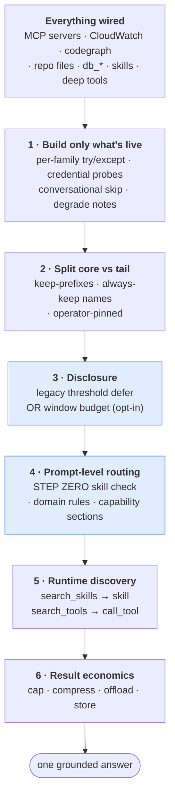
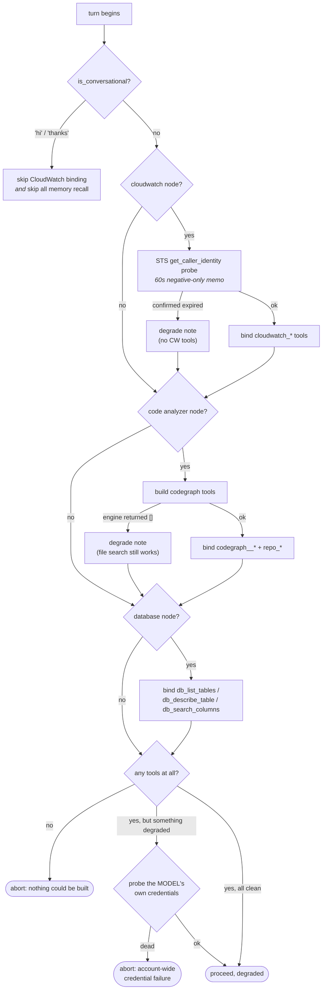
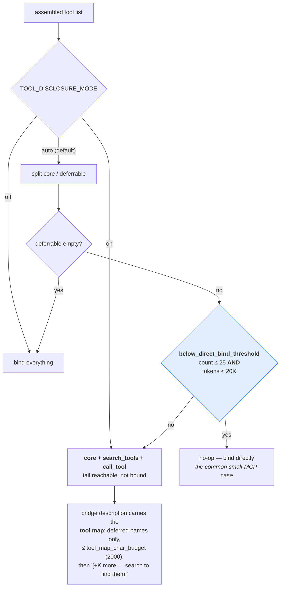
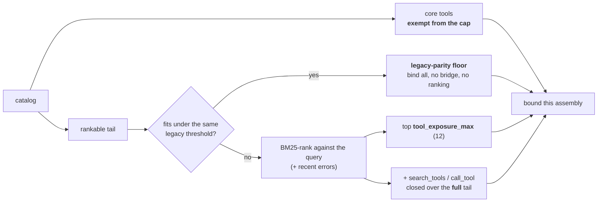
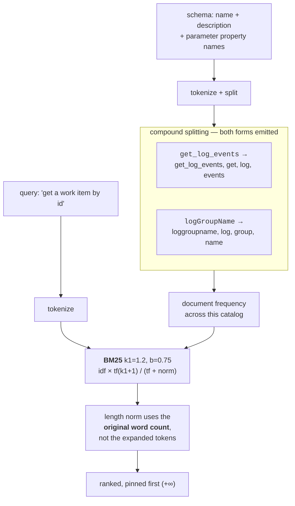
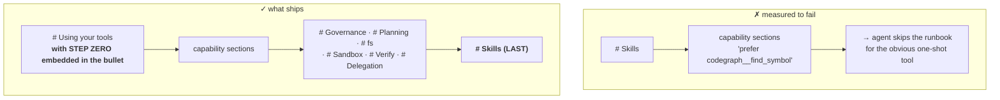
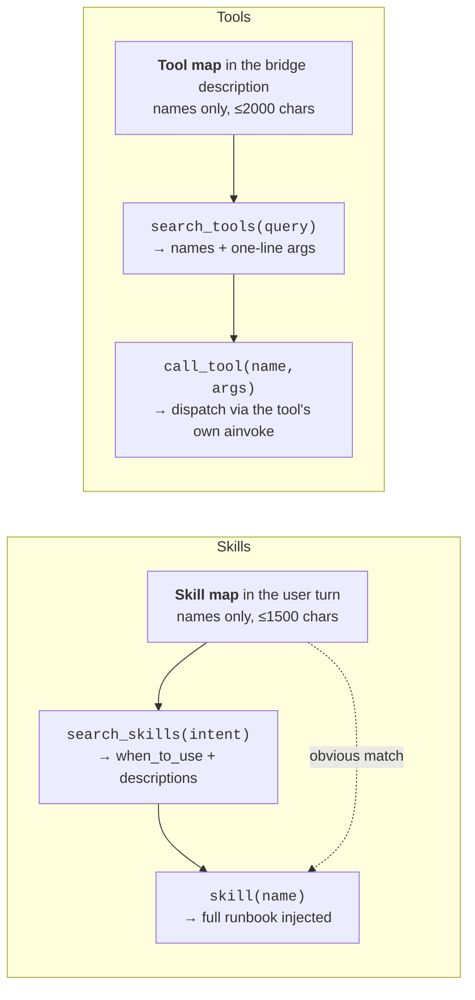
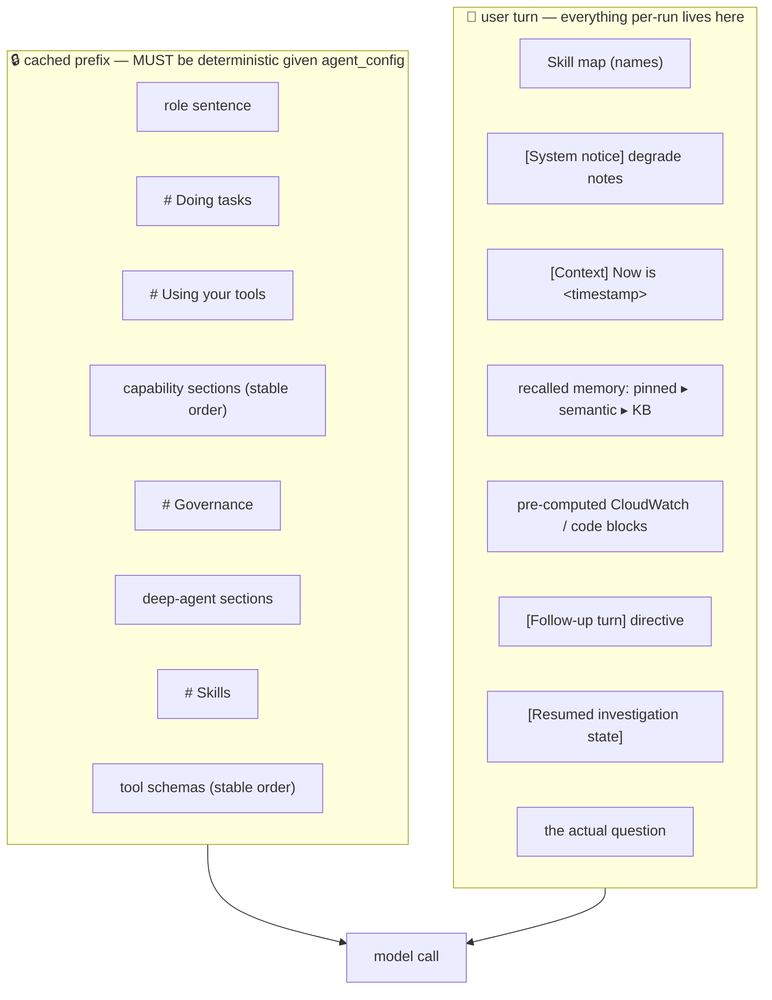
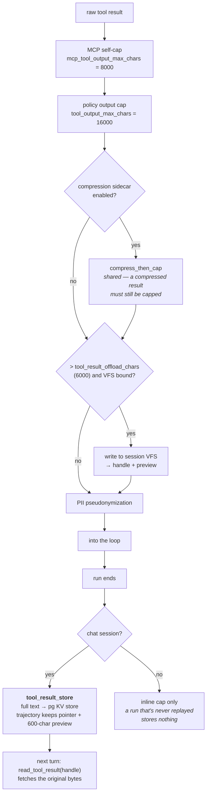

# Tool calling — how the agent picks the *right* tool

Tool-selection accuracy is the platform's hardest problem. A wired-up deployment can
expose 150+ tools (Azure DevOps alone advertises ~90), and published MCP tool-density
research puts bound-tool selection accuracy below 90% once the *active* tool count passes
roughly 10–15. Binding everything is both expensive (schema tokens on every call) and
inaccurate.

This document is the complete picture of what the platform does about it.

> Companion docs: **[architecture.md](architecture.md)** for the surrounding flow,
> **[features.md](features.md)** for defaults and knobs.

---

## The funnel at a glance

Six stages, each narrowing "every tool that exists" toward "the one call this question
needs". Stages 1–3 decide **what the model can see**; 4–5 decide **what it picks**; 6
decides **what the result costs**.

---

## 1. Build only what is actually live

[`tool_assembler.assemble_base_tools`](../agent-api/app/harness/tool_assembler.py)

Nothing is bound speculatively. Each family — MCP, CloudWatch, codegraph + repo files,
`db_*` schema tools — is built inside its own `try/except`. A failure removes **that
family only**, appends a human-readable reason to `degraded`, and the run continues.

Three details that matter:

- **The STS memo caches only the negative.** "Credentials are fine" is cached for 60 s and
  keyed on the exact identity, because one turn probes the same AWS identity several times
  (CloudWatch's creds, the model's creds, every AWS MCP server's env). A *confirmed
  expiry* is never cached — otherwise a user who runs `aws sso login` and retries
  immediately would be told their fresh session is still dead.
- **The extra model-credential probe is conditional.** It only runs when something already
  degraded, because that's the only time the answer changes anything: account-wide failure
  (abort with a clear message) versus a narrowly scoped one (degrade and continue).
- **Provider verifiers are a registry, not a special case.** A server whose *connection*
  authenticates (ADO PAT, Postgres DSN) is already verified by the MCP pre-connect barrier.
  The registry exists for the one case the generic machinery misses — a provider whose
  handshake succeeds but whose downstream calls 401 later (AWS STS). Supporting another
  such provider is one appended `_McpCredVerifier` entry; nothing is hardcoded to a server
  name.

---

## 2. Core vs tail — what is never deferred

[`tool_disclosure._is_core_tool`](../agent-api/app/harness/tool_disclosure.py)

An agent's core investigation primitives must be directly callable **every turn**. Only
open-ended MCP tools are candidates for deferral.

A tool is **core** if any of these hold:

| Rule | Value |
|------|-------|
| Name prefix match | `cloudwatch_`, `code_`, `codegraph_`, `repo_`, `db_`, `database_`, `sql_` (`TOOL_ROUTER_ALWAYS_KEEP_PREFIXES`) |
| Exact name in the always-keep set | `search_tools`, `call_tool`, `save_playbook`, `patch_playbook`, `pin_fact`, `delegate_investigation`, `edit_file`, `apply_edit`, `write_todos`, `update_todo`, `run_command`, `fs_write`, `fs_read`, `fs_ls`, `fs_grep`, `fs_append`, `fs_upsert`, `fs_prune`, `skill`, `search_skills` |
| `router_pinned` | An operator's explicit per-node allowlist — a deliberate choice, always bound |
| Unnameable | Kept, because it could never be found by search or called by name |

Everything else is the **rankable tail** — almost entirely MCP-server tools, which is also
exactly where tool-count-driven accuracy loss comes from.

---

## 3. Progressive disclosure — two modes

The previous mitigation was a keyword prune that kept the top-K and **silently dropped**
the rest. It removed tools the agent genuinely needed (`wit_get_work_item` for a "generate
test cases for PBI 877" task) with no trace. That module has been deleted.

The replacement never drops anything. Oversized tool sets are **deferred behind a bridge**:
`search_tools` (find by intent) + `call_tool` (invoke by exact name). The model discovers
what it needs on demand.

### Why *both* a count and a token trigger

They catch different failures:

- **Tokens (< 20K, or 10% of the context window when known).** Schema bulk paid on every
  single model call.
- **Count (≤ 25).** Azure DevOps' ~90 tools are only ~5K tokens — comfortably under the
  token cutoff — yet binding 90 schemas per call is what trips Bedrock guardrail
  throttling.

Either trigger activates deferral. The char/4 size heuristic is deliberately approximate
(Bedrock tokenises dense JSON closer to 3.5 chars/token, so the real cost can be ~15%
higher); when it's wrong it errs toward binding *more* directly, which is the safer
direction for accuracy.

### Window mode (opt-in)

`TOOL_EXPOSURE_MODE=window` replaces the binary all-or-nothing choice with a **per-assembly
budget** ([`ToolExposureManager`](../agent-api/app/harness/tool_exposure.py)):

The legacy-parity floor is decided **once** per assembly (it depends only on the catalog,
not the query), which is what makes enabling window mode a genuine no-op for small
deployments. A tool outside the window is still reachable via `call_tool` — nothing is ever
unreachable.

Measured on `evals/accuracy/tool_selection.py`: direct-bind rate goes from **0% (legacy)
to 100% (window)** above the floor. Default remains `legacy`.

---

## 4. The ranker

[`app/core/tools/router.py`](../agent-api/app/core/tools/router.py) — **Okapi BM25**,
deliberately embedding-free so it works in air-gapped / no-Bedrock environments.

Four decisions carry their own weight here:

**Compound splitting is mandatory.** Tool and parameter names are the highest-signal text
in a schema and they are overwhelmingly compound. Without splitting, the natural query
"get log events" scored **zero** against the very tool it names. Both forms are emitted —
the compound token so an exact-name query keeps its full weight, the parts so prose queries
can reach it.

**Length normalisation counts words as written.** Splitting emits 2–4 tokens per compound
name, so a schema full of `snake_case` parameters would otherwise look several times longer
than a prose-heavy one of the same real size, and be penalised for a tokenizer artifact.

**`b` is load-bearing.** The previous scorer (`(1 + log tf) × idf`) grew unbounded in term
frequency and ignored length entirely, so a verbose tool that merely *repeated* a query word
outscored the short, precisely-named tool that word came from. Measured on a 4-tool probe: a
padded `describe_alarms` beat `get_log_events` for both "get log events" and "log group
name"; with `k1`+`b` it loses both — and at `b=0` the decoy wins again.

**Name enrichment for search.** Both disclosure modes prepend an underscore-split copy of
the name to the *ranking* text (`wit_get_work_item` → `wit get work item …`). The `name`
stays exact for dispatch, and `search_tools` displays the **original** description — the
enrichment never leaks to the model.

### Where it currently sits

| Case class | Cases | Mean rank |
|------------|-------|-----------|
| Lexical overlap | 13 | **1.0** |
| Synonym | 2 | **1.0** (improved from 1.5 by name enrichment) |
| True paraphrase | 2 | 5 → 7 |
| **Headline mean** | 17 | **1.53 → 1.71** at unchanged hit@3 (88.2%) and hit@8 (100%) |

> **Do not "fix" this by re-tuning `b`.** The two paraphrase cases share *no* tokens with
> their target by construction, so their rank is decided by incidental stopword matches.
> A sweep found configurations that score them better (`b=0`, or pruning query terms above
> a 0.20 document-frequency ratio) — each helps only at a cliff, and each gives back the
> verbose-decoy fix. Both were rejected as overfitting to two noisy cases. Closing that gap
> is the deferred synonym/embedding work, not a ranker-tuning exercise.

---

## 5. Prompt-level routing

Ranking decides what's *visible*. The prompt decides what the model *reaches for*. This is
the higher-leverage half, and it is almost entirely the product of measured regressions.

### The routing procedure

From [`agent_builder.compose_system_prompt`](../agent-api/app/harness/agent_builder.py),
the `# Using your tools` section:

1. **Prefer the most specific tool** over a generic one; fetch only what the question needs.
2. **STEP ZERO — check the skill map first** *(emitted only when the `skill` tool is bound)*.
   When a listed skill matches, load it with `skill` and let its runbook direct tool choice.
   Route yourself only when no skill matches.
3. **Pick by what the question is ABOUT, not by habit:**

   | The question is about… | Answer it with… |
   |---|---|
   | live data, records, counts, current state | the **data source** that holds it (the connected database) — *not* the code that writes it |
   | how the system is built, where logic lives | the **code** tools |
   | logs, metrics, alarms | the **observability** tools |

4. **If the tool you need isn't visible, use `search_tools`** *(emitted only when the bridge
   is actually bound)* before falling back to a different domain's tools.

### Two hard-won ordering rules

- **STEP ZERO must be inside the routing bullet.** A caveat *appended after* the domain
  rules was measured to lose (trajectory eval `traj-skill-locate`, score 0.00): the model
  runs the routing procedure through to a concrete tool choice and never comes back.
- **`# Skills` must be the last platform section.** Recency is what binds it. When Skills
  came before the capability text, "prefer `codegraph__find_symbol` for a known symbol"
  beat "load the matching skill first" — and when later sections (scratch-fs, planning)
  slid in *after* it, the regression came straight back. Every other section stays above
  it, gated or not.

### Never name a tool the agent doesn't have

Every prompt section that mentions a tool is gated on that tool actually appearing in the
final bound list — not on the operator's intent to enable it:

| Section | Gate |
|---------|------|
| `search_tools` hint | `"search_tools" in tool_names` (disclosure actually fired) |
| `# Sandboxed shell` | `sandbox` flag **AND** `run_command` bound (needs `SANDBOX_BACKEND`) |
| `# Verify your changes` | `verify` flag **AND** `run_verify` **AND** `edit_file` — the section prescribes an edit→verify→fix *loop* |
| `# Delegation` | only the `delegate_to_*` names that were really built |
| CloudWatch / code capability sections | intent flag **AND** a matching bound tool prefix |
| `rds_performance` (≈942 tokens) | `db_*` **AND** `cloudwatch_*` — a plain business-data lookup shouldn't pay for a pg_stat runbook |

The failure this prevents is silent: the model emits a call for a tool that isn't in its
schema list, burns the turn, and for `run_verify` can never satisfy a completion criterion
the prompt itself set. Up to 2,369 tokens of capability text used to describe absent tools
precisely on runs that were already degraded.

---

## 6. Runtime discovery — two bridges

Both follow the same two-stage shape: **cheap names in the turn, full detail on demand.**

**Why a names-only map at all?** A search tool whose subject matter the model can't see is
a search tool it won't think to use. The map proves the capability exists and supplies the
vocabulary to search with. Schemas are what cost tokens, and those stay deferred. Per-turn
cost for a 40-skill library dropped **1,575 → 252 tokens** when descriptions moved out of
the map and behind `search_skills`.

**`call_tool` dispatches through the underlying tool's own `ainvoke`**, so pseudonymization
wrapping, output capping, offload and per-tool timeouts all fire identically to a directly
bound call. It also strips explicit `None` values (many MCP servers reject `null` for
optionals they'd happily accept as absent) and, on an unknown name, returns near-match
suggestions so the model can self-correct instead of dead-ending.

**Skill invocation is guarded per context.** The re-invoke guard is installed per *run
context*, seeded with any `/slash`-preloaded skills. It must be per-context, not keyed on a
shared sink: subagents share the parent's tool *object*, so a sink-keyed guard leaked a
parent's loads into every child.

---

## 7. The cache contract

The Bedrock `cachePoint` prefix is **system prompt + tool schemas**. Cache reads bill at
~10% of fresh input, so keeping that prefix byte-stable across every call in a run is the
single largest cost lever — larger than shrinking the prompt itself.

**Anything run-specific in the system prompt busts the cache on every call.** That's why
the timestamp, the degrade notices, recalled memory and the skill map are all routed into
the query — and why `compose_system_prompt` carries an explicit CACHE CONTRACT comment.
Section order and tool order are held stable for the same reason.

Prompt and tool-schema size barely matter once cached (0.1× on reads). **The real lever is
tool results** — which is stage 6.

---

## 8. Result-side economics

A tool that returns 200 KB of JSON costs more than any number of tool schemas, and costs it
again on every subsequent turn of the loop.

Notes from production measurement:

- **Compression does not cut tokens above ~9.4K chars — the cap always binds.** The sidecar
  compresses JSON well, prose poorly, and returns code **unchanged 100% of the time** (its
  code path needs tree-sitter, absent from the pinned image). `compression_stats` exposes
  `unchanged` / `skipped_uncompressible` counters precisely because the sidecar fails
  *silently useful*: it answers 200 OK and hands the text straight back.
- **`delegate_*` output is exempt from offload.** A subagent envelope is already a distilled
  summary, so a pointer to a summary just adds a fetch round-trip for no saving.
- **The pointer text is deliberately explicit.** A bare character slice is
  indistinguishable from a complete result — the model can't tell it's holding a fragment
  and answers from it as though it were whole. The marker states the original size, what
  fraction is shown, and exactly how to retrieve the rest.

---

## 9. Bounding a call that goes wrong

Selecting correctly isn't enough; a correct selection can still hang or loop.

| Bound | Mechanism | Default |
|-------|-----------|---------|
| One tool call hangs | [`tool_timeout`](../agent-api/app/harness/tool_timeout.py) — `min(configured cap, remaining run deadline)`; returns an **error string** the model adapts to, never raises | `0` (bounded by the run deadline alone) |
| Repetitive / looping calls | `ToolCallGuardrailController` — `warn` / `block` / `halt` | on |
| Too many calls, or too costly | policy engine `max_tool_calls`, `budget_cost_usd` | unset |
| Whole run too long | run deadline: nudge at 90%, stop at 100% | 840 s |
| Whole run too expensive | run token budget, per agent (so it caps runaway *children*) | 200,000 |
| Loop won't converge | LangGraph `recursion_limit` → forced synthesis | 25 |
| Fan-out too wide | `agent_max_concurrency`, `DELEGATION_MAX_CONCURRENT` | 0 (unbounded) / 3 |

The timeout wrapper returns a **copy** of each tool rather than a proxy: the tool must stay
a real `BaseTool` because `bind_tools` converts it to a provider schema and a duck-typed
proxy fails that conversion. Copying also means a tool shared between a parent and a
subagent never inherits the other's cap.

---

## 10. Measuring it

| Suite | Location | Reports |
|-------|----------|---------|
| Tool selection | `evals/accuracy/tool_selection.py` | Hermetic: mean rank, hit@3, hit@8, direct-bind rate per exposure mode |
| Trajectory | `evals/accuracy/` | Whether the agent takes the intended path (this is what caught the `# Skills` ordering regression) |
| Live telemetry | result envelope | `subagent_usage`, `auxiliary_usage`, `compression_stats`, `ungrounded_ids`, `stop_reason` |

`evals/` is **not** in the production image — run on the host with `PYTHONUTF8=1`, or copy
it into the container.

---

## 11. Configuration reference

| Setting | Env | Default | Effect |
|---------|-----|---------|--------|
| `tool_exposure_mode` | `TOOL_EXPOSURE_MODE` | `legacy` | `legacy` = threshold defer; `window` = ranked per-assembly budget |
| `tool_exposure_max` | `TOOL_EXPOSURE_MAX` | `12` | Window-mode cap on directly-bound tail tools |
| — | `TOOL_DISCLOSURE_MODE` | `auto` | `auto` / `on` (force defer) / `off` (never defer) |
| — | `TOOL_DISCLOSURE_MAX_DIRECT` | `25` | Count trigger for deferral |
| — | `TOOL_ROUTER_ALWAYS_KEEP_PREFIXES` | see §2 | Core prefixes, never deferred |
| — | `TOOL_ROUTER_PINNED_NAMES` | *(empty)* | Always score `+∞` in the ranker |
| — | `TOOL_ROUTER_TOP_K` | `12` | `ToolRouter.filter` budget |
| `tool_map_char_budget` | `TOOL_MAP_CHAR_BUDGET` | `2000` | Deferred-name map size |
| `skill_map_char_budget` | `SKILL_MAP_CHAR_BUDGET` | `1500` | Skill-name map size |
| `mcp_tool_output_max_chars` | — | `8000` | MCP self-cap |
| `tool_output_max_chars` | `TOOL_OUTPUT_MAX_CHARS` | `16000` | Policy output cap |
| `tool_result_offload_chars` | `TOOL_RESULT_OFFLOAD_CHARS` | `6000` | VFS offload + durable-store threshold |
| `trajectory_tool_result_max_chars` | — | see config | Inline fallback cap when storage is unavailable |
| `agent_tool_call_timeout_seconds` | `AGENT_TOOL_CALL_TIMEOUT_SECONDS` | `0.0` | Per-tool wall clock (`240` recommended) |
| `skill_tool_enabled` | `SKILL_TOOL_ENABLED` | `true` | Binds `skill` / `search_skills` — *only if the library is non-empty* |
| `skill_slash_commands_enabled` | `SKILL_SLASH_COMMANDS_ENABLED` | `true` | `/name` expands a runbook up front |
