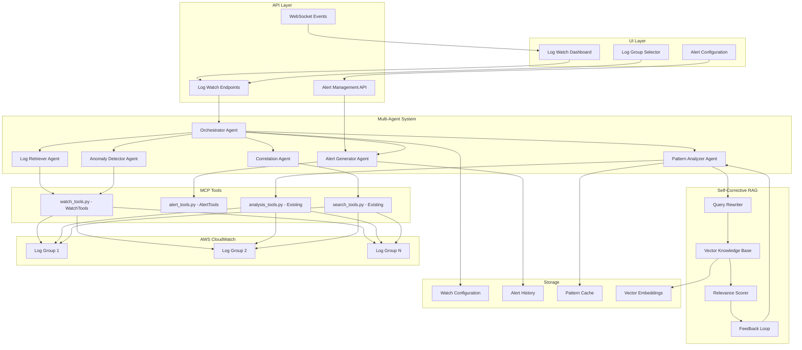
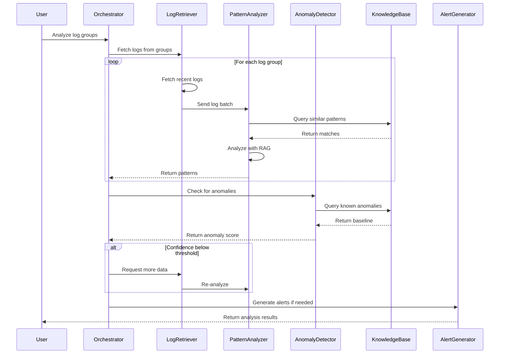

# Log Watch Analyzer Agent - Architecture Plan

## Overview

The Log Watch Analyzer Agent is a multi-agent self-corrective system for CloudWatch Logs analysis. Inspired by NVIDIA's Nemotron architecture, it uses specialized agents with RAG capabilities to analyze multiple log groups, detect patterns, anomalies, and generate actionable insights with self-correction mechanisms.

## Key Concepts from NVIDIA Nemotron Approach

1. **Multi-Agent Architecture**: Specialized agents for different analysis tasks
2. **Self-Corrective RAG**: Retrieval-Augmented Generation with feedback loops
3. **Iterative Refinement**: Agents can request more data or re-analysis
4. **Confidence Scoring**: Results include confidence levels for decision making
5. **Knowledge Base Integration**: Historical patterns and known issues stored in vector DB

## Architecture Diagram



## Multi-Agent Workflow



## Component Details

### 1. New MCP Tools

#### 1.1 Watch Tools - `agent-api/app/mcp/tools/watch_tools.py`

```python
class CloudWatchLogsWatchTools:
    """Tools for continuous log watching and monitoring."""
    
    async def watch_log_groups(
        self,
        log_group_names: List[str],
        poll_interval: int = 60,
        max_duration: int = 3600
    ) -> str:
        """
        Watch multiple log groups for new entries.
        
        Returns stream of new log events as they arrive.
        """
        pass
    
    async def get_log_group_health(
        self,
        log_group_names: List[str],
        hours: int = 1
    ) -> str:
        """
        Get health status of multiple log groups.
        
        Returns: JSON with health metrics per log group
        - error_rate: percentage of error logs
        - volume_trend: increasing/decreasing/stable
        - anomaly_score: 0-100
        - last_activity: timestamp
        """
        pass
    
    async def tail_logs(
        self,
        log_group_name: str,
        filter_pattern: str = None,
        stream_prefix: str = None
    ) -> str:
        """
        Tail logs from a specific log group with optional filtering.
        
        Similar to AWS CLI tail functionality but with real-time streaming.
        """
        pass
```

#### 1.2 Alert Tools - `agent-api/app/mcp/tools/alert_tools.py`

```python
class CloudWatchLogsAlertTools:
    """Tools for alert management and notification."""
    
    async def create_alert_rule(
        self,
        name: str,
        log_group_names: List[str],
        condition: Dict[str, Any],
        actions: List[Dict[str, Any]]
    ) -> str:
        """
        Create an alert rule.
        
        Condition types:
        - error_threshold: error count exceeds X in Y minutes
        - pattern_match: specific pattern found in logs
        - anomaly_detected: anomaly score exceeds threshold
        - volume_spike: log volume increases by X%
        
        Actions:
        - webhook: POST to URL
        - email: Send email notification
        - slack: Post to Slack channel
        - pagerduty: Trigger PagerDuty incident
        """
        pass
    
    async def evaluate_alert_rules(
        self,
        log_group_name: str,
        log_events: List[Dict[str, Any]]
    ) -> str:
        """
        Evaluate alert rules against incoming log events.
        
        Returns: List of triggered alerts
        """
        pass
    
    async def get_alert_history(
        self,
        log_group_name: str = None,
        hours: int = 24,
        severity: str = None
    ) -> str:
        """
        Get alert history with optional filtering.
        """
        pass
```

### 2. Multi-Agent System

#### 2.1 Orchestrator Agent - `agent-api/app/agents/log_analyzer/orchestrator.py`

```python
class LogAnalyzerOrchestrator:
    """
    Main orchestrator for the multi-agent log analysis system.
    
    Coordinates specialized agents and manages the self-corrective loop.
    """
    
    def __init__(self, llm_client, knowledge_base, mcp_manager):
        self.llm = llm_client
        self.knowledge_base = knowledge_base
        self.mcp_manager = mcp_manager
        
        # Initialize specialized agents
        self.log_retriever = LogRetrieverAgent(mcp_manager)
        self.pattern_analyzer = PatternAnalyzerAgent(llm_client, knowledge_base)
        self.anomaly_detector = AnomalyDetectorAgent(llm_client, knowledge_base)
        self.correlation_agent = CorrelationAgent(llm_client)
        self.alert_generator = AlertGeneratorAgent()
        
        # Confidence threshold for self-correction
        self.confidence_threshold = 0.75
    
    async def analyze(
        self,
        log_group_names: List[str],
        analysis_config: Dict[str, Any]
    ) -> Dict[str, Any]:
        """
        Execute multi-agent analysis with self-correction.
        
        1. Retrieve logs from all groups
        2. Analyze patterns with RAG
        3. Detect anomalies
        4. Correlate across groups
        5. Generate alerts if needed
        6. Self-correct if confidence is low
        """
        results = {}
        iteration = 0
        max_iterations = 3
        
        while iteration < max_iterations:
            # Step 1: Retrieve logs
            logs = await self.log_retriever.fetch_logs(
                log_group_names,
                time_range=analysis_config.get('timeRange', '1h')
            )
            
            # Step 2: Analyze patterns with RAG
            patterns = await self.pattern_analyzer.analyze(
                logs,
                use_rag=True
            )
            
            # Step 3: Detect anomalies
            anomalies = await self.anomaly_detector.detect(
                logs,
                patterns
            )
            
            # Step 4: Correlate across groups
            correlations = await self.correlation_agent.correlate(
                logs,
                patterns,
                anomalies
            )
            
            # Calculate confidence
            confidence = self._calculate_confidence(patterns, anomalies)
            
            if confidence >= self.confidence_threshold:
                # Step 5: Generate alerts
                alerts = await self.alert_generator.generate(
                    patterns,
                    anomalies,
                    correlations,
                    analysis_config
                )
                
                return {
                    'status': 'success',
                    'confidence': confidence,
                    'patterns': patterns,
                    'anomalies': anomalies,
                    'correlations': correlations,
                    'alerts': alerts,
                    'iterations': iteration + 1
                }
            
            # Self-correction: request more data or re-analysis
            iteration += 1
            analysis_config['timeRange'] = self._extend_time_range(
                analysis_config.get('timeRange', '1h')
            )
        
        return {
            'status': 'low_confidence',
            'confidence': confidence,
            'partial_results': {...}
        }
```

#### 2.2 Log Retriever Agent - `agent-api/app/agents/log_analyzer/log_retriever.py`

```python
class LogRetrieverAgent:
    """Agent responsible for fetching logs from CloudWatch."""
    
    async def fetch_logs(
        self,
        log_group_names: List[str],
        time_range: str = '1h'
    ) -> Dict[str, List[Dict]]:
        """
        Fetch logs from multiple log groups in parallel.
        
        Returns logs grouped by log group name with metadata.
        """
        pass
    
    async def stream_logs(
        self,
        log_group_names: List[str],
        callback: Callable
    ) -> AsyncGenerator:
        """
        Stream logs in real-time for continuous monitoring.
        """
        pass
```

#### 2.3 Pattern Analyzer Agent with RAG - `agent-api/app/agents/log_analyzer/pattern_analyzer.py`

```python
class PatternAnalyzerAgent:
    """
    Agent for analyzing log patterns using RAG.
    
    Uses knowledge base to identify known patterns and anomalies.
    """
    
    async def analyze(
        self,
        logs: Dict[str, List[Dict]],
        use_rag: bool = True
    ) -> Dict[str, Any]:
        """
        Analyze logs for patterns with RAG enhancement.
        
        1. Extract log messages
        2. Query knowledge base for similar patterns
        3. Use LLM to identify new patterns
        4. Score and rank patterns
        """
        patterns = {
            'error_patterns': [],
            'warning_patterns': [],
            'info_patterns': [],
            'custom_patterns': []
        }
        
        for log_group, log_events in logs.items():
            # Query knowledge base for known patterns
            if use_rag:
                known_patterns = await self.knowledge_base.query(
                    query=f"patterns for {log_group}",
                    top_k=10
                )
            
            # Use LLM to analyze logs
            analysis = await self.llm.analyze_patterns(
                log_events,
                context=known_patterns if use_rag else None
            )
            
            patterns['error_patterns'].extend(analysis.get('errors', []))
            patterns['warning_patterns'].extend(analysis.get('warnings', []))
        
        return patterns
    
    async def learn_pattern(
        self,
        pattern: Dict[str, Any],
        log_group: str
    ):
        """
        Store new pattern in knowledge base for future reference.
        """
        await self.knowledge_base.store(
            content=pattern,
            metadata={'log_group': log_group, 'type': 'pattern'}
        )
```

#### 2.4 Anomaly Detector Agent - `agent-api/app/agents/log_analyzer/anomaly_detector.py`

```python
class AnomalyDetectorAgent:
    """
    Agent for detecting anomalies in log data.
    
    Uses statistical analysis and ML models for anomaly detection.
    """
    
    async def detect(
        self,
        logs: Dict[str, List[Dict]],
        patterns: Dict[str, Any]
    ) -> List[Dict[str, Any]]:
        """
        Detect anomalies based on:
        - Volume spikes
        - Error rate changes
        - Unusual patterns
        - Time-based anomalies
        """
        anomalies = []
        
        for log_group, log_events in logs.items():
            # Get baseline from knowledge base
            baseline = await self.knowledge_base.query(
                query=f"baseline metrics for {log_group}",
                top_k=5
            )
            
            # Calculate current metrics
            current_metrics = self._calculate_metrics(log_events)
            
            # Compare with baseline
            if self._is_anomaly(current_metrics, baseline):
                anomalies.append({
                    'log_group': log_group,
                    'type': 'volume_anomaly',
                    'severity': self._calculate_severity(current_metrics, baseline),
                    'details': current_metrics
                })
        
        return anomalies
```

#### 2.5 Correlation Agent - `agent-api/app/agents/log_analyzer/correlation.py`

```python
class CorrelationAgent:
    """
    Agent for correlating events across multiple log groups.
    
    Identifies related events and causal relationships.
    """
    
    async def correlate(
        self,
        logs: Dict[str, List[Dict]],
        patterns: Dict[str, Any],
        anomalies: List[Dict[str, Any]]
    ) -> List[Dict[str, Any]]:
        """
        Find correlations between events in different log groups.
        
        Uses:
        - Timestamp proximity
        - Common identifiers (request IDs, trace IDs)
        - Causal chain analysis
        """
        correlations = []
        
        # Find common identifiers
        identifiers = self._extract_identifiers(logs)
        
        for identifier in identifiers:
            related_events = self._find_related_events(logs, identifier)
            if len(related_events) > 1:
                correlations.append({
                    'identifier': identifier,
                    'events': related_events,
                    'timeline': self._build_timeline(related_events)
                })
        
        return correlations
```

#### 2.6 Alert Generator Agent - `agent-api/app/agents/log_analyzer/alert_generator.py`

```python
class AlertGeneratorAgent:
    """
    Agent for generating actionable alerts from analysis results.
    """
    
    async def generate(
        self,
        patterns: Dict[str, Any],
        anomalies: List[Dict[str, Any]],
        correlations: List[Dict[str, Any]],
        config: Dict[str, Any]
    ) -> List[Dict[str, Any]]:
        """
        Generate alerts based on analysis results and configuration.
        
        Prioritizes alerts by severity and impact.
        """
        alerts = []
        
        # Generate alerts for critical anomalies
        for anomaly in anomalies:
            if anomaly['severity'] >= config.get('alert_threshold', 0.7):
                alerts.append({
                    'type': 'anomaly',
                    'severity': anomaly['severity'],
                    'log_group': anomaly['log_group'],
                    'message': self._generate_alert_message(anomaly),
                    'recommendations': await self._get_recommendations(anomaly)
                })
        
        # Generate alerts for correlated events
        for correlation in correlations:
            if self._is_critical_correlation(correlation):
                alerts.append({
                    'type': 'correlation',
                    'severity': 'high',
                    'message': 'Related events detected across services',
                    'events': correlation['events']
                })
        
        return sorted(alerts, key=lambda x: x['severity'], reverse=True)
```

### 3. Data Models

#### 3.1 Watch Configuration - `agent-api/app/models/log_watch.py`

```python
class WatchCondition(BaseModel):
    """Condition for triggering alerts."""
    type: Literal[
        "error_threshold",
        "pattern_match", 
        "anomaly_detected",
        "volume_spike",
        "latency_increase"
    ]
    threshold: float
    time_window_minutes: int = 5
    pattern: Optional[str] = None  # For pattern_match

class AlertAction(BaseModel):
    """Action to take when alert triggers."""
    type: Literal["webhook", "email", "slack", "pagerduty", "teams"]
    config: Dict[str, Any]
    severity: Literal["info", "warning", "critical"] = "warning"

class LogWatchConfig(BaseModel):
    """Configuration for a log watch."""
    id: str
    name: str
    log_group_names: List[str]
    conditions: List[WatchCondition]
    actions: List[AlertAction]
    poll_interval_seconds: int = 60
    enabled: bool = True
    created_at: datetime
    updated_at: datetime

class LogWatchState(BaseModel):
    """Runtime state of a log watch."""
    watch_id: str
    status: Literal["running", "paused", "error"]
    last_poll_time: Optional[datetime]
    events_processed: int = 0
    alerts_triggered: int = 0
    last_error: Optional[str]
```

### 4. API Endpoints

#### 4.1 Log Watch API - `agent-api/app/api/v1/endpoints/log_watch.py`

```python
router = APIRouter(prefix="/log-watch", tags=["log-watch"])

@router.post("/watches")
async def create_watch(config: LogWatchConfigCreate):
    """Create a new log watch configuration."""
    pass

@router.get("/watches")
async def list_watches():
    """List all log watch configurations."""
    pass

@router.get("/watches/{watch_id}")
async def get_watch(watch_id: str):
    """Get a specific log watch configuration."""
    pass

@router.put("/watches/{watch_id}")
async def update_watch(watch_id: str, config: LogWatchConfigUpdate):
    """Update a log watch configuration."""
    pass

@router.delete("/watches/{watch_id}")
async def delete_watch(watch_id: str):
    """Delete a log watch configuration."""
    pass

@router.post("/watches/{watch_id}/start")
async def start_watch(watch_id: str):
    """Start watching the configured log groups."""
    pass

@router.post("/watches/{watch_id}/stop")
async def stop_watch(watch_id: str):
    """Stop watching."""
    pass

@router.get("/watches/{watch_id}/state")
async def get_watch_state(watch_id: str):
    """Get current state of a log watch."""
    pass

@router.websocket("/watches/{watch_id}/stream")
async def watch_stream(websocket: WebSocket, watch_id: str):
    """WebSocket endpoint for real-time log streaming."""
    pass

@router.get("/alerts")
async def list_alerts(hours: int = 24, severity: str = None):
    """List recent alerts."""
    pass

@router.get("/alerts/{alert_id}")
async def get_alert(alert_id: str):
    """Get alert details."""
    pass

@router.post("/alerts/{alert_id}/acknowledge")
async def acknowledge_alert(alert_id: str):
    """Acknowledge an alert."""
    pass
```

### 5. UI Components

#### 5.1 Log Watch Dashboard - `ui/src/components/logWatch/LogWatchDashboard.jsx`

Features:
- Overview of all active watches
- Health status indicators per log group
- Recent alerts panel
- Quick actions - start/stop/edit/delete

#### 5.2 Watch Configuration Form - `ui/src/components/logWatch/WatchConfigForm.jsx`

Features:
- Multi-select log groups
- Condition builder UI
- Action configuration
- Schedule settings

#### 5.3 Alert List - `ui/src/components/logWatch/AlertList.jsx`

Features:
- Filterable alert history
- Severity indicators
- Acknowledge/resolve actions
- Link to related logs

### 6. Workflow Node Types

#### 6.1 Log Watch Node - `ui/src/components/workflow/nodes/LogWatchNode.jsx`

```javascript
const logWatchNodeConfig = {
  type: 'logWatch',
  label: 'Log Watch',
  category: 'monitoring',
  inputs: ['trigger'],
  outputs: ['alerts', 'events'],
  config: {
    logGroupNames: [],
    conditions: [],
    pollInterval: 60,
    maxDuration: 3600
  }
};
```

#### 6.2 Alert Action Node - `ui/src/components/workflow/nodes/AlertActionNode.jsx`

```javascript
const alertActionNodeConfig = {
  type: 'alertAction',
  label: 'Alert Action',
  category: 'actions',
  inputs: ['alert'],
  outputs: ['success', 'failure'],
  config: {
    actionType: 'webhook', // webhook, email, slack, pagerduty, teams
    config: {}
  }
};
```

## Implementation Phases

### Phase 1: UI Node for CloudWatch Log Analyzer
1. Add node configuration in `ui/src/components/workflow/nodes/nodeConfig.js`
2. Register node type in `ui/src/components/workflow/nodes/index.js`
3. Add node to sidebar in `ui/src/components/workflow/NodeSidebar.jsx`
4. Add configuration panel in `ui/src/components/workflow/NodeConfigPanel.jsx`

### Phase 2: Core MCP Tools
1. Create `watch_tools.py` with basic watching functionality
2. Create `alert_tools.py` with alert rule management
3. Add unit tests for new tools

### Phase 3: Workflow Integration
1. Create `LogWatchStrategy` class
2. Register strategy with workflow engine
3. Add log watch node type to UI

### Phase 4: API Layer
1. Create log watch API endpoints
2. Add WebSocket support for real-time streaming
3. Integrate with existing scheduler

### Phase 5: Alert System
1. Implement alert evaluation engine
2. Add notification channels - webhook, email, slack
3. Create alert history storage

### Phase 6: UI Components
1. Create Log Watch Dashboard
2. Build Watch Configuration Form
3. Add Alert List component
4. Integrate with existing workflow editor

### Phase 7: Documentation
1. API documentation
2. User guide
3. Example workflows

## Phase 1: UI Node Implementation Details

### 1.1 Node Configuration - `ui/src/components/workflow/nodes/nodeConfig.js`

Add the following configuration to `nodeConfigurations`:

```javascript
cloudwatchAnalyzer: {
  icon: '📊',
  title: 'CloudWatch Log Analyzer',
  className: 'cloudwatch-analyzer-node',
  defaultLabel: 'Log Analyzer',
  defaultDescription: 'Analyze multiple log groups',
  handles: [
    { type: 'target', position: Position.Left, id: 'trigger', style: { background: '#666' } },
    { type: 'source', position: Position.Right, id: 'analysis-output', style: { background: '#ff9800' } },
    { type: 'source', position: Position.Right, id: 'alerts-output', style: { background: '#f44336', top: '70%' } }
  ],
  hasProcessing: true,
  getIcon: (data) => {
    if (data?.processing) return { icon: '📊', spinner: true };
    if (data?.error) return { icon: '❌' };
    if (data?.lastAnalysis) return { icon: '✅' };
    return { icon: '📊' };
  },
  renderStatus: (data) => {
    if (data?.processing) {
      return {
        text: 'Analyzing logs...',
        className: 'processing-status'
      };
    }
    if (data?.error) {
      return {
        text: 'Error: ' + (data.error.substring(0, 30) + '...' || 'Unknown'),
        className: 'error-status'
      };
    }
    const logGroupCount = data?.logGroups?.length || 0;
    return {
      text: `${logGroupCount} log group${logGroupCount !== 1 ? 's' : ''} configured`,
      className: 'ready-status'
    };
  },
  renderExtra: (data) => {
    if (data?.lastAnalysis) {
      return {
        text: `Last: ${new Date(data.lastAnalysis).toLocaleTimeString()}`,
        className: 'node-timestamp'
      };
    }
    return null;
  }
}
```

### 1.2 Node Registration - `ui/src/components/workflow/nodes/index.js`

Add the following:

```javascript
// Add import
const CloudWatchAnalyzerNode = (props) => React.createElement(NodeGenerator, { ...props, type: "cloudwatchAnalyzer" });

// Add to nodeTypes
export const nodeTypes = {
  // ... existing types
  cloudwatchAnalyzer: CloudWatchAnalyzerNode,
};

// Add to exports
export { ..., CloudWatchAnalyzerNode };
```

### 1.3 Sidebar Entry - `ui/src/components/workflow/NodeSidebar.jsx`

Add a new category in `getNodeCategories()`:

```javascript
{
  title: 'Monitoring',
  items: [
    {
      type: 'cloudwatchAnalyzer',
      icon: '📊',
      title: 'CloudWatch Log Analyzer',
      description: 'Analyze multiple CloudWatch log groups',
      data: { 
        label: 'Log Analyzer',
        logGroups: [],
        analysisType: 'error-patterns',
        timeRange: '1h',
        status: 'Ready'
      }
    }
  ]
}
```

### 1.4 Configuration Panel - `ui/src/components/workflow/NodeConfigPanel.jsx`

Add configuration fields for the CloudWatch Log Analyzer node:

```jsx
case 'cloudwatchAnalyzer':
  return (
    <>
      <div className="config-field">
        <label>Log Groups</label>
        <div className="log-groups-list">
          {(config.logGroups || []).map((group, index) => (
            <div key={index} className="log-group-item">
              <input
                type="text"
                value={group}
                onChange={(e) => {
                  const newGroups = [...(config.logGroups || [])];
                  newGroups[index] = e.target.value;
                  handleConfigChange('logGroups', newGroups);
                }}
                placeholder="/aws/lambda/my-function"
              />
              <button 
                className="remove-btn"
                onClick={() => {
                  const newGroups = config.logGroups.filter((_, i) => i !== index);
                  handleConfigChange('logGroups', newGroups);
                }}
              >✕</button>
            </div>
          ))}
        </div>
        <button 
          className="add-btn"
          onClick={() => handleConfigChange('logGroups', [...(config.logGroups || []), ''])}
        >+ Add Log Group</button>
      </div>
      
      <div className="config-field">
        <label>Analysis Type</label>
        <select
          value={config.analysisType || 'error-patterns'}
          onChange={(e) => handleConfigChange('analysisType', e.target.value)}
        >
          <option value="error-patterns">Error Patterns</option>
          <option value="activity-summary">Activity Summary</option>
          <option value="anomaly-detection">Anomaly Detection</option>
          <option value="correlation">Cross-Group Correlation</option>
        </select>
      </div>
      
      <div className="config-field">
        <label>Time Range</label>
        <select
          value={config.timeRange || '1h'}
          onChange={(e) => handleConfigChange('timeRange', e.target.value)}
        >
          <option value="15m">Last 15 minutes</option>
          <option value="1h">Last 1 hour</option>
          <option value="6h">Last 6 hours</option>
          <option value="24h">Last 24 hours</option>
          <option value="7d">Last 7 days</option>
        </select>
      </div>
      
      <div className="config-field">
        <label>Error Threshold</label>
        <input
          type="number"
          value={config.errorThreshold || 10}
          onChange={(e) => handleConfigChange('errorThreshold', parseInt(e.target.value))}
          placeholder="10"
          min="1"
        />
        <small>Alert if error count exceeds this value</small>
      </div>
      
      <div className="config-field">
        <label>
          <input
            type="checkbox"
            checked={config.enableAlerts || false}
            onChange={(e) => handleConfigChange('enableAlerts', e.target.checked)}
          />
          Enable Alerts
        </label>
      </div>
    </>
  );
```

### 1.5 CSS Styles - `ui/src/components/workflow/nodes/nodes.css`

Add styles for the CloudWatch Analyzer node:

```css
/* CloudWatch Analyzer Node */
.cloudwatch-analyzer-node {
  background: linear-gradient(135deg, #1a237e 0%, #283593 100%);
  border: 2px solid #3f51b5;
  border-radius: 8px;
  padding: 10px;
  min-width: 200px;
}

.cloudwatch-analyzer-node .node-icon {
  font-size: 24px;
}

.cloudwatch-analyzer-node .node-status {
  font-size: 11px;
  color: #b3e5fc;
}

/* Log Groups Configuration */
.log-groups-list {
  max-height: 200px;
  overflow-y: auto;
  margin-bottom: 10px;
}

.log-group-item {
  display: flex;
  gap: 5px;
  margin-bottom: 5px;
}

.log-group-item input {
  flex: 1;
}

.remove-btn {
  background: #f44336;
  color: white;
  border: none;
  border-radius: 4px;
  cursor: pointer;
  padding: 4px 8px;
}

.add-btn {
  background: #4caf50;
  color: white;
  border: none;
  border-radius: 4px;
  cursor: pointer;
  padding: 8px 16px;
  width: 100%;
}
```

## File Structure

```
agent-api/
├── app/
│   ├── agents/
│   │   └── log_analyzer/               # NEW - Multi-agent system
│   │       ├── __init__.py
│   │       ├── orchestrator.py         # Main orchestrator
│   │       ├── log_retriever.py        # Log fetching agent
│   │       ├── pattern_analyzer.py     # Pattern analysis with RAG
│   │       ├── anomaly_detector.py     # Anomaly detection agent
│   │       ├── correlation.py          # Cross-group correlation
│   │       └── alert_generator.py      # Alert generation agent
│   ├── mcp/
│   │   └── tools/
│   │       ├── watch_tools.py          # NEW
│   │       ├── alert_tools.py          # NEW
│   │       └── __init__.py             # UPDATE
│   ├── models/
│   │   ├── log_watch.py                # NEW
│   │   └── __init__.py                 # UPDATE
│   ├── api/v1/endpoints/
│   │   ├── log_watch.py                # NEW
│   │   └── __init__.py                 # UPDATE
│   ├── workflow/strategies/
│   │   ├── log_watch.py                # NEW
│   │   └── __init__.py                 # UPDATE
│   └── services/
│       ├── alert_engine.py             # NEW
│       ├── knowledge_base.py           # NEW - Vector DB integration
│       └── log_watch_executor.py       # NEW

ui/
└── src/
    ├── components/
    │   ├── workflow/nodes/
    │   │   ├── nodeConfig.js           # UPDATE - Add cloudwatchAnalyzer
    │   │   ├── index.js                # UPDATE - Register node
    │   │   └── nodes.css               # UPDATE - Add styles
    │   └── logWatch/
    │       ├── LogWatchDashboard.jsx   # NEW
    │       ├── WatchConfigForm.jsx     # NEW
    │       ├── AlertList.jsx           # NEW
    │       └── LogGroupHealth.jsx      # NEW
    └── pages/
        └── LogWatch.jsx                # NEW
```

## Knowledge Base with pgvector

### Architecture

Using PostgreSQL with pgvector extension for the knowledge base provides:
- **Unified Storage**: Same database for workflow data and vector embeddings
- **ACID Compliance**: Reliable transactions for pattern storage
- **Efficient Similarity Search**: pgvector supports cosine similarity, L2 distance, and inner product
- **Scalability**: Can handle millions of vectors with proper indexing

### Database Schema

```sql
-- Enable pgvector extension
CREATE EXTENSION IF NOT EXISTS vector;

-- Log patterns table with embeddings
CREATE TABLE log_patterns (
    id SERIAL PRIMARY KEY,
    log_group VARCHAR(255) NOT NULL,
    pattern_type VARCHAR(50) NOT NULL, -- 'error', 'warning', 'info', 'custom'
    pattern_text TEXT NOT NULL,
    pattern_embedding vector(1536), -- OpenAI embedding dimension
    metadata JSONB,
    occurrence_count INTEGER DEFAULT 1,
    first_seen TIMESTAMP WITH TIME ZONE DEFAULT NOW(),
    last_seen TIMESTAMP WITH TIME ZONE DEFAULT NOW(),
    created_at TIMESTAMP WITH TIME ZONE DEFAULT NOW()
);

-- Known issues table for RAG
CREATE TABLE known_issues (
    id SERIAL PRIMARY KEY,
    title VARCHAR(255) NOT NULL,
    description TEXT NOT NULL,
    solution TEXT,
    issue_embedding vector(1536),
    related_patterns INTEGER[], -- References to log_patterns.id
    severity VARCHAR(20) DEFAULT 'medium',
    created_at TIMESTAMP WITH TIME ZONE DEFAULT NOW(),
    updated_at TIMESTAMP WITH TIME ZONE DEFAULT NOW()
);

-- Baseline metrics for anomaly detection
CREATE TABLE baseline_metrics (
    id SERIAL PRIMARY KEY,
    log_group VARCHAR(255) NOT NULL,
    metric_type VARCHAR(50) NOT NULL, -- 'error_rate', 'volume', 'latency'
    metric_value FLOAT NOT NULL,
    standard_deviation FLOAT,
    calculated_at TIMESTAMP WITH TIME ZONE DEFAULT NOW(),
    time_window VARCHAR(20), -- '1h', '6h', '24h', '7d'
    UNIQUE(log_group, metric_type, time_window)
);

-- Create vector indexes for similarity search
CREATE INDEX ON log_patterns USING ivfflat (pattern_embedding vector_cosine_ops) WITH (lists = 100);
CREATE INDEX ON known_issues USING ivfflat (issue_embedding vector_cosine_ops) WITH (lists = 100);

-- Create regular indexes
CREATE INDEX idx_log_patterns_log_group ON log_patterns(log_group);
CREATE INDEX idx_log_patterns_type ON log_patterns(pattern_type);
CREATE INDEX idx_baseline_metrics_lookup ON baseline_metrics(log_group, metric_type);
```

### Knowledge Base Service - `agent-api/app/services/knowledge_base.py`

```python
from typing import List, Dict, Any, Optional
import asyncpg
import numpy as np
from openai import AsyncOpenAI

class KnowledgeBase:
    """
    Knowledge base service using PostgreSQL with pgvector.
    
    Provides:
    - Pattern storage and retrieval
    - Similarity search for RAG
    - Baseline metrics management
    - Known issues database
    """
    
    def __init__(self, db_pool: asyncpg.Pool, embedding_client: AsyncOpenAI):
        self.pool = db_pool
        self.embedding_client = embedding_client
        self.embedding_model = "text-embedding-3-small"  # 1536 dimensions
    
    async def get_embedding(self, text: str) -> List[float]:
        """Generate embedding for text using OpenAI."""
        response = await self.embedding_client.embeddings.create(
            model=self.embedding_model,
            input=text
        )
        return response.data[0].embedding
    
    async def store_pattern(
        self,
        log_group: str,
        pattern_type: str,
        pattern_text: str,
        metadata: Dict[str, Any] = None
    ) -> int:
        """
        Store a log pattern with its embedding.
        
        Returns the pattern ID.
        """
        embedding = await self.get_embedding(pattern_text)
        
        async with self.pool.acquire() as conn:
            # Check if similar pattern exists
            existing = await conn.fetchrow(
                """
                SELECT id, occurrence_count FROM log_patterns
                WHERE log_group = $1 AND pattern_text = $2
                """,
                log_group, pattern_text
            )
            
            if existing:
                # Update occurrence count and last_seen
                await conn.execute(
                    """
                    UPDATE log_patterns
                    SET occurrence_count = occurrence_count + 1,
                        last_seen = NOW()
                    WHERE id = $1
                    """,
                    existing['id']
                )
                return existing['id']
            
            # Insert new pattern
            return await conn.fetchval(
                """
                INSERT INTO log_patterns 
                (log_group, pattern_type, pattern_text, pattern_embedding, metadata)
                VALUES ($1, $2, $3, $4, $5)
                RETURNING id
                """,
                log_group, pattern_type, pattern_text, embedding, metadata
            )
    
    async def query_similar_patterns(
        self,
        query_text: str,
        log_group: str = None,
        top_k: int = 10,
        similarity_threshold: float = 0.8
    ) -> List[Dict[str, Any]]:
        """
        Find similar patterns using vector similarity search.
        
        Uses cosine similarity for matching.
        """
        query_embedding = await self.get_embedding(query_text)
        
        async with self.pool.acquire() as conn:
            if log_group:
                results = await conn.fetch(
                    """
                    SELECT id, log_group, pattern_type, pattern_text, metadata,
                           1 - (pattern_embedding <=> $1::vector) as similarity
                    FROM log_patterns
                    WHERE log_group = $2
                    ORDER BY pattern_embedding <=> $1::vector
                    LIMIT $3
                    """,
                    query_embedding, log_group, top_k
                )
            else:
                results = await conn.fetch(
                    """
                    SELECT id, log_group, pattern_type, pattern_text, metadata,
                           1 - (pattern_embedding <=> $1::vector) as similarity
                    FROM log_patterns
                    ORDER BY pattern_embedding <=> $1::vector
                    LIMIT $2
                    """,
                    query_embedding, top_k
                )
            
            return [
                {
                    'id': r['id'],
                    'log_group': r['log_group'],
                    'pattern_type': r['pattern_type'],
                    'pattern_text': r['pattern_text'],
                    'metadata': r['metadata'],
                    'similarity': r['similarity']
                }
                for r in results
                if r['similarity'] >= similarity_threshold
            ]
    
    async def store_known_issue(
        self,
        title: str,
        description: str,
        solution: str,
        related_patterns: List[int] = None,
        severity: str = 'medium'
    ) -> int:
        """
        Store a known issue with its solution for RAG.
        """
        embedding = await self.get_embedding(f"{title}\n{description}")
        
        async with self.pool.acquire() as conn:
            return await conn.fetchval(
                """
                INSERT INTO known_issues
                (title, description, solution, issue_embedding, related_patterns, severity)
                VALUES ($1, $2, $3, $4, $5, $6)
                RETURNING id
                """,
                title, description, solution, embedding, related_patterns, severity
            )
    
    async def find_known_issues(
        self,
        query_text: str,
        top_k: int = 5
    ) -> List[Dict[str, Any]]:
        """
        Find known issues matching the query.
        
        Used for RAG to provide solutions for detected patterns.
        """
        query_embedding = await self.get_embedding(query_text)
        
        async with self.pool.acquire() as conn:
            results = await conn.fetch(
                """
                SELECT id, title, description, solution, severity,
                       1 - (issue_embedding <=> $1::vector) as similarity
                FROM known_issues
                ORDER BY issue_embedding <=> $1::vector
                LIMIT $2
                """,
                query_embedding, top_k
            )
            
            return [dict(r) for r in results]
    
    async def update_baseline_metrics(
        self,
        log_group: str,
        metric_type: str,
        value: float,
        time_window: str = '1h'
    ):
        """
        Update baseline metrics for anomaly detection.
        """
        async with self.pool.acquire() as conn:
            # Get existing values for standard deviation calculation
            existing = await conn.fetch(
                """
                SELECT metric_value FROM baseline_metrics
                WHERE log_group = $1 AND metric_type = $2 AND time_window = $3
                ORDER BY calculated_at DESC
                LIMIT 100
                """,
                log_group, metric_type, time_window
            )
            
            values = [r['metric_value'] for r in existing]
            values.append(value)
            
            std_dev = float(np.std(values)) if len(values) > 1 else 0.0
            
            await conn.execute(
                """
                INSERT INTO baseline_metrics
                (log_group, metric_type, metric_value, standard_deviation, time_window)
                VALUES ($1, $2, $3, $4, $5)
                ON CONFLICT (log_group, metric_type, time_window)
                DO UPDATE SET
                    metric_value = EXCLUDED.metric_value,
                    standard_deviation = EXCLUDED.standard_deviation,
                    calculated_at = NOW()
                """,
                log_group, metric_type, value, std_dev, time_window
            )
    
    async def get_baseline(
        self,
        log_group: str,
        metric_type: str,
        time_window: str = '1h'
    ) -> Optional[Dict[str, float]]:
        """
        Get baseline metrics for anomaly detection.
        """
        async with self.pool.acquire() as conn:
            result = await conn.fetchrow(
                """
                SELECT metric_value, standard_deviation
                FROM baseline_metrics
                WHERE log_group = $1 AND metric_type = $2 AND time_window = $3
                """,
                log_group, metric_type, time_window
            )
            
            if result:
                return {
                    'mean': result['metric_value'],
                    'std_dev': result['standard_deviation']
                }
            return None
```

### Integration with Pattern Analyzer

```python
class PatternAnalyzerAgent:
    """Pattern analyzer with pgvector-based RAG."""
    
    def __init__(self, llm_client, knowledge_base: KnowledgeBase):
        self.llm = llm_client
        self.kb = knowledge_base
    
    async def analyze_with_rag(
        self,
        logs: Dict[str, List[Dict]],
        log_group: str
    ) -> Dict[str, Any]:
        """
        Analyze logs with RAG enhancement.
        
        1. Extract potential patterns from logs
        2. Query knowledge base for similar patterns
        3. Query for known issues
        4. Use LLM to synthesize findings
        """
        # Extract error messages
        error_messages = [
            event['message'] for event in logs.get(log_group, [])
            if self._is_error(event['message'])
        ]
        
        if not error_messages:
            return {'patterns': [], 'known_issues': []}
        
        # Aggregate similar errors
        unique_patterns = self._aggregate_patterns(error_messages)
        
        results = {
            'patterns': [],
            'known_issues': [],
            'recommendations': []
        }
        
        for pattern in unique_patterns[:10]:  # Top 10 patterns
            # Find similar patterns in knowledge base
            similar = await self.kb.query_similar_patterns(
                pattern['text'],
                log_group=log_group,
                top_k=3
            )
            
            # Find known issues
            issues = await self.kb.find_known_issues(pattern['text'])
            
            # Store new pattern if not found
            if not similar:
                pattern_id = await self.kb.store_pattern(
                    log_group=log_group,
                    pattern_type='error',
                    pattern_text=pattern['text'],
                    metadata={'count': pattern['count']}
                )
            else:
                pattern_id = similar[0]['id']
            
            results['patterns'].append({
                'text': pattern['text'],
                'count': pattern['count'],
                'similar_patterns': similar,
                'pattern_id': pattern_id
            })
            
            if issues:
                results['known_issues'].extend(issues)
        
        # Use LLM to generate recommendations
        if results['patterns']:
            recommendations = await self._generate_recommendations(
                results['patterns'],
                results['known_issues']
            )
            results['recommendations'] = recommendations
        
        return results
```

## Dependencies

### Python
- Existing: boto3, pydantic, fastapi, apscheduler
- New: 
  - `asyncpg` - Async PostgreSQL driver
  - `pgvector` - Python bindings for pgvector
  - `openai` - For embeddings (or use local model)
  - `numpy` - For statistical calculations

### JavaScript
- Existing: react, reactflow, tailwindcss
- No new dependencies required

### Database
- PostgreSQL 15+ with pgvector extension
- Can use existing PostgreSQL instance

### Environment Variables
```env
# Log Watch Settings
LOG_WATCH_DEFAULT_POLL_INTERVAL=60
LOG_WATCH_MAX_CONCURRENT_WATCHES=10
LOG_WATCH_ALERT_RETENTION_DAYS=30

# Notification Settings
ALERT_WEBHOOK_TIMEOUT=30
ALERT_EMAIL_FROM=noreply@example.com
ALERT_SLACK_DEFAULT_CHANNEL=#alerts
```

## Security Considerations

1. **AWS Credentials**: Use IAM roles with least privilege
2. **API Authentication**: Require authentication for all endpoints
3. **WebSocket Security**: Validate JWT tokens on connection
4. **Alert Webhooks**: Support HTTPS only, validate certificates
5. **Sensitive Data**: Mask sensitive log content in alerts

## Monitoring

1. **Metrics to Track**:
   - Active watches count
   - Events processed per minute
   - Alert trigger rate
   - API response times
   - WebSocket connections

2. **Health Checks**:
   - AWS CloudWatch connectivity
   - Database connectivity
   - Alert delivery status
